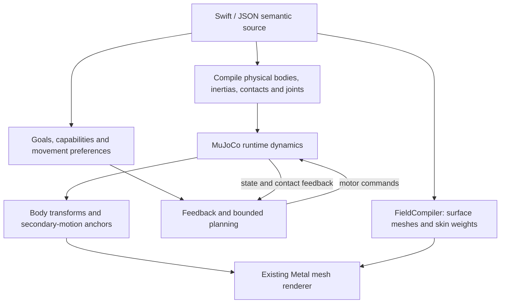

# Local physical motion for Wrela

Research date: 2026-09-12. Target: the user's M4 MacBook Air, 10 CPU cores
(4 performance / 6 efficiency), 8 GPU cores, 16 GiB unified memory. Existing
render target: native 1920×1080 at 60 Hz.

This is a proposal with an isolated CPU feasibility measurement. It does not
change the game runtime, certify animation quality, or establish a frame budget
for the complete garden. Library statements below come from primary sources;
architecture choices, budgets and milestones are recommendations.

## Recommendation

Use **native MuJoCo CPU dynamics**, procedural physical recipes, and a small
feedback controller as the first implementation. Add constrained optimization
and limited predictive planning where the first experiments show a need. Use
**MuJoCo MPC (MJPC) as a planning reference and research workbench**, rather than
making its complete application a game dependency. Keep Wrela's existing skinning,
field compiler, wind and secondary guide simulation.

The initial local stack needs no neural training, paid service, imported motion
capture, new computer or replacement renderer. Neural controllers remain a later
option, especially for compressing an expensive successful controller into a
cheap policy. They are not the first missing component in the current engine.

The central source contract should become:

> Define the body, what it senses, what it wants, and its movement preferences.
> Compute actions from the current situation; let dynamics produce the movement.

This supports unscripted responses within authored capabilities. It does not
promise that arbitrary goals, anatomies and contact sequences will automatically
produce appealing motion. Constraint satisfaction and attractive acting are
separate acceptance criteria.

## What the local probe actually found

I installed MuJoCo **3.13.0** and NumPy **2.5.3** into an isolated Python 3.12.12
environment under `.build/physics-research-2026-09-12/venv`. No package was added
to Wrela's Swift manifest or the global Python environment.

The [probe source](research/local-physics-2026-09-12/probe.py) generates a synthetic
13-body quadruped with 12 actuators, 18 velocity degrees of freedom including a
free root, primitive collision shapes and a plane. It uses 240 Hz dynamics,
implicit-fast integration, a Newton solver capped at 20 iterations, varying motor
targets and brief lateral forces. Its dimensions/anatomy are not Frostling's.

| Workload | Workers | Median | p95 | Maximum |
| --- | ---: | ---: | ---: | ---: |
| Advance four physics substeps, including Python command update | 1 | 0.044 ms | 0.055 ms | 0.199 ms |
| Roll out 8 candidates, each 0.25 s into the future | 1 | 9.026 ms | 10.959 ms | 12.826 ms |
| Same 8 candidates | 4 | 3.541 ms | 4.633 ms | 5.549 ms |
| Roll out 32 candidates, each 0.5 s into the future | 1 | 43.267 ms | 44.021 ms | 44.153 ms |
| Same 32 candidates | 4 | 11.883 ms | 12.111 ms | 12.263 ms |
| Roll out 64 candidates, each 0.5 s into the future | 4 | 24.641 ms | 25.885 ms | 25.999 ms |

The stepping sample included 7–11 contacts and no simulator warnings. Restoring
the complete integration state into two fresh data objects produced identical
120-step continuations in the same process. This is a narrow replay check, not
cross-process or cross-version certification.

These results support cheap **body stepping** on this machine. They also show why
unrestricted planning is risky: even 32 candidates can occupy most of a 16.67 ms
frame on four workers. Rollout measurements exclude candidate generation, task
scoring, action selection, rendering, secondary motion and actual game logic.
Different candidates/contact histories make different rows non-linear in cost.

There were 600 measured stepping frames and only 20 measured batches per rollout
configuration, after warmup. The entire timed experiment lasted about 2.27 wall
seconds; it is not a sustained thermal test. No Wrela render process was running.
The shared harness measurement lease was held. Other machine activity was not
controlled; `pmset` reported no recorded thermal/performance warning, which is not
a temperature measurement. There was no rendered review of this synthetic model.

Raw timings, environment, hashes and warnings are preserved in
[results.json](research/local-physics-2026-09-12/results.json), alongside the
[generated model](research/local-physics-2026-09-12/model.xml) and
[dependency versions](research/local-physics-2026-09-12/requirements.txt).

## Libraries and methods

| Candidate | Role and local fit | Decision |
| --- | --- | --- |
| **MuJoCo**, Apache-2.0 | Articulated bodies, actuators, frictional contacts; C API and native macOS binaries. CPU execution verified by this probe. | **First choice for character dynamics.** [Project](https://github.com/google-deepmind/mujoco) |
| **MuJoCo MPC**, Apache-2.0 | Online predictive sampling and derivative-based planners; documented macOS build. The authors explicitly describe it as a research prototype. | Study and evaluate its planners; keep its UI/gRPC machinery outside the game. Not built in this research pass. [Project](https://github.com/google-deepmind/mujoco_mpc) |
| **OSQP**, Apache-2.0 | Small convex quadratic programs; can generate fixed-dimension C solvers without dynamic allocation or external libraries. | Add only if joint/task/contact-force allocation needs a QP. Does not itself plan contact changes or solve nonlinear whole-body motion. [License](https://osqp.org/) / [code generation](https://osqp.org/docs/codegen/index.html) |
| **Mink**, Apache-2.0 | MuJoCo-based differential IK with pose/velocity limits and collision avoidance; Python examples include macOS. | Useful local reference for task formulation; IK is not dynamically balanced movement. Avoid a Python dependency in the native frame loop. [Project](https://github.com/kevinzakka/mink) |
| **Jolt**, MIT | C++ game physics with macOS support, rigid bodies and ragdolls. | Strong alternative if general game-object dynamics becomes the priority. MuJoCo is the better initial match for our control experiments. Do not introduce both now. [Project](https://github.com/jrouwe/JoltPhysics) |
| **Bullet**, zlib | Existing C++ physics/robotics ecosystem, including articulated simulation. | Viable fallback; no identified advantage sufficient to split the first implementation across engines. [Project](https://github.com/bulletphysics/bullet3) |
| **Newton**, Apache-2.0 code | Warp-based physics. Current requirements explicitly say macOS is CPU-only; accelerated path requires NVIDIA hardware. | Not an Apple Metal physics shortcut. Revisit only for a concrete capability. [Requirements](https://github.com/newton-physics/newton#requirements) |
| **MimicKit / ProtoMotions** | Motion imitation and large-scale learned control. MimicKit documents CPU/CUDA devices and GPU-oriented simulator backends. | Research references, not a turnkey native Apple GPU training solution for our creature. [MimicKit](https://github.com/xbpeng/MimicKit) / [ProtoMotions](https://github.com/NVlabs/ProtoMotions) |
| **PyTorch MPS / MLX** | Local neural-network training on Apple hardware; MLX also has a Swift API. | Optional later. Neither automatically accelerates MuJoCo CPU contacts or ports CUDA simulation code to Metal. [PyTorch on Mac](https://developer.apple.com/metal/pytorch/) / [MLX Swift](https://github.com/ml-explore/mlx-swift) |

Only MuJoCo/NumPy were installed and executed. Other library compatibility above
is documented support, not a tested integration. Preserve licenses/notices and
pin dependencies when adopting them; the open-source projects require no paid
runtime service.

### Why start with feedback and limited planning

Real-time responsive movement does not require a neural policy. SIMBICON
demonstrated physically simulated locomotion using compact controllers and
feedback, including response to disturbances. This is precedent for a practical
controller, not a ready-made Frostling implementation.
[SIMBICON](https://www.cs.ubc.ca/~van/papers/Simbicon.htm)

Predictive sampling evaluates possible future controls and repeatedly updates a
plan from the current state. Its appeal here is transparent, editable objectives
and no training prerequisite. MJPC demonstrates the method and alternatives such
as iLQG. It cannot guarantee global optima or aesthetically pleasing solutions.
[Predictive Sampling paper](https://arxiv.org/abs/2212.00541)

Proposed control hierarchy:

1. **Game intent:** seek, observe, approach, retreat. Sanctuary owns decisions.
2. **Task selection:** nose target, gaze direction, desired speed, clearance,
   acceptable support, urgency and style. Define priorities and unreachable-goal
   behavior explicitly.
3. **Contact and short-horizon planning:** choose among a small number of foot
   placements, durations or body shifts. Initially search meaningful parameters,
   rather than every torque at every future step.
4. **Feedback control:** convert goals into bounded motor commands using current
   positions, velocities and contact feedback. Begin with a simple standing/reach
   controller; extend as evidence justifies.
5. **Dynamics:** calculate forces, contacts and the actual resulting pose.

Step timing and a small vocabulary of support patterns can be authored while
exact placements, adjustments and responses remain situation-dependent. This is
a deliberate intermediate scope. Discovering arbitrary contact schedules is a
much harder problem than tracking a target with known support.

Do not teleport joints or apply the current final foot-IK correction after the
physics step on simulated limbs. Those algorithms can propose motor targets;
the simulated body must remain the authority for their actual transforms.

## Fit with field-based procedural authorship

The field approach is an advantage for generating consistent geometry and
physical models, provided physical meaning is authored explicitly.



This is a proposed data flow. Physical source, model compilation and control are
new work; the mesh rendering branch already exists.

### Physical source needs more than a visual rig

Existing `PartJoint` records describe attachment pivots and transform inheritance.
`BodyMass` supplies a point mass for support analysis. `RigCapsule` supplies
collision-query proxies. These are useful inputs, but they do not constitute an
articulated physical model with inertia, mechanical joint axes/ranges, friction,
actuator limits and connected load-bearing limbs.

Frostling's paws are independent root children to avoid skating in its current
procedural hop. Vesper also has generator-specific leg transforms. Neither rig
can be converted by treating every draw part as a separate rigid body. We need a
mechanical skeleton that maps to the existing visual controls. Ears, eyes, trim
and skin guides need not become load-bearing rigid bodies.

Proposed additional source describes named bodies, rest frames, joint types,
limits, actuators, density or explicit mass/inertia, contact material parameters,
collision groups, anatomical task points and mappings to visual joints. Keep
semantic IDs stable through regenerated meshes and compatible anatomy edits.

Generate MJCF XML for inspection initially, or use MuJoCo's programmatic `mjSpec`
API. Both are representations of the same procedural source, never a second
hand-maintained anatomy. Compile/load outside the simulation tick.
[MuJoCo model editing](https://mujoco.readthedocs.io/en/stable/programming/modeledit.html)

For physical mass, start with explicit per-body values or a few declared solids.
Later, integrate an authored density distribution over the actual occupied
volume to obtain mass, center of mass and inertia. Do not sum overlapping visual
CSG primitives blindly, or count fur/ornament volumes as solid flesh. Geometry,
skin weights and density have different meanings. Validate positive inertias and
mass ratios as part of source compilation.

World units remain metres. The seed pod remains 35 mm tall. Resizing a physical
asset requires recomputing its physical representation: at fixed density,
uniform size factor s changes mass by s³ and inertia by s⁵. Existing purely
visual instance scaling is not a complete physics-scaling policy.

### Collision should have an explicit representation policy

| Source / situation | Initial physical representation | Important limitation |
| --- | --- | --- |
| Creature limb | Source-derived capsule, sphere, ellipsoid or small convex compound | Visual skin can protrude or fold beyond the physical proxy; audit this |
| Sanctuary terrain | Height-field samples from the same terrain function | Sampling introduces error and cannot represent overhangs |
| Nearby rocks / props | Small source-derived convex compounds | Cover contact areas without excessive shape/contact counts |
| Cave interior | Separate investigation: local convex pieces or qualified SDF plugin | Never load the whole cave as one convex hull; it would fill passages |
| Fur / cloth / grass | Reduced guides and contact envelopes | No claim of exact collision of every rendered strand/triangle |

MuJoCo's ordinary mesh collision uses the mesh's convex hull, even when the
rendered mesh is concave. Its height-field and mesh conventions need explicit
conversion and sampled comparisons against Wrela source.
[XML reference](https://mujoco.readthedocs.io/en/stable/XMLreference.html#asset-mesh)

There is a promising longer-term field-native path: MuJoCo SDF plugins accept
distance and gradient callbacks. The collision search uses multiple starts and
gradient descent. Exact signed distances are preferred; the documentation also
allows suitably monotonic signed functions, with potentially more search effort.
This makes direct field integration possible, not automatically robust or cheap.
[SDF extension contract](https://mujoco.readthedocs.io/en/stable/programming/extension.html#sdf)

Wrela already distinguishes `exactDistance`, `distanceBound` and `implicit` in
`Field.swift`. Preserve that distinction in a collision adapter. Validate each
field family for sign, gradient, local contact behavior and query cost. Hard CSG
seams, deep smooth unions and enclosed surfaces require dedicated cases. A field
bound is not an exact penetration depth. A conservative exterior bound also does
not by itself establish that a contact-search algorithm finds every contact.

Use cached compiled proxies first. If SDF contacts become necessary, run queries
against immutable source/compiled evaluators safe for concurrent rollouts; avoid
editor callbacks, per-query allocation or locking. Keep the existing mesh
renderer. MuJoCo's optional visual mesh generation need not become our renderer.

## How the animation can still look good

Authored movement preference remains necessary. A physically feasible body can
move awkwardly, freeze, shuffle, exploit overly strong motors or miss an acting
beat. Smoothness alone is insufficient and excessive smoothing can erase a hop's
anticipation and landing.

Start with source-authored preferences for posture, head/body lead, comfortable
joint ranges, response time, supported reach, gaze settling and recovery. Give
task phases different priorities: a landing may prioritize impact management
over gaze accuracy; an idle reach may prioritize quiet support and a soft face.
These preferences are controller inputs and costs, not fixed resulting poses.

Existing `MotionPhrase` and `PerformanceScore` sources can supply examples,
nominal postures or target timing. They are not guaranteed physically feasible
trajectories; the new controller must adapt them under force/contact limits.
Persist why a goal was relaxed and inspect the result visually.

Later, AMP-style learning can represent movement preferences from a collection
of examples. MaskedMimic shows physically simulated humanoids responding to
partial goals. Neither supplies a universal pretrained model for arbitrary
procedural anatomy. Changing mass, proportions or joint topology may require
controller retuning or retraining.
[AMP](https://xbpeng.github.io/projects/AMP/) /
[MaskedMimic](https://research.nvidia.com/labs/par/maskedmimic/)

Keep Frostling's face and soft proportions as an artistic acceptance condition.
A successful robot-like demonstration is a control milestone, not a finished
Sanctuary creature.

## Native ownership and integration

Read alongside [ARCHITECTURE.md](ARCHITECTURE.md) and [TESTING.md](TESTING.md).
Suggested boundaries, not changes made by this document:

| Owner | Proposed responsibility |
| --- | --- |
| `FieldCore` | Renderer-free physical source definitions, units, field semantics, stable anatomical mappings and mathematical validation |
| New `PhysicsCompiler` target | Convert source to immutable physical representations; obtain geometry approximations from FieldCompiler only where needed |
| Small `CMuJoCo` boundary | Pinned native library, ownership of C handles, version checks, stepping/state access; no anatomy or game policy |
| New `PhysicsRuntime` target | Body simulation, reusable control machinery, fixed-step state and contact observations |
| `Games/Sanctuary/Content` | Physical creature recipe, intent, capabilities, controller preferences and versioned game state |
| `Games/Sanctuary/Project` | Register the same sources for authoring; adapt simulated transforms to render items |
| `SoundstageKit` | Generic physical rehearsal controls, stimulus/history, checkpoints and diagnostics |
| `FieldEngine` / renderer | Consume supplied transforms and surface data; retain skinning and shadows |

The existing full `AssetSource` and animation registrations live in FieldEngine.
CPU simulation must not acquire that dependency. Introduce a renderer-free
physical-source contract shared by Content and Project; decode/validate that
source once through a common implementation. Do not maintain separate physical
recipes in the game and editor or duplicate the rules in Python.

Use the engine headlessly. MuJoCo's OpenGL viewer is optional; it is not needed
to calculate poses for our Metal renderer. The native C-to-Swift bridge and app
packaging have not been implemented or compiled in this research pass.

For the native app, pin and package the native library with the app's existing
signing/build flow, including its license and any enabled plugin dependencies.
The Python wheel is a research convenience, not the app's deployment strategy.
Use a narrow C interface and preallocated state buffers; handle compilation
errors at the authoring boundary rather than during a frame.

Choose a coordinate convention explicitly. We can keep Y-up by configuring
gravity and orienting primitives appropriately; imported Z-up examples need a
single tested basis conversion. Account for MuJoCo's wxyz quaternions, Swift's
xyzw representation, runtime radians, source degrees and parent-local frames.
Derive skin delta matrices from simulated current/rest body frames and the
explicit visual mapping, rather than adding Euler angles. Prevent duplicate
root/placement transforms.

The body physics owns dynamic root travel and body contacts. Existing authored
IK should not subsequently overwrite it. Pose correctives currently observe
authored angles; a physical actor needs an explicit mapping from actual solved
joint state to corrective drivers. Keep unsimulated facial controls available.

### Replay must include history

An unscripted physical performance cannot be reconstructed from only a clip name,
time and current stimulus. Record the initial physical state and the full input
history, with checkpoints. Current `SecondaryPosePlayer` resamples a known pose
function at earlier times; that mechanism cannot reconstruct a physical actor's
past from its present state. Feed it recorded anchors, or advance a stateful
secondary player with the actor and checkpoint it too.

Save the physics integration state, model/source version, controller memory,
goals, filtered inputs, contact-mode state, RNG, plan/warm start, secondary state
and tick/substep position. MuJoCo documents deterministic replay with matching
state, including warm-start components where exact continuation is needed;
version and floating-point environment remain relevant.
[Reproducibility](https://mujoco.readthedocs.io/en/stable/computation/index.html#reproducibility)

Build and validate a candidate physical model before replacing the active one.
Topology changes need explicit state remapping or a controlled rehearsal reset.
Do not assume recompilation's state preservation also satisfies Wrela's atomic
rejection and semantic correspondence contracts.

## Wind and vegetation

Keep the current shared wind implementation as the starting point. `Wind.swift`
has a 32×32 horizontal flow grid, 10 m cells, 15 Hz updates and damped responses
interpolated for rendering. `Surface.metal` uses this response to bend vegetation.
It is a coarse simulation with procedural forcing, not airflow resolved around
individual leaves or trees.

Proposed next step is physically parameterized response near the player:

- Author root positions, rest curves, stiffness, effective mass, damping and
  contact radius in the plant source.
- Simulate a few controls per nearby clump/stem with the existing guide machinery;
  let many rendered blades follow those controls.
- Drive forces from the same wind field, using relative air/plant velocity and an
  authored effective drag area. Add local variation below the 10 m grid scale and
  label that variation as procedural detail.
- Add passing-creature contacts with stable recovery. Handle far-field plants
  through cheaper wind-driven deformation and blend transitions without popping.

Wrela already implements XPBD-style secondary constraints; preserve and extend
that investment instead of making every blade a MuJoCo articulated body. XPBD
provides a useful compliance-based formulation, but discretization, convergence
and collision limits still matter.
[XPBD paper](https://matthias-research.github.io/pages/publications/XPBD.pdf)

Begin with one-way coupling: air affects plants, creatures bend plants, plant
motion does not meaningfully push air or the creature back. That is an explicit
approximation. If a plant must resist a character, define force exchange and a
shared update schedule for that interaction. Do not claim that independent body
and guide solvers form a fully coupled physical simulation.

Large-scale GPU vegetation driven by local/global wind has substantial practical
precedent, including Crysis. This supports reduced representations, not a claim
that its procedural bending solves per-leaf aerodynamics.
[Crysis vegetation chapter](https://developer.nvidia.com/gpugems/gpugems3/part-iii-rendering/chapter-16-vegetation-procedural-animation-and-shading-crysis)

MuJoCo's fluid forces also approximate forces on bodies rather than solving an
air volume. They would not replace Sanctuary's spatial wind field.
[Fluid-force documentation](https://mujoco.readthedocs.io/en/stable/computation/fluid.html)

## A feasible local schedule and learning path

Initial candidate rates are 60 Hz game/control ticks and four 240 Hz body
substeps. These are starting settings to test, not stability guarantees. Faster
motions or stiff contacts may require more substeps or different solver settings.

Aim initially to keep the **whole character simulation plus controller** inside
the existing 2 ms p95 CPU simulation budget in `TESTING.md`. The probe establishes
room for simple body stepping, not compliance with that budget for a finished
controller. Reserve GPU headroom for Metal rendering.

For planning, use a reduced model or a small action parameterization; warm-start
from the previous plan. Profile full decisions including preparation and scoring.
If spreading work across ticks, use fixed work units and deterministic completion
boundaries for replay, plus a bounded fallback. A lower planning frequency does
not erase a 12 ms spike, and four workers still compete for CPU resources. Plans
must carry their initial-state tick and be checked against the current state.

If learning becomes useful, keep everything local:

1. Collect episodes from a working controller and approved procedural examples.
2. Fit a small state-and-goal-to-action network with CPU PyTorch initially; compare
   MPS or MLX only when network training is a demonstrated bottleneck.
3. Evaluate closed-loop rollouts with new targets, pushes and held-out anatomy
   variants. Supervised action error alone is insufficient because rollout errors
   compound. Collect corrections from the teacher in states the student visits.
4. Run the compact policy locally; benchmark native CPU evaluation versus Core ML
   or MLX rather than assuming GPU/Neural Engine inference is faster for one small
   actor. Core ML permits explicit compute-unit selection.
   [Core ML configuration](https://developer.apple.com/documentation/coreml/mlmodelconfiguration)
5. Preserve model weights, normalization, source/controller versions, seeds and
   input encoding as reproducible derived artifacts. A learned policy stays
   dependent on its training body/task distribution.

This distillation path is a proposed experiment, not a measured result. Local
small-task RL is also possible in principle, but training throughput, reward
design and repeated failures make it a less predictable starting point. No
training completion time or quality estimate is justified yet.

If adopting MLX Swift, investigate packaging first: its current README notes
that the SwiftPM command-line path does not build its Metal shaders and describes
Xcode/CMake alternatives. Wrela's `scripts/build` workflow would need an explicit
solution. This is another reason to begin optional training in an isolated Python
environment and keep native inference minimal.
[MLX Swift build instructions](https://github.com/ml-explore/mlx-swift#installation)

## Implementation sequence and decision gates

| Stage | Concrete result | Evidence required before expansion |
| --- | --- | --- |
| **0. Feasibility research — done here** | Native CPU stepping/rollout costs; library and source mapping | Preserved probe and limitations |
| **1. Physical source and rehearsal** | One compact connected creature body generated from source, with a free root and motor limits; physical drop/push behavior in Soundstage | Native build, source rejection/undo, stable units, real multi-view captures, complete checkpoint replay |
| **2. Goal-driven standing and reach** | Body balances while a nose target moves; gaze can have lower priority; impossible reach gives explicit residual or retreat | Goal changes and disturbances produce different valid motion; no root teleport or post-physics foot snap; inspect face and support |
| **3. One locomotion capability** | Slow step/reposition with limited contact choices, then a separate hop experiment | Unseen target positions/slopes/pushes; actual contact timing and bounded motor effort; same controller in game and workshop |
| **4. Garden integration** | One active physical Frostling and a small nearby patch of responsive plants | Normal live cloud/wind/skin cost included; p95/max spikes; preserve player save; physics/render contact comparison |
| **5. Optional learning** | A small locally trained controller or residual improves a measured limitation | Closed-loop improvement over the non-neural controller; local latency and replay evidence |

Stage 1 requires extending the mechanical recipe; the current visual paw rig is
not sufficient. Stage 2 is the cheapest test of the user's central idea. Do not
start with a universal locomotion system, Vesper's complete costume, a whole
physical garden, or automatic generation of arbitrary controllers.

Use the existing harness and production ownership: focused Swift tests and
`scripts/test quick`, game-owned physical scenarios, rejection paths, restore
failure atomicity, `check-boundaries`, then native Soundstage controls and game
replay. GPU work stays serial. Keep default saves and published content isolated.
No baseline acceptance happens automatically. Body-contact performance, source
recompile hitches, steady frames and perceptual motion quality need separate
results.

Remaining open questions are the quality achievable with compact authored
preferences, the cost of a useful full controller on the real creature, collision
proxy accuracy against its skin, SDF contact robustness for cave geometry, and
stable replay once physical and secondary histories interact. Those require
prototypes; published demonstrations and the current CPU probe do not settle them.

## Reproduce the research probe

From the repository root, using the already available `uv`:

```sh
uv venv .build/physics-research-2026-09-12/venv --python 3.12
uv pip install --python .build/physics-research-2026-09-12/venv/bin/python -r docs/research/local-physics-2026-09-12/requirements.txt
.build/physics-research-2026-09-12/venv/bin/python docs/research/local-physics-2026-09-12/probe.py --output .build/physics-research-2026-09-12/probe-02
```

The output directory must be new. The initial run is `probe-01`. The script uses
the harness CPU performance lease, runs no GPU work and never launches or closes
applications. This is an external-library research probe, not a replacement for
Wrela's production movement or validation scenarios. The environment occupies
ignored `.build` storage; initial package downloads need network access, and
execution thereafter is local. No cloud compute or paid service was used.
