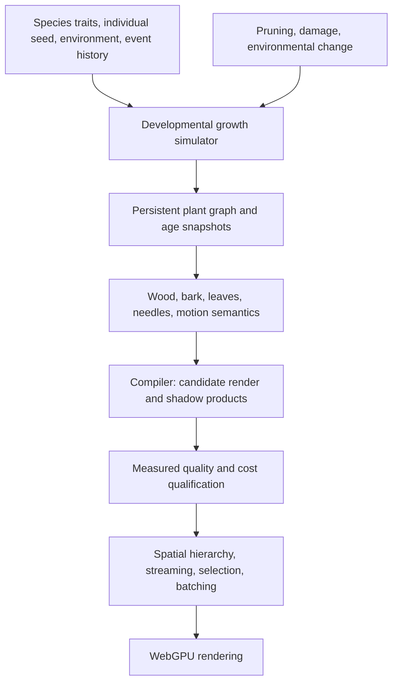

# Botanical growth and forest rendering implementation plan

Date: September 23, 2026. Status: revised after visual rejection of the developmental specimens. Targets below are requirements to test, not achieved results. Performance targets prioritize the user's actual M4 MacBook Air and substantial frame-time headroom.

## Accepted change of direction — shape before ecology

The user rejected the sparse, poorly proportioned trees from the uncalibrated growth solver and approved a focused pivot. Keep the measured rendering/compiler improvements. Use directly authored species architecture for production specimen development; retain the resource/light solver as an explicitly experimental path. Its structural test results do not qualify its appearance or ecological accuracy.

The immediate gate is one pine branch, a full pine, and a nine-tree grove, compared with the original under matched lighting and full-tree/stand cameras. Check fixed seeds and multiple maturity stages. Establish crown proportions, supporting branch hierarchy, foliage mass, and negative spaces before further material refinement. The constrained architecture may use a deterministic developmental schedule and stable branch identities; it must not be described as predictive botany or calibrated calendar growth.

Milestones 2 and 6 below remain research context, with their ecological simulation work parked. Do not expand crown/cell representations or forest infrastructure until the specimen gate passes. The revised critical path is **fast existing rendering → convincing controlled pine architecture → approved variations/stages → measured shoot representations → forest scaling**. Birch follows the approved pine rather than extending the rejected solver in parallel.

## Outcome

Build a forest that holds up from a close branch inspection to a distant wooded hillside, supports believable variation and observable growth, and runs exceptionally fast on this M4 MacBook Air. Make the compiler responsible for converting rich botanical meaning into the cheapest representation that preserves the visible result. Preserve portable WebGPU foundations, with this machine as the performance acceptance authority.

The author should be able to populate an extensive landscape without budgeting individual needles or manually building levels of detail. Runtime cost should depend principally on visible projected detail, relevant shadows, and the active simulation region. Total world population must not require a per-frame scan, unique resident meshes, or continuous growth simulation for every plant.

No finite GPU can draw arbitrarily many independently resolved leaves at arbitrary resolution. The practical interpretation of “as many as we want” is a large persistent population, bounded residency, and hierarchical representations that combine unresolved vegetation while preserving its appearance. Dense foreground overlap and a horizon full of trees must be explicit benchmark cases, not hidden exceptions.

Complete one coherent route through a beautiful, living forest before adding a broad species catalog.

## Current evidence and useful foundations

The September 23 review rendered all eleven pine/stand frames at 1024 × 768 on an adapter reported as `apple · metal-3`. These are individual frame observations, not sustained timings or an identified hardware model:

| View | Renderer triangles | Observed whole-frame GPU time |
| --- | ---: | ---: |
| Pine beauty | 47,564 | 14.88 ms |
| Pine close detail | 47,564 | 55.12 ms |
| Same close camera, albedo diagnostic | 47,564 | 1.57 ms |
| Nine-tree stand, near | 512,628 | 55.84 ms |
| Nine-tree stand, gameplay | 522,868 | 33.03 ms |
| Nine-tree stand, far | 250,220 | 31.98 ms |

The preserved [capture report](../../output/browser-1790173888306-18275/vegetation-lookdev.json) and [close-up](../../output/browser-1790173888306-18275/plant-detail.png) establish the baseline appearance. Diagnostic and beauty modes differ in several features; their timing difference motivates profiling shading, shadows, and shared rendering work, but does not isolate a foliage bottleneck. Preserve a replayable source snapshot and sustained baseline in milestone 0 before using these observations as a comparison.

Existing work to extend:

- Botanical source documents, stable branch identities, parent relationships, pruning, deterministic stands, cooked delivery, picking, and wind attributes.
- Explicit leaf/needle geometry and compiler-generated coverage fields. The current pine reuses one needle field across shoots; regularly spaced alternating needles and simplified trunk/limb/shoot structure limit realism.
- A thin coverage depth pass followed by depth-tested color, with independent sample masks. Earlier single-layer alpha-to-coverage success failed under overlapping foliage; that regression must remain in the suite.
- Bounded diffuse leaf reflection/transmission, procedural surface appearance, and multiscale physical relief. Bark already has shallow procedural bump; it lacks convincing species structure and branch-aligned coordinates.
- Instancing, visibility, upload budgets, GPU allocation accounting, and world population cells. Current batches require identical geometry/material signatures and hold at most 256 instances. Generating unique trees does not automatically preserve batching.
- Compiled-product metadata and measured representation analysis. The general product union currently covers direct meshes, parametric meshes, and static quadrics. The general selector rejects wind-deformed candidates; vegetation still has a separate heuristic distance-detail path. New foliage products and deformation-aware validity need explicit integration.

The [vegetation architecture](vegetation-authoring.md), [coverage evidence](../research/vegetation-authoring-2026-09-22.md), [surface relief](surface-relief.md), and [representation frontier](render-frontier.md) describe existing limits. Existing static diffuse GI is not a canopy scattering solver.

## Acceptance contract

### Performance targets

**Primary target: the user's current MacBook Air, model Mac16,12, Apple M4, 10-core CPU (4 performance / 6 efficiency), 8-core GPU, and 16 GB unified memory.** This configuration was verified locally with macOS System Information on September 23. Milestone 0 additionally records OS/browser versions, power mode, battery/charger state, actual render dimensions, and anti-aliasing mode. No target below is claimed to have passed.

The main goal is sustained 120 fps-class rendering capacity with room for gameplay. Merely reaching a 16.67 ms frame does not close the performance work. The built-in display currently reports 60 Hz, so visible presentation there is tested at 60 Hz while a separate saturation test measures renderer throughput. GPU timestamps alone cannot establish 120 delivered frames per second.

| Mode on this M4 Air | Internal and output resolution | Complete-scene GPU p95 / p99 | Matched marginal vegetation GPU p95 | Vegetation CPU p95 | Total renderer allocation ceiling / vegetation share |
| --- | --- | ---: | ---: | ---: | ---: |
| Primary fast mode | 1920 × 1080, native sampling | ≤6 / ≤8.33 ms | ≤2 ms | ≤0.5 ms | 256 / 64 MiB |
| Full panel resolution | 2560 × 1664, native sampling | ≤10 / ≤12 ms | ≤3 ms | ≤0.5 ms | 384 / 96 MiB |
| Further optimization target | 1920 × 1080, same scene and accepted quality | ≤4 / ≤6 ms | ≤1.5 ms | ≤0.35 ms | 256 / 64 MiB |

The first two modes are acceptance gates; the third keeps optimization aimed beyond the initial pass. The physical panel resolution is 2560 × 1664. macOS also reports a scaled 2940 × 1912 backing size and 1470 × 956 logical desktop; do not confuse those with the benchmark's render resolution. A Studio pane uses its measured drawable size, and must be reported separately from the fixed full-panel fixture.

The complete scene includes ground, sky, lighting, shadows, a representative moving character, and vegetation. Require complete-frame CPU p95 ≤2 ms and p99 ≤3 ms, with no vegetation-caused main-thread task above 4 ms. Measure marginal vegetation GPU cost with controlled variants; it is an interaction-sensitive estimate, not a sum of supposedly exclusive pass timings. CPU and GPU durations remain separate and must not be added to predict frame time. The primary fast mode must also demonstrate at least 120 completed frames/second in a sustained, bounded-queue throughput test with full frame work and no omitted updates. Report visible presentation/pacing independently.

Use an initial 8 MiB/frame upload ceiling on this machine, reducing it whenever the time budget requires. Include geometry, coverage/orientation/depth fields, shadow products, instance buffers, fallback products, transition overlap, and auxiliary allocations in vegetation memory. Include shared render targets in the total renderer ceiling. Track worker data, retained source graphs, caches, temporary compilation peaks, and JS heap separately. With 16 GB of shared system memory, GPU, worker, browser, and authoring allocations compete for the same physical memory; swapped or memory-pressure-distorted runs cannot pass unnoticed.

Test sustained thermal behavior explicitly: warm the full workload for at least five minutes, then run a 30-minute traversal/interaction session. Require the targets during the final ten minutes, report rolling frame-time distributions throughout, and retain thermal/power observations where available. Qualify plugged-in and ordinary battery operation separately, recording Low Power Mode; an untested power state remains unqualified. Do not depend on unusually cold starts, external cooling, or an unlimited GPU submission queue. Run normal 60 Hz presentation alongside separate saturation experiments, since their sustained power loads differ.

Native sampling at the specified resolution is the comparison baseline. Dynamic resolution and temporal upscaling may be qualified as explicit additional modes, with their actual internal resolution and image error reported. Do not silently lower resolution, density, shadow range, or visible species diversity to claim a win. A stable 60 fps compatibility mode is a fallback, not the primary success criterion. Other hardware can be checked later for portability; it does not substitute for performance on this exact M4 Air.

### Scale and scene tests

Benchmark tree populations of 1, 100, 1,000, 10,000, and 100,000, then a streamed world containing at least 1,000,000 persistent plant occurrences. Report trees, shrubs, herbaceous plants, foliage clusters, selected render nodes, and source needles/leaves separately. A million grass blades is not a million trees.

Use three distinct scaling experiments:

1. **Unseen population:** increase world extent/population while keeping the visible scene identical. A 10× increase should change steady CPU/GPU p95 by no more than 10%, with a minimum tolerance of 0.2 ms, and remain inside fixed residency budgets. Inspect traversal counts to rule out a hidden total-population scan.
2. **Visible density:** increase actual canopy overlap in the same view. Report image changes, shaded samples, shadow work, selected products, time, and memory. This legitimately increases work until aggregation applies; do not claim constant cost by comparing identical pictures.
3. **Visible extent:** a high overlook and a low horizon across the populated landscape. Distant crowns must combine hierarchically; per-tree draw calls and individual full skeleton residency cannot remain mandatory.

Acceptance scenes: one hero tree; a dense grove viewed from inside; grass/fern undergrowth filling the foreground; a sunlit forest edge; a wooded valley; a long-shadow low sun; a night scene with moving local lights; and a moving character revealing previously occluded vegetation. Include 1 km of travel, reversals, teleports, and repeated return to an edited tree. Missing plants, omitted shadow casters, upload refusal, and source-budget truncation must be visible in completeness reports.

### Image quality targets

Freeze source, camera, lighting, exposure, and wind when comparing representations. Use scene-linear readbacks and a converged spatial/temporal reference. Compare 16× and 32× per-axis reference sampling on small fixtures and increase it if convergence is insufficient; “16× reference” alone is not proof of truth. Render the actual three-dimensional needle source when judging a three-dimensional proxy. The existing flat-spray reference remains a useful narrower test.

Initial numerical gates for representation experiments:

| Quantity | Gate and measurement domain |
| --- | --- |
| Integrated geometric coverage | ≤2% relative error where reference coverage ≥0.1; ≤0.002 absolute coverage error for sparser cases |
| Local coverage | Fractional-coverage RMSE ≤0.03 in a tight, consistently padded projected subject region; blank background must not dilute error |
| Resolved silhouette | 95th-percentile contour displacement ≤0.5 pixel and maximum ≤1 pixel, measured only where a contour is resolved |
| Appearance | Linear-radiance normalized RMS ≤5% and 99th-percentile normalized absolute error ≤15%, using a fixed 0.05 scene-linear denominator floor at reference exposure; record unclamped maxima |
| Detail transition | ≤2% integrated coverage change and ≤5% mean-radiance change at the same camera against forced neighboring representations |
| Motion | Reprojected error-change normalized RMS ≤5%; test disocclusions separately and reject persistent trails, sparkling, or visible sample boiling |
| Shadows and canopy transmission | ≤5% integrated energy error on isolated matched fixtures, plus local error maps and blocker/overlap checks |

These are proposed experiment gates, not universal perceptual thresholds. Preserve failures; change a threshold only with an explicit explanation and new visual evidence. Wind animation, camera motion, grazing views, origin rebasing, and lighting changes are part of each candidate's measured validity domain. A single still or correct mean opacity cannot certify them.

Visual approval remains independent: recognize the intended species; see credible branch junctions and supporting wood; read natural leaf/needle grouping; retain illuminated tips, shaded interiors, and appropriate translucency; see bark respond to light; and avoid visible repeated stamps, cardboard planes, popping, or grainy silhouettes. Review at native size, close crop, and normal gameplay speed.

### Botanical accuracy targets

Start with Rocky Mountain lodgepole pine and paper birch, representing contrasting needle, leaf, crown, and bark structures. Use the existing grass and fern presets as additional rendering controls; select exact groundcover species before claiming botanical fidelity.

For each tree species, build a reference dossier with source/license information, physical scale, age/site context where known, and uncertainty. Record needle or leaf attachment, dimensions, shoot lengths, branch order and angles, taper, crown ratios, bark by age, retention, and responses to competition. The USDA descriptions provide initial anchors for [lodgepole pine](https://research.fs.usda.gov/feis/species-reviews/pinconl) and [paper birch](https://research.fs.usda.gov/silvics/paper-birch); they are not sufficient calibration data for every parameter.

Fit distributions and relationships, then hold out both references and seeds. Review at least 32 seeds per species in each of four environments and four developmental stages. Retain a botanical descriptor report and contact sheets; reject invalid structures across the full set rather than selecting one attractive seed. Define metric-specific tolerances from reference uncertainty before tuning. An uncalibrated growth step is a growth step; label it “years” only after species/site calibration supports that mapping.

Accuracy has three independent meanings: plausible species anatomy, calibrated developmental behavior, and rendering fidelity to the generated plant. Passing one does not establish the others.

## Architecture and ownership

Keep authored meaning independent from realization. Compiler-generated textures, coverage fields, meshes, and caches are owned derived products, regenerated from portable source. They are compatible with field authorship and do not require manually painted asset libraries.

| Responsibility | Extend existing code | Proposed focused additions |
| --- | --- | --- |
| Botanical source and validation | `model/vegetation-authoring.ts`, documents and validation | `model/botanical-growth.ts`, `model/botanical-species.ts` |
| Deterministic growth and analysis | Compiler botanical/conifer structure and branch helpers | `compiler/botanical-growth.ts`, `compiler/botanical-environment.ts`, `compiler/botanical-analysis.ts` |
| Wood and organ realization | Conifer/botanical meshes, leaf/needle ribbons, surface relief | `compiler/botanical-junctions.ts`, `compiler/botanical-surfaces.ts` |
| Representation compilation | Render products, thin coverage, cooked serialization | `compiler/vegetation-products.ts`, `compiler/vegetation-clusters.ts` |
| Runtime products and selection | `model/render-products.ts`, renderer realization/detail/visibility | `render-webgpu/vegetation-selection.ts`, product-specific shaders |
| World and persistent growth | World population/session, runtime scene host | `world/vegetation-cells.ts`, `runtime/vegetation-growth.ts` |
| Studio and verification | Vegetation panel/review, current lookdev/browser/frontier tools | `tools/vegetation-benchmark.ts`, `tools/botanical-growth-study.ts`, `tools/vegetation-frontier-lookdev.ts` |

Paths in this table are relative to `packages/*/src` unless prefixed with `tools/`. Proposed additions are work items, not existing APIs. Renderer residency currently lives largely in `render-webgpu/src/index.ts`; extend that ownership/accounting rather than assuming a separate residency module exists. Add new modules only at useful boundaries, avoiding a second general scene system or scheduler.

## Milestone 0 — Freeze a reproducible forest baseline

**Deliverable:** a benchmark and visual report that identifies where time and memory actually go.

- Extend the existing hardware browser/evidence harness with warm stationary and moving trajectories, exact GPU sample/frame identity, source snapshots, adapter identity, render settings, and retained images.
- Add coverage-depth and thin-color instrumentation to the current GPU timing system. Keep allocation/upload/compilation, first use, and steady state separate. Existing timestamp ranges can overlap on tiled GPUs; do not add pass durations to infer a frame.
- Use matched ablations for sky evaluation, direct lighting, leaf optics, shadow sampling, coverage/depth work, procedural material evaluation, and reconstruction. Use marginal repetition only where it preserves the intended workload. Albedo-versus-beauty remains diagnostic, not an attribution method.
- Run at least three 60-second steady/moving trials after warmup, alternate A/B ordering, and report p50/p95/p99 plus trial spread. Include the required five-minute warmup and 30-minute M4 Air streaming run, reporting the final ten minutes separately. Keep 60 Hz presentation and bounded-queue saturation measurements distinct; the latter must measure completed-frame throughput rather than infer it from timestamps. Preserve GPU errors and dropped timing samples; reject software rendering as hardware evidence.
- Freeze the existing pine, a fixed branch, overlapping needle sprays, held-out broadleaf plants, and all scale scenes. Capture current single-sample/temporal and four-sample paths separately.

**Exit:** identified dominant workloads, replayable baseline on the verified M4 Air, explicit resolution and power-state bindings, and no unaccounted missing geometry. Generic `apple · metal-3` identification is insufficient to substitute another Apple GPU for this machine. Untested resolutions or power states remain unqualified.

## Milestone 1 — Establish a fast rendering foundation

**Depends on:** milestone 0. **Deliverable:** the unchanged current tree renders substantially faster without losing coverage or lighting.

Optimize the measured dominant costs in order. Candidate work includes specialized foliage/bark shader variants, shared sky/irradiance evaluation, eliminating redundant procedural evaluation, cheaper shadow queries, tighter shoot proxy bounds, compact vegetation attributes, and avoiding per-frame material serialization and repeated buffer uploads. Existing material caches must be measured before inventing another cache.

Preserve the thin depth/color separation where it actually saves cost. Measure the cost of the extra pass and verify equal-depth behavior and wind parity on each adapter. A lower triangle count is insufficient if overlapping proxy pixels become more expensive. Track shadow work as carefully as camera work.

For position/normal compression, derive error at the closest accepted view, preserve small twig widths, and reject decoded motion/normal errors. Keep a direct uncompressed comparison. Profile uniform/control-flow specialization rather than assuming a large shader is intrinsically slow.

**Exit:** pass the coverage and image gates on the unchanged source; meet the M4 Air primary-mode 2 ms marginal vegetation and 6 ms complete-scene GPU p95 targets for the nine-tree gameplay fixture, or retain a documented bottleneck experiment before advancing optimization breadth. This is an early gate, not forest-scale acceptance. Growth research in milestone 2 may proceed independently once baseline inputs are frozen.

## Milestone 2 — Grow a tree from persistent developmental state

**Depends on:** milestone 0 species dossier. **Deliverable:** the same seed develops different, explainable trees in open light, beside a shading neighbor, after pruning, and under reduced resource availability.

### State and simulation

Add a versioned plant graph with permanent organ IDs, parentage, birth step, branch order, centerline segments, radius, local growth frames, terminal/lateral buds, foliage cohorts, vigor, reserves, and living/dead/pruned state. Store species traits, individual correlated trait offsets, environmental inputs, event history, algorithm version, and checkpoint identities. IDs must survive growth and replay; deleting a branch must not renumber unrelated organs.

Implement deterministic, synchronous steps:

1. Query approximate seasonal light exposure and free space using a spatial index or bounded canopy grid. Growth uses seasonal exposure, not the current camera or a single instantaneous sun direction.
2. Estimate assimilation and maintenance in explicitly named model units, update bounded reserves, and allocate the available growth budget through the branch graph. Account for growth/death/removal; prevent negative resources and runaway branching.
3. Decide bud activation, dormancy, and survival from species rules, age, resource supply, and leading-shoot dominance. Space colonization can guide direction but cannot supply species anatomy on its own.
4. Extend shoots, create buds/foliage cohorts, and bend growth through species-specific light/gravity responses and local space constraints.
5. Update supporting wood from descendant demand and species-calibrated allometry. Treat area-based taper as a modeling rule with evidence, not a universal physical law.
6. Age foliage, shed persistently shaded or senescent organs, preserve dead wood where appropriate, and apply ordered pruning/damage events.

Apply decisions from an immutable start-of-step snapshot so iteration order does not bias competition. Use keyed random decisions, explicit step size, convergence studies, and deterministic replay. First guarantee reproducibility within the supported implementation; qualify cross-engine numerical tolerance before promising identical graphs across all platforms. Use quantized decision inputs if required.

The model follows established [self-organizing growth](https://algorithmicbotany.org/papers/selforg.sig2009.html) ideas. A simple source/sink resource model makes development causal; it does not establish measured carbon physiology. [L-PEACH](https://algorithmicbotany.org/papers/lpeach.fsmp2004.pdf) is a reference for a later calibrated carbon/water extension. Add detailed roots, hydraulics, nutrients, or disease when they serve a selected visual/gameplay behavior and have validation data.

### Variation that remains botanical

Use correlated variation at species, individual, annual shoot, foliage-cohort, and organ scales. Individual traits stay consistent through time. Local variation follows those traits and the environment. For lodgepole, model paired needle bundles and retention by shoot age; do not repeat one identical alternating needle stamp everywhere. Allow some module sharing, but measure repetition across whole stands.

Compare the same seed across environments with a fixed event history; compare different seeds under identical conditions. Validate dimensions, branch-order distributions, crown ratios, attachment rules, survival, and descriptor covariance against held-out references. Preserve a reason for each bud decision so agents can diagnose an implausible crown.

**Exit:** both species pass topology/resource/replay tests and the held-out botanical review. Growth is visibly continuous in developmental state, not a sequence of unrelated regenerated trees. The viewer can scrub checkpoints and inspect a selected organ's history. New growth may alter connected resource allocation, but unrelated IDs and prior history remain stable.

## Milestone 3 — Make one branch, then one tree, visually exceptional

**Depends on:** milestone 2 skeleton; milestone 1 performance baseline. **Deliverable:** reference-matched pine and birch specimens under neutral, grazing, overcast, and back lighting.

- **Wood:** construct tapered curved branches with adequate branch orders, continuous junctions, branch collars, root flare, and age-appropriate dead stubs. Use branch-frame coordinates. Prefer a continuous surface around the graph; use bounded local field blending/extraction at difficult junctions only where it improves the result. Avoid a uniform high-resolution field grid over the whole tree.
- **Bark:** develop species/age/diameter-dependent plates, fissures, scales, scars, and exposed wood. Carry surface direction through forks. Split one authored surface signal between silhouette-scale geometry, resolved normal detail, and unresolved roughness. Reuse relief infrastructure, but account for its inward-only displacement, local-grain limitations, and deformation validity. Do not duplicate a detail band in both displacement and bump.
- **Needles:** create curved, tapered individual needles in correct bundles with coherent growth direction, cohort variation, and bounded twist. The explicit source/reference must contain this anatomy before a proxy is derived from it.
- **Leaves:** model species outline, attachment, petiole, fold/curvature, thickness, restrained veins, and front/back differences. Damage and seasonal changes follow organ state rather than independent color noise.
- **Groundcover:** qualify one tuft grass and one fern after selecting reference species. Give them basal/tiller or frond structure, coherent age variation, curved blades/leaflets, ground attachment, and their own wind response. Use patch-level products when unresolved; retain distinct crowns and fronds nearby. Groundcover must pass dense, overlapping, ground-level views rather than inheriting acceptance from a tree fixture.
- **Light and motion:** maintain shared reflection/transmission energy budgets, separate geometric coverage from material transmission, and correct shading frames under deformation. Add branch-scale lag and leaf flutter driven by compact precomputed modes only if a filmed reference justifies them. Avoid a per-needle physical solve.

Validate canopy lighting separately from an isolated leaf. Build a small explicit cluster with a converged offline transport reference, then test directional sky visibility, colored transmission, and a bounded approximation for repeated scattering between leaves. Compile reusable geometric/optical coefficients where they remain valid under the qualified motion range; keep changing illumination as an input. Do not substitute a minimum ambient/transmission brightness for missing light transport. A more complex scattering model earns adoption through a visible improvement at an accepted cost.

Review silhouette/clay before bark and final color. Capture root, fork, bare twig, leafy shoot, full crown, and gameplay stand. Fix large structure before using shading to hide it.

**Exit:** native-resolution visual approval for both species and no regression in growth, attachment, shadow, or reference coverage. Record the expensive direct specimen as a correctness reference; do not require its full detail at every forest distance.

## Milestone 4 — Compile thin detail across scale

**Depends on:** milestone 3 semantic/reference branch. **Deliverable:** measured render products that preserve fine detail while sharply reducing work with distance.

### Candidate set

| Scale / purpose | First candidate | Required preserved information |
| --- | --- | --- |
| Resolved wood, leaves, and needles | Adaptive explicit surfaces, with analytic tapered segments as a measured alternative | Shape, junctions, material frames, organ identity, motion |
| Partly resolved shoots | Tight curved proxies with compiled coverage, orientation and bounded depth structure | Directional occupancy, gaps, reflection/transmission, shoot motion |
| Unresolved branch clusters | Compact multiview depth/coverage products with relightable attributes | Silhouette, parallax within a stated view domain, directional light response |
| Distant crowns and forest cells | Hierarchical aggregate products shared across many occurrences | Crown shape, projected density, ground/canopy shadowing, seasonal state |
| Unresolved light transport | Optional directional extinction/microflake experiment | Optical depth, orientation, leaf optics, spatial clumping |

Do not implement every candidate simultaneously. Start with adaptive explicit surfaces versus tight shoot proxies. Add crown/cell products for measured scaling failures. The [SGGX representation](https://research.nvidia.com/publication/2015-08_sggx-microflake-distribution) is a candidate for unresolved directional statistics; it supplies neither a complete canopy transport solution nor a guaranteed faster path. Fit projected-area behavior and compare held-out directions before adoption.

### Compiler contract

Extend the typed render-product schema, cooked validation, byte ownership, and selector deliberately. Each product records source graph/subtree, species and material revision, growth snapshot, algorithm version, payload/dependencies, fallback, wind envelope, camera/light validity domains, and measured errors/costs. Changed growth, pruning, leaf state, or optics invalidates dependent data.

Generate products per natural subtree/cluster. Compile quality/cost tables and practical selection thresholds offline; keep runtime selection cheap. The current generic selector's rigid assumptions must not be bypassed by disguising wind-deformed proxies as static parametric meshes. Keep one coherent selection/accounting path when migrating the old detail heuristic.

A tree may use detailed foreground branches and coarse background branches simultaneously. A hierarchical cut owns each source organ exactly once. Refine/collapse neighboring nodes without gaps, duplicated opacity, doubled shadows, or phase jumps. Transition memory and rendering cost count toward the budget. Test complementary ownership/coverage transitions; two independent fades are not automatically density-preserving.

### Coverage, shadows, and temporal behavior

Test widths 0.1, 0.25, 0.5, 1, 2, and 4 pixels; translations; grazing views; 1/8/32 overlapping layers; camera/light azimuth; wind; disocclusion; and origin rebasing. Measure both camera occupancy and light-direction occupancy. Resolve true close detail explicitly where proxies reveal planar anatomy.

Compare deterministic filtered coverage, stratified sample masks, and temporally reconstructed stochastic coverage using the same source and cost accounting. [Hashed alpha testing](https://research.nvidia.com/labs/rtr/publication/wyman2017hashed/) preserves minified coverage by introducing noise; it does not guarantee a clean final image. Qualify the default single-sample temporal path and the four-sample path separately. Fix sample correlation, stable identity, motion vectors, changing topology, and history rejection rather than assuming temporal accumulation repairs them.

Choose shadow detail using projected size in the light's view, not the camera's distance alone. Off-camera trees can cast visible shadows. Preserve holes and colored transmission where supported. Separate near contact shadows from coarse distant canopy transport; validate complete blockers and stacked foliage. Dynamic sun, local lights, wind, and growth require cache validity checks and explicit fallbacks. Do not bake a fixed daylight image into an allegedly relightable product.

**Exit:** admitted candidates pass the acceptance metrics, artist review, and matched p95/memory comparisons. Reuse the existing frontier reporter with added coverage/temporal evidence. Unknown or failing products keep a valid fallback; a beautiful still with unacceptable motion does not qualify.

## Milestone 5 — Make the forest cost follow visible information

**Depends on:** milestones 1 and 4. **Deliverable:** streamed landscapes pass the scale tests within fixed budgets.

- Build a persistent spatial hierarchy over canonical world population cells, with a second hierarchy over crown/branch clusters where needed. Reject distant or hidden cell ranges before materializing individual tree surfaces. Account for generation queries and shadow-region queries as well as draw submission.
- Compile coarse cell products from deterministic source summaries ahead of use, during world generation or background jobs. A distant cell must not require growing and meshing every tree on the main thread. Bound source generation itself and expose pending/refused work.
- Keep detailed plant graphs only for authoring, nearby interaction, or active growth. Store seeds, initial conditions, events, checkpoints, and coarse summaries for dormant populations. Preserve persistent occurrence IDs across refinement and unloading.
- Use compact draw records, shared geometry/coverage pages, and WebGPU compute/indirect drawing where measurements justify them. Group by product/material family and selected detail. Avoid assuming bindless textures, mesh shaders, or hardware ray tracing. Query device limits and retain a bounded CPU fallback.
- Share biological modules and compiled products where their actual source/shape permits it. Quantized variants or deformations must have measured image error. Unique silhouette changes need corresponding geometry/product identity; do not render many cloned crowns while reporting unique growth seeds.
- Budget geometry, shaded samples/proxy overlap, shadow work, CPU selection, uploads, and memory together. Use projected error and persistent hysteresis. Prioritize nearby silhouettes, interaction targets, and visible shadow contributors. Overload may choose only qualified lower-detail products; report when no product satisfies both budgets and quality.
- Reuse proven opaque occluders for conservative visibility. Hole-filled foliage cannot become an opaque depth blocker merely because its bounding box is large. Conservative wind bounds must cover current/previous geometry and shadow motion.
- Pin a valid coarse product while fine data streams; use bounded cancellation, prefetch, and eviction with anti-thrashing hysteresis. Bound transition residency. Update only changed instance records. Test context loss/rebuild and disposal.

**Exit:** complete the thermally sustained 30-minute M4 Air traversal and all population/overlap/horizon sweeps in both primary fast and full-panel modes. CPU selection and resident bytes stay bounded when unrelated world population grows. All required visible content has a qualified resident representation; disappearing trees cannot satisfy the budget.

## Milestone 6 — Integrate growth, editing, and environmental interaction

**Depends on:** milestones 2–5. **Deliverable:** an editable forest whose history survives travel, saves, and export.

Expose grow/stop, development scrub, species traits, light/resource context, prune, damage, and regrow through ordinary authoring transactions and machine-readable operations. Preserve manual overrides, undo/redo, stable picking, and source provenance. Inspect a tree's event history, growth diagnostics, selected representations, and actual resource cost.

Run growth in workers or during compilation/world generation. Interactive runtime growth uses a bounded active region and occasional simulation steps; rendering continues between them. Smooth extension/thickening interpolates compatible organ state, with birth/death handling and motion/history validity. Do not swap unrelated complete tree meshes at every age.

Recompile changed subtrees incrementally, but propagate dependencies honestly: removing a limb can change trunk support, reserves, and neighbors' light exposure. Invalidate affected light cells and dependent snapshots. Across streaming boundaries, use deterministic simulation regions with halos and synchronized boundary summaries; test the same stand loaded in different orders. Dormant catch-up needs the relevant environmental/event history, or an explicitly documented approximation. It cannot reproduce competition from age alone.

Maintain separate authoritative growth state and render caches. Version saves, species models, source graphs, and cooked payloads. Keep legacy vegetation documents unchanged until an explicit undoable migration. Picking and collision follow appropriate woody/interaction proxies; do not create one physics body per needle. Edits invalidate derived products without losing the user's authored tree.

Proposed responsiveness targets: cached age scrub visible within 100 ms; editing feedback within 100 ms while fine products finish asynchronously; first interactive single-tree growth/compile within 2 seconds at the documented organ budget; reference-quality preparation within 10 seconds in background work. Measure actual budgets and preserve cancellation. No tree-quality claim may hide source truncation to meet these targets.

**Exit:** prune/grow/save/reload/export/reopen preserves the same state and identities; isolated edits do not rebuild the entire world; streaming order does not change qualified simulation results; changes stay inside frame, upload, and memory budgets.

## Milestone 7 — Accept the complete experience

**Depends on:** every preceding exit gate. **Deliverable:** a playable forest route and a reproducible acceptance report.

Use both trees plus qualified understory in an authored landscape with clearings, dense interior, a forest edge, a wet/shaded patch, and a distant overlook. Include a visible growth/pruning interaction. Review daylight, overcast, low sun, night lighting, still air, and gusts. Walk through it at normal speed on this M4 Air in both required modes and qualified power states, then verify sustained throughput separately.

Publish a compact evidence bundle containing exact sources/seeds/events, species references, held-out botanical results, native images and motion clips, representation/error reports, sustained frame distributions, residency/streaming traces, hardware/browser identities, and remaining limitations. Check cooked/exported Player behavior as well as Studio.

Do not close this milestone because numerical tests pass. The forest must look beautiful, move convincingly, remain readable during traversal, and leave enough frame budget for the game. When a technical assumption fails, preserve the evidence and revise the representation or scope before extending dependent systems.

## Execution order and first implementation slice

Critical path: **baseline → fast existing rendering + developmental skeleton → exceptional reference specimens → qualified scale representations → forest scaling → persistent interactions → playable acceptance**. Growth modeling and profiling are independent after the baseline is frozen; their outputs meet at the specimen and compiler stages.

Start with these reviewable changes, each retaining its measurements and rollback path:

1. Add the sustained vegetation benchmark and thin-pass attribution; record the unchanged pine and dense-overlap baseline.
2. Fix the largest measured rendering cost without changing the botanical source.
3. Add versioned growth state and the four-environment pine skeleton experiment; keep the legacy generator as a comparison.
4. Implement one mature pine branch with real secondary structure, coherent bark, and paired curved needles; compare direct and compiled shoot realizations.
5. Extend the successful growth/surface rules to a full pine and then paper birch, using held-out seeds and references.
6. Qualify one cheap shoot product and one crown/cell product before building a larger candidate library.
7. Run the scale ladder, integrate persistent growth/editing, and build the final forest route.

The first combined gate is a pine branch and nine-tree grove that are visibly more convincing and materially faster, with reproducible growth. It prevents a long architecture project from postponing the first useful result.

## Verification and delivery

Each implementation change includes the smallest meaningful checks for its behavior. Keep numerical correctness, visual approval, and sustained performance as distinct results:

| Area | Required regression coverage |
| --- | --- |
| Growth | Valid parentage and attachments, resource accounting, birth/death, same-seed replay, timestep sensitivity, prune/regrow, seed/environment separation, and held-out species descriptors |
| Compilation | Payload/source identity, deterministic product generation, local invalidation, cooked round trips, malformed payload rejection, actual owned bytes, and explicit source-budget diagnostics |
| Rendering | CPU/GPU agreement for shared math, overlap coverage, actual 3D reference comparisons, current/previous wind, lighting blockers, grazing views, origin changes, and transition ownership |
| Streaming | No full-population scan, bounded queues/residency, cancellation, fallback completeness, eviction/revisit, teleport recovery, context rebuild, and environment changes across cell boundaries |
| Authoring/player | Transaction/undo integrity, stable picking, growth history, save compatibility, legacy migration, and exported Player replay |

Extend the existing botanical, thin-coverage, foliage, motion, visibility, residency, world, and cooked tests. Reuse `tools/vegetation-lookdev.ts`, `tools/foliage-lookdev.ts`, and `tools/thin-coverage-lookdev.ts` for controls; the proposed benchmark/growth/frontier tools add the missing evidence. Newly added commands must be documented as available only when implemented.

Run the repository's required source checks (`bun run check`) and relevant tests for implementation changes. Run hardware capture and sustained benchmarks whenever shader, representation, batching, streaming, or motion behavior changes. Record exact revisions and meaningful failures; tests that merely restate a formula or screenshots without inspection do not close a milestone.

## Decision rules when an experiment fails

| Observation | Next action |
| --- | --- |
| More accurate needles still look grainy | Isolate coverage, reconstruction, and shadow sampling against the actual 3D source; do not widen anatomy to mask missing coverage |
| Fewer triangles make the frame slower | Measure shaded area, proxy overlap, sample count, lighting and shadows; tighten/split proxies or retain explicit geometry |
| Growth produces recognizable but repetitive trees | Revisit species rules, cohort correlation and environmental history; measure diversity before adding independent jitter |
| A believable tree needs a costly global biological subsystem | Run the smallest causal approximation against that behavior; add physiology only if the simpler model fails |
| Distant crowns look like flat stamps or blobs | Increase depth/view support or use smaller clusters; qualify the trade against memory and transition cost |
| Wind breaks lighting or filtering | Repair deformed frames, bounds, identities and history; narrow the product's motion domain until supported |
| Unique growth destroys instancing | Share qualified modules and aggregate unresolved crowns/cells; retain distinct source identities and measure visual repetition |
| Budgets fail on this M4 Air after sustained load | Profile the hot-state workload and improve selection/representation; preserve the failure and do not substitute a faster machine, cold-start run, lower resolution, or thinner forest |

The intended advantage is concrete: growth gives us meaningful structure; the compiler uses that structure to remove work that cannot affect the accepted image. Every added system must earn its place through a better plant, a cheaper frame, or a faster authoring loop.
