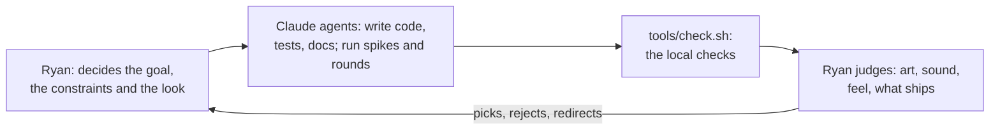

# wrela: how it's made

*What AI does in this project, what people do, and every outside work we use and how. Started
2026-10-10. Games are a contentious place for AI, so this record is complete and public. If a
line here is wrong, that is a bug: fix it in the same change that makes it wrong.*

## In short

- **One person, a team of AI agents.** Ryan (the owner) decides, directs and judges. Claude agents
  write almost all of the code, tests and docs, and run the experiments.
- **No generative image, sound, music, voice or video model makes anything in wrela.** Every
  image and sound comes from wrela code that runs on the player's device: the renderer draws the
  world from fields, the piano synthesizes its notes, and the music is a score written as code.
- **References are for learning, not for copying.** Agents look at outside images to learn
  light, colour, form and composition. We never trace them, ship them or recreate a specific
  shot, character or design. Each one is listed below with its source, its rights and its use.

## Who does what

| Work | People (Ryan) | AI (Claude agents) |
|---|---|---|
| Goal, constraints, flagship design | Decides all of it (#44: "settled means the owner decided it") | Asks questions, writes the decisions down |
| Language, compiler, engine, runtime, studio | Reviews, directs, merges | Writes the code and its tests |
| Art direction | Picked the look (#50) and judges every art result | Builds the looks in code, judges stills against a rubric, proposes changes |
| Creatures and the world | Judges each result (blind where we can) | Authors them as fields, in wrela code |
| Music and sound | Judges by ear; ruled out music models (#44) | Write the piano synthesizer, the scores and performances as code, and the tools |
| Story and lore | Writes the overarching story and its ending | Drafts each floor's lore and echoes; Ryan reviews them |
| Translation (planned) | | Translates; players review |
| Docs and records | Reviews | Writes them |

Every commit on `main` so far (50 of 50 on 2026-10-10) was written with Claude Code and carries
a `Co-Authored-By: Claude` line; Ryan commits or merges them. Agents also merge their own
branches with Ryan's standing permission, after `tools/check.sh` passes.

## Tools and models

| Tool | What it does here |
|---|---|
| [Claude Code](https://claude.com/claude-code) (Anthropic), mostly Claude Opus 5.5 | Writes the code, tests and docs, on Ryan's MacBook Air and in cloud sessions |
| Claude Opus 5.5, Sonnet 5.5 and Fable 5.1 | The authors in the blind authoring rounds that test thesis 1 (vision.md); Opus also in the first round |
| Claude subagents with no context | Blind raters in the lookdev loop: they see only the before and after stills and the anchors |
| Claude projects (claude.ai) | Run several agent threads at once (lookdev items, fixes, rendering setup), with one coordinator |

Not used, by decision: Suno or any music model (Ryan, 2026-10-06, #44), and any image, texture,
3D, voice or video generator. No asset is made by a model that was trained to output art.

## The references

### The rules

1. **Learn, don't copy.** A reference teaches light, colour, value, form, scale or composition.
   We don't trace it, sample its pixels into the game, or rebuild a specific shot, character or
   design from it.
2. **Prefer the cleanest rights.** Public-domain works first (museum open-access collections, US
   federal government photos), then works under open licences, then official stills a studio
   offers for free use. A copyrighted image with no such offer (a publisher's screenshot) is for
   private study only. A reference whose source or rights we can't name isn't used.
3. **Ship only what the licence allows, with its credit.** A file in the repo has a manifest
   beside it (`references/**/*.toml`) with its source, author and licence. Anything adapted from
   a work that needs credit (CC BY) carries the credit into the game.
4. **Style references stay private.** Images used only to judge the look (lookdev) are kept out
   of the repo, in the project's private files. Only their record is here.
5. **Record every one, in this file.** An agent that uses a reference adds its row in the same
   change. The row says what it teaches and how we used it.

### In the repo

| Reference | Source and rights | How we use it |
|---|---|---|
| Six photos of bison and wolves (`references/grazer/`, `references/wolf/`) | Wikimedia Commons; US National Park Service, Fish and Wildlife Service and Agricultural Research Service photos; public domain. Each `.toml` has the URL and author. | Authoring rounds 4 and 5: agents saw them beside their creature to check proportion and silhouette (`wrela studio … beside`, `wrela compare`). Nothing of the photo goes into a creature. |
| "Fantasy wolf miniature", a sculpt (`references/wolf/sculpt-standing.obj`) | Drew Vaughan (3ddrew), [Thingiverse 680145](https://www.thingiverse.com/thing:680145), CC BY 4.0 | Test 6 (vision.md): a wolf measured from the sculpt and rebuilt as lofts and sweeps, to learn whether wrela's forms can hold a great shape. It is an adaptation, so its source carries the attribution in the `.toml`, and a game that ships it credits him. |
| Satie, Gymnopédie No. 1 (1888) | The Mutopia Project's edition (Mutopia-2014/12/14-37, typeset by Evin Robertson from the Dover reprint), public domain | Spike 14 (#48, branch `spike-14`): transcribed note by note into a score as code, then performed by wrela's piano. |
| Salamander Grand Piano V3 (a Yamaha C5) | Recorded by Alexander Holm, CC BY 3.0; FreePats' retuned SFZ, played by sfizz | Spike 14: wrela's piano model is fitted to measurements of these recordings (partial frequencies, levels, decays). The recordings are not in the game; the fitted numbers are, so a game that ships them credits him. The listening test on `spike-14` also plays them beside wrela's piano. |
| Inter and JetBrains Mono fonts (`ui/fonts/`) | SIL Open Font License 1.1, licence texts beside them | The studio's interface text. |
| musl's libm; ARM's optimized-routines | MIT | `compiler/std/math.wrela` follows their algorithms and coefficients (credited in the file). |

### Style influences (named, not traced)

The art direction (#44) names four influences. They set the direction in words; we don't copy
images from them.

| Influence | What it stands for |
|---|---|
| E. H. Shepard's drawings for Winnie-the-Pooh | Storybook softness and texture |
| Anime | Shapes, characters, stylized faces |
| *The Legend of Zelda: Breath of the Wild* (Nintendo) | Landscapes: landform, distance, haze |
| Studio Ghibli's films, Kazuo Oga's backgrounds | Painted light and colour in forests and fields (the rubric's "hero" bar) |
| Real light | Sun, sky, bounce light and fog in the renderer |

### Lookdev references (private, for judging the look)

The lookdev loop (milestone 6) judges each still against a rubric whose scale has anchor
images. They are in the project's private files, not the repo.

| Reference | Source and rights | How we use it |
|---|---|---|
| Spike 15's stills, B and C; spike 16's forest interior and year 800 | wrela's own renders (branches `spike-15`, `spike-16`), MIT | The "shippable mid-tier" anchor: the look Ryan picked, which today's floor must reach again. |
| The lookbook baseline, 2026-10-10 | wrela's own renders | The "blockout" and "placeholder" anchors. |
| The AAA set, 83 images (below) | 23 public-domain paintings (The Met Open Access, CC0); 52 official Studio Ghibli stills (Ghibli offers them free to use "within the bounds of common sense", [ghibli.jp/info/013344](https://www.ghibli.jp/info/013344/); © Studio Ghibli); 8 Nintendo store-page screenshots of *Breath of the Wild* and *Tears of the Kingdom* (© Nintendo, private study only) | The "hero" anchor: an agent looks at them beside a render to judge light, colour, value, depth and how a material reads. |

#### The AAA set

A Claude agent gathered it on 2026-10-10. It downloaded all 50 official stills of each of 14
Studio Ghibli films (700 images), looked at them on contact sheets and kept the 52 that show each
topic best, Kazuo Oga's painted backgrounds first. It added screenshots from Nintendo's official
store pages and public-domain landscape paintings from The Met (Hudson River School, Barbizon
school, Constable, Courbet, Ruisdael). The images were not traced, not copied into assets, not
used to train any model, and are not in the repo or the game. The project's private record keeps
each file's size and SHA-256. Tried and not used: *Genshin Impact* (no image large enough
without text over it) and Wikimedia Commons (rate-limited).

**forest-interior**

| File | Work | Rights | Source | What it teaches |
|---|---|---|---|---|
| `ghibli-karigurashi-001.jpg` | The Secret World of Arrietty (2010). Studio Ghibli, dir. Hiromasa Yonebayashi. | © Studio Ghibli, free-use still | [link](https://www.ghibli.jp/gallery/karigurashi001.jpg) | Garden path through dense undergrowth to a house; many painted plant types, worn path, and soft dappled light. |
| `ghibli-kazetachinu-050.jpg` | The Wind Rises (2013). Studio Ghibli, dir. Hayao Miyazaki. | © Studio Ghibli, free-use still | [link](https://www.ghibli.jp/gallery/kazetachinu050.jpg) | Large trees framing a bright opening to sky and an easel; shows the dark frame / bright gap pattern in a forest edge. |
| `ghibli-marnie-035.jpg` | When Marnie Was There (2014). Studio Ghibli, dir. Hiromasa Yonebayashi. | © Studio Ghibli, free-use still | [link](https://www.ghibli.jp/gallery/marnie035.jpg) | Bright, open conifer wood with ferns and a mossy log; light green shadows and high-key forest light. |
| `ghibli-mononoke-010.jpg` | Princess Mononoke (1997). Studio Ghibli, dir. Hayao Miyazaki; art directors incl. Kazuo Oga. | © Studio Ghibli, free-use still | [link](https://www.ghibli.jp/gallery/mononoke010.jpg) | Deep forest with huge mossy trunks and a glowing god in back light; volumetric light shafts and warm glow through a dark interior. |
| `ghibli-mononoke-023.jpg` | Princess Mononoke (1997). Studio Ghibli, dir. Hayao Miyazaki; art directors incl. Kazuo Oga. | © Studio Ghibli, free-use still | [link](https://www.ghibli.jp/gallery/mononoke023.jpg) | Night forest of roots and moss with small glowing spirits; dark blue-green values with small light accents. |
| `ghibli-mononoke-027.jpg` | Princess Mononoke (1997). Studio Ghibli, dir. Hayao Miyazaki; art directors incl. Kazuo Oga. | © Studio Ghibli, free-use still | [link](https://www.ghibli.jp/gallery/mononoke027.jpg) | Thick moss floor in a forest clearing with figures; how to paint a moss carpet with light patches. |
| `ghibli-totoro-019.jpg` | My Neighbor Totoro (1988). Studio Ghibli, dir. Hayao Miyazaki; art director Kazuo Oga. | © Studio Ghibli, free-use still | [link](https://www.ghibli.jp/gallery/totoro019.jpg) | Tunnel of twisted bushes and trees; Kazuo Oga's dense green layering and a lit path through shade. |
| `ghibli-totoro-025.jpg` | My Neighbor Totoro (1988). Studio Ghibli, dir. Hayao Miyazaki; art director Kazuo Oga. | © Studio Ghibli, free-use still | [link](https://www.ghibli.jp/gallery/totoro025.jpg) | Fern hollow with flowers and a sleeping creature in a dappled den; saturated greens, many leaf shapes, and a light pool on the ground. |
| `pd-met-courbet-a-brook-in-the-forest.jpg` | A Brook in the Forest (ca. 1868–77). Gustave Courbet. | Public domain (CC0); downscaled | [link](https://images.metmuseum.org/CRDImages/ep/original/DP302942.jpg) | Dark forest brook with rocks; a realist value structure for a shaded wood interior with water. |
| `pd-met-ruisdael-the-forest-stream.jpg` | The Forest Stream (ca. 1660). Jacob van Ruisdael. | Public domain (CC0); downscaled | [link](https://images.metmuseum.org/CRDImages/ep/original/DP146457.jpg) | Old oaks over a stream with a bright cloud sky; strong tree silhouettes and a lit water break. |
| `pd-met-whittredge-the-brook-in-the-woods.jpg` | The Brook in the Woods (ca. 1885–86). Worthington Whittredge. | Public domain (CC0); downscaled | [link](https://images.metmuseum.org/CRDImages/ad/original/DT5642.jpg) | Hudson River School forest interior: tall trunks, a still brook and quiet light; vertical rhythm of trunks. |

**meadow-clearing**

| File | Work | Rights | Source | What it teaches |
|---|---|---|---|---|
| `game-botw-37559b8f.jpg` | The Legend of Zelda: Breath of the Wild (2017). Nintendo (Nintendo EPD). | © Nintendo, store screenshot | [link](https://assets.nintendo.com/image/upload/f_jpg,q_95/store/software/switch/70010000000025/37559b8fa80cf0708c8dcef23ef4fea9af26d997a7c6f981565bc50eeaa3cc0f) | Rider through tall wind-blown grass and white flowers; real-time grass density, motion and stylised colour. |
| `game-totk-ec907a95.jpg` | The Legend of Zelda: Tears of the Kingdom (2023). Nintendo (Nintendo EPD). | © Nintendo, store screenshot | [link](https://assets.nintendo.com/image/upload/f_jpg,q_95/store/software/switch/70010000063714/ec907a9568fb27177faf87288e98cee15f4fc4f0ff575ab39b150b3c6efe0350) | Open grass plain with trees, ruins and a far volcano; real-time vista of a flat meadow and how far trees read. |
| `game-totk-pmp-bg-cliffside.jpg` | The Legend of Zelda: Tears of the Kingdom (2023). Nintendo (Nintendo EPD). | © Nintendo, store screenshot | [link](https://assets.nintendo.com/image/upload/f_jpg,q_95,w_2400/Microsites/zelda-totk-pmp/bg-cliffside) | Grass plain at low sun with a lone rider; back-lit grass and long shadows across a flat field. |
| `ghibli-karigurashi-022.jpg` | The Secret World of Arrietty (2010). Studio Ghibli, dir. Hiromasa Yonebayashi. | © Studio Ghibli, free-use still | [link](https://www.ghibli.jp/gallery/karigurashi022.jpg) | Garden lawn seen from a tiny figure's height; huge grass blades and leaves at ground scale. |
| `ghibli-kazetachinu-024.jpg` | The Wind Rises (2013). Studio Ghibli, dir. Hayao Miyazaki. | © Studio Ghibli, free-use still | [link](https://www.ghibli.jp/gallery/kazetachinu024.jpg) | Hill meadow with a parasol under big cumulus; bright high-key grass and a strong sky. |
| `ghibli-majo-002.jpg` | Kiki's Delivery Service (1989). Studio Ghibli, dir. Hayao Miyazaki. | © Studio Ghibli, free-use still | [link](https://www.ghibli.jp/gallery/majo002.jpg) | Cottage in a garden clearing ringed by trees; flowers, lawn and soft forest edge in daylight. |
| `ghibli-mononoke-002.jpg` | Princess Mononoke (1997). Studio Ghibli, dir. Hayao Miyazaki; art directors incl. Kazuo Oga. | © Studio Ghibli, free-use still | [link](https://www.ghibli.jp/gallery/mononoke002.jpg) | Bright green open grass with a demon boar coming out of the wood edge; flat saturated grass against a dark tree line. |
| `ghibli-totoro-001.jpg` | My Neighbor Totoro (1988). Studio Ghibli, dir. Hayao Miyazaki; art director Kazuo Oga. | © Studio Ghibli, free-use still | [link](https://www.ghibli.jp/gallery/totoro001.jpg) | House in a summer clearing with wild grass and flowers; Kazuo Oga's meadow detail and sky. |
| `ghibli-totoro-021.jpg` | My Neighbor Totoro (1988). Studio Ghibli, dir. Hayao Miyazaki; art director Kazuo Oga. | © Studio Ghibli, free-use still | [link](https://www.ghibli.jp/gallery/totoro021.jpg) | Child sitting in a small grassy clearing in thick growth; ground-level grass and small flowers. |
| `ghibli-totoro-040.jpg` | My Neighbor Totoro (1988). Studio Ghibli, dir. Hayao Miyazaki; art director Kazuo Oga. | © Studio Ghibli, free-use still | [link](https://www.ghibli.jp/gallery/totoro040.jpg) | Child on a grass rise under a huge sky; tall wild grass silhouettes against clouds. |
| `pd-met-constable-stoke-by-nayland.jpg` | Stoke-by-Nayland (ca. 1810–11). John Constable. | Public domain (CC0); downscaled | [link](https://images.metmuseum.org/CRDImages/ep/original/DP164805.jpg) | Constable oil sketch of a village, fields and a stormy sky; loose brushwork and broken light on English farmland. |
| `pd-met-courbet-a-brook-in-a-clearing-possibly-brook-val.jpg` | A Brook in a Clearing (possibly "Brook, Valley of Fontcouverte; Study") (probably 1862). Gustave Courbet. | Public domain (CC0); downscaled | [link](https://images.metmuseum.org/CRDImages/ep/original/DP302937.jpg) | Small clearing with a brook and rocks in strong light; realist light on grass and stone. |
| `pd-met-rousseau-a-meadow-bordered-by-trees.jpg` | A Meadow Bordered by Trees (ca. 1845–60). Théodore Rousseau. | Public domain (CC0); downscaled | [link](https://images.metmuseum.org/CRDImages/ep/original/DP-19627-001.jpg) | Barbizon meadow edged by trees; how a tree line closes a clearing and holds the light. |
| `pd-met-rousseau-an-early-summer-morning-in-the-forest-of.jpg` | An Early Summer Morning in the Forest of Fontainebleau (probably 1861). Théodore Rousseau. | Public domain (CC0); downscaled | [link](https://images.metmuseum.org/CRDImages/ep/original/DT240033.jpg) | Fontainebleau heath with a lone birch in morning light; sparse open ground and a pale sky. |

**water**

| File | Work | Rights | Source | What it teaches |
|---|---|---|---|---|
| `ghibli-chihiro-043.jpg` | Spirited Away (2001). Studio Ghibli, dir. Hayao Miyazaki. | © Studio Ghibli, free-use still | [link](https://www.ghibli.jp/gallery/chihiro043.jpg) | Train on a flooded plain under a pink evening sky; a still mirror surface with soft reflections. |
| `ghibli-karigurashi-049.jpg` | The Secret World of Arrietty (2010). Studio Ghibli, dir. Hiromasa Yonebayashi. | © Studio Ghibli, free-use still | [link](https://www.ghibli.jp/gallery/karigurashi049.jpg) | Catfish in a shallow pond with a kettle boat; clear shallow water, ripples and submerged forms. |
| `ghibli-laputa-037.jpg` | Castle in the Sky (1986). Studio Ghibli, dir. Hayao Miyazaki. | © Studio Ghibli, free-use still | [link](https://www.ghibli.jp/gallery/laputa037.jpg) | Waterfall pouring from a ruin wall into mist; painted falling water and spray. |
| `ghibli-marnie-009.jpg` | When Marnie Was There (2014). Studio Ghibli, dir. Hiromasa Yonebayashi. | © Studio Ghibli, free-use still | [link](https://www.ghibli.jp/gallery/marnie009.jpg) | Lakeside house reflected in calm water at dusk; painted reflections and warm-cool contrast. |
| `ghibli-marnie-010.jpg` | When Marnie Was There (2014). Studio Ghibli, dir. Hiromasa Yonebayashi. | © Studio Ghibli, free-use still | [link](https://www.ghibli.jp/gallery/marnie010.jpg) | Marsh with grass islands under fog; flat grey water and low-contrast mist. |
| `ghibli-marnie-021.jpg` | When Marnie Was There (2014). Studio Ghibli, dir. Hiromasa Yonebayashi. | © Studio Ghibli, free-use still | [link](https://www.ghibli.jp/gallery/marnie021.jpg) | Rowing boat on a lake at sunset; a glittering sun path and pastel sky in the water. |
| `ghibli-marnie-037.jpg` | When Marnie Was There (2014). Studio Ghibli, dir. Hiromasa Yonebayashi. | © Studio Ghibli, free-use still | [link](https://www.ghibli.jp/gallery/marnie037.jpg) | Forest pool under a mossy log in bright woodland; clear water in a green, lit setting. |
| `ghibli-ponyo-041.jpg` | Ponyo (2008). Studio Ghibli, dir. Hayao Miyazaki. | © Studio Ghibli, free-use still | [link](https://www.ghibli.jp/gallery/ponyo041.jpg) | Flooded house and boat in clear water; simple flat reflections and clear shallow water over grass. |
| `pd-met-bierstadt-nevada-falls-yosemite.jpg` | Nevada Falls, Yosemite (1872 or 1873). Albert Bierstadt. | Public domain (CC0); downscaled | [link](https://images.metmuseum.org/CRDImages/ad/original/DT9507.jpg) | Falls and rapids in a pine valley; white water against dark rock and trees. |
| `pd-met-corot-waterfall-at-terni.jpg` | Waterfall at Terni (1826). Camille Corot. | Public domain (CC0) | [link](https://images.metmuseum.org/CRDImages/ep/original/DP274250.jpg) | Corot's oil sketch of a waterfall in a gorge; simple brushwork for falling water and rock. |
| `pd-met-courbet-the-source-of-the-loue.jpg` | The Source of the Loue (1864). Gustave Courbet. | Public domain (CC0); downscaled | [link](https://images.metmuseum.org/CRDImages/ep/original/DT1964.jpg) | River coming out of a cave under cliffs; dark water, white rapids and heavy rock. |

**rock-cliff**

| File | Work | Rights | Source | What it teaches |
|---|---|---|---|---|
| `game-botw-8f7854a3.jpg` | The Legend of Zelda: Breath of the Wild (2017). Nintendo (Nintendo EPD). | © Nintendo, store screenshot | [link](https://assets.nintendo.com/image/upload/f_jpg,q_95/store/software/switch/70010000000025/8f7854a3b7271d364e1e421aced946982235d22b420e1a0cec5296a62d97c225) | Paraglider in a red-rock canyon; real-time rock faces with simple shading and soft haze in the gap. |
| `ghibli-ged-014.jpg` | Tales from Earthsea (2006). Studio Ghibli, dir. Gorō Miyazaki. | © Studio Ghibli, free-use still | [link](https://www.ghibli.jp/gallery/ged014.jpg) | Figure on a rocky crag above a sunset sea with dark islands; rock shapes as silhouettes against a hot sky. |
| `ghibli-ged-023.jpg` | Tales from Earthsea (2006). Studio Ghibli, dir. Gorō Miyazaki. | © Studio Ghibli, free-use still | [link](https://www.ghibli.jp/gallery/ged023.jpg) | Dark castle on a rock spur over water; massing of rock and wall in shadow under a bright sky. |
| `ghibli-ged-025.jpg` | Tales from Earthsea (2006). Studio Ghibli, dir. Gorō Miyazaki. | © Studio Ghibli, free-use still | [link](https://www.ghibli.jp/gallery/ged025.jpg) | Two figures on a large boulder in a windy grass plain at sunset; a lone rock in grass with warm rim light. |
| `ghibli-laputa-019.jpg` | Castle in the Sky (1986). Studio Ghibli, dir. Hayao Miyazaki. | © Studio Ghibli, free-use still | [link](https://www.ghibli.jp/gallery/laputa019.jpg) | Close cliff face with grass tufts in the cracks; painted rock planes and texture at near range. |
| `ghibli-porco-001.jpg` | Porco Rosso (1992). Studio Ghibli, dir. Hayao Miyazaki. | © Studio Ghibli, free-use still | [link](https://www.ghibli.jp/gallery/porco001.jpg) | Hidden cove under a limestone overhang; layered sedimentary rock, white sand and clear water. |
| `ghibli-porco-032.jpg` | Porco Rosso (1992). Studio Ghibli, dir. Hayao Miyazaki. | © Studio Ghibli, free-use still | [link](https://www.ghibli.jp/gallery/porco032.jpg) | Figure climbing a pale layered rock wall; close-range strata, cracks and cool shadow in limestone. |
| `pd-met-brett-kynance.jpg` | Kynance (1888). John Brett. | Public domain (CC0); downscaled | [link](https://images.metmuseum.org/CRDImages/ep/original/DP169651.jpg) | Cornish coast with rocks and surf in clear light; precise rock forms and sea colour. |
| `pd-met-courbet-river-and-rocks.jpg` | River and Rocks (1873–77). Gustave Courbet. | Public domain (CC0); downscaled | [link](https://images.metmuseum.org/CRDImages/ep/original/DP302935.jpg) | Large rock masses by a river; Courbet's palette-knife rock texture and heavy forms. |
| `pd-met-gifford-a-gorge-in-the-mountains-kauterskill-clo.jpg` | A Gorge in the Mountains (Kauterskill Clove) (1862). Sanford Robinson Gifford. | Public domain (CC0); downscaled | [link](https://images.metmuseum.org/CRDImages/ad/original/DT81.jpg) | Gorge full of glowing haze between dark rock walls; luminism and backlit atmosphere in a cliff valley. |
| `pd-met-ruisdael-mountain-torrent.jpg` | Mountain Torrent (1670s). Jacob van Ruisdael. | Public domain (CC0); downscaled | [link](https://images.metmuseum.org/CRDImages/ep/original/DP123841.jpg) | Falling water over rocks under a heavy sky; rock and water contrast with dramatic value. |

**ruins**

| File | Work | Rights | Source | What it teaches |
|---|---|---|---|---|
| `game-totk-pmp-explore.jpg` | The Legend of Zelda: Tears of the Kingdom (2023). Nintendo (Nintendo EPD). | © Nintendo, store screenshot | [link](https://assets.nintendo.com/image/upload/f_jpg,q_95,w_2400/Microsites/zelda-totk-pmp/explore) | Stone ruins with a glowing effect in a real-time engine; worn blocks, moss and readable stone at mid range. |
| `ghibli-ged-009.jpg` | Tales from Earthsea (2006). Studio Ghibli, dir. Gorō Miyazaki. | © Studio Ghibli, free-use still | [link](https://www.ghibli.jp/gallery/ged009.jpg) | Ruined arch and statue over a busy harbour; old stone in the foreground against a bright, lived-in far city. |
| `ghibli-karigurashi-020.jpg` | The Secret World of Arrietty (2010). Studio Ghibli, dir. Hiromasa Yonebayashi. | © Studio Ghibli, free-use still | [link](https://www.ghibli.jp/gallery/karigurashi020.jpg) | Huge stacked stone blocks with moss and plants at a tiny scale; weathered stone with soft green growth. |
| `ghibli-laputa-039.jpg` | Castle in the Sky (1986). Studio Ghibli, dir. Hayao Miyazaki. | © Studio Ghibli, free-use still | [link](https://www.ghibli.jp/gallery/laputa039.jpg) | Overgrown garden of columns and pools seen from above; ruins reclaimed by lawn and trees. |
| `ghibli-laputa-040.jpg` | Castle in the Sky (1986). Studio Ghibli, dir. Hayao Miyazaki. | © Studio Ghibli, free-use still | [link](https://www.ghibli.jp/gallery/laputa040.jpg) | Moss-covered robot ruin in rain and forest; heavy green growth on a broken form. |
| `ghibli-laputa-041.jpg` | Castle in the Sky (1986). Studio Ghibli, dir. Hayao Miyazaki. | © Studio Ghibli, free-use still | [link](https://www.ghibli.jp/gallery/laputa041.jpg) | Tall overgrown robot in a forest glade; a large ruin silhouette in calm forest light. |
| `ghibli-marnie-003.jpg` | When Marnie Was There (2014). Studio Ghibli, dir. Hiromasa Yonebayashi. | © Studio Ghibli, free-use still | [link](https://www.ghibli.jp/gallery/marnie003.jpg) | Old stone silo on a green hill; a lone ruined tower against cloud. |
| `ghibli-nausicaa-006.jpg` | Nausicaä of the Valley of the Wind (1984). Studio Ghibli, dir. Hayao Miyazaki. | © Studio Ghibli, free-use still | [link](https://www.ghibli.jp/gallery/nausicaa006.jpg) | Ancient giant's stone skull rising from vegetation into blue sky; a big ruin form and weathered surface. |
| `pd-met-church-the-parthenon.jpg` | The Parthenon (1871). Frederic Edwin Church. | Public domain (CC0); downscaled | [link](https://images.metmuseum.org/CRDImages/ad/original/DT1540.jpg) | Parthenon in warm light; marble ruins, broken edges and a soft sky. |
| `pd-met-cole-a-view-near-tivoli-morning.jpg` | A View near Tivoli (Morning) (1832). Thomas Cole. | Public domain (CC0); downscaled | [link](https://images.metmuseum.org/CRDImages/ad/original/DT208249.jpg) | Temple ruin on a height above a valley in morning haze; a ruin as the focal point of a vista. |
| `pd-met-gifford-tivoli.jpg` | Tivoli (1870). Sanford Robinson Gifford. | Public domain (CC0); downscaled | [link](https://images.metmuseum.org/CRDImages/ad/original/DT1549.jpg) | Tivoli in a golden haze; a hilltop town and ruins dissolved in luminous air. |
| `pd-met-robert-aqueduct-in-ruins.jpg` | Aqueduct in Ruins (). Hubert Robert. | Public domain (CC0) | [link](https://images.metmuseum.org/CRDImages/ep/original/DP230529.jpg) | Ruined aqueduct with figures; arches, broken stone and plants growing out of masonry. |

**far-land-vista**

| File | Work | Rights | Source | What it teaches |
|---|---|---|---|---|
| `game-botw-7137262b.jpg` | The Legend of Zelda: Breath of the Wild (2017). Nintendo (Nintendo EPD). | © Nintendo, store screenshot | [link](https://assets.nintendo.com/image/upload/f_jpg,q_95/store/software/switch/70010000000025/7137262b5a64d921e193653f8aa0b722925abc5680380ca0e18a5cfd91697f58) | Key art from a rock outcrop over a hazy valley with a far castle and volcano; layered aerial perspective in a painterly real-time style (logo in frame). |
| `game-totk-05b3d8e8.jpg` | The Legend of Zelda: Tears of the Kingdom (2023). Nintendo (Nintendo EPD). | © Nintendo, store screenshot | [link](https://assets.nintendo.com/image/upload/f_jpg,q_95/store/software/switch/70010000063714/05b3d8e8c74beaa43a7714c275a7ad06018ed069bd6bd3f923442b9ac16fdc49) | In-game vista from height: mesas, a far mountain range and a soft blue haze; reference for real-time distance fog and silhouette layering. |
| `ghibli-ged-007.jpg` | Tales from Earthsea (2006). Studio Ghibli, dir. Gorō Miyazaki. | © Studio Ghibli, free-use still | [link](https://www.ghibli.jp/gallery/ged007.jpg) | Painted city by the sea seen from a hill; shows detail falling off into blue haze with distance and a warm-cool split between near and far. |
| `ghibli-howl-009.jpg` | Howl's Moving Castle (2004). Studio Ghibli, dir. Hayao Miyazaki. | © Studio Ghibli, free-use still | [link](https://www.ghibli.jp/gallery/howl009.jpg) | Green alpine meadow, far snow peaks and clouds; saturated near greens against desaturated blue mountains. |
| `ghibli-howl-048.jpg` | Howl's Moving Castle (2004). Studio Ghibli, dir. Hayao Miyazaki. | © Studio Ghibli, free-use still | [link](https://www.ghibli.jp/gallery/howl048.jpg) | High-mountain valley with lakes; a figure in the foreground gives scale to a far valley painted in cool layers. |
| `ghibli-kazetachinu-028.jpg` | The Wind Rises (2013). Studio Ghibli, dir. Hayao Miyazaki. | © Studio Ghibli, free-use still | [link](https://www.ghibli.jp/gallery/kazetachinu028.jpg) | Looking down over a forest canopy from a height; shows how a painted canopy reads as clustered masses, not single leaves, at distance. |
| `ghibli-marnie-006.jpg` | When Marnie Was There (2014). Studio Ghibli, dir. Hiromasa Yonebayashi. | © Studio Ghibli, free-use still | [link](https://www.ghibli.jp/gallery/marnie006.jpg) | Wide view of a bay and green hills with low cloud; a calm high-key vista with very soft value steps into the distance. |
| `ghibli-mimi-020.jpg` | Whisper of the Heart (1995). Studio Ghibli, dir. Yoshifumi Kondō. | © Studio Ghibli, free-use still | [link](https://www.ghibli.jp/gallery/mimi020.jpg) | Town and hills from a balcony; a figure and railing frame a far view that fades into warm haze. |
| `ghibli-mononoke-024.jpg` | Princess Mononoke (1997). Studio Ghibli, dir. Hayao Miyazaki; art directors incl. Kazuo Oga. | © Studio Ghibli, free-use still | [link](https://www.ghibli.jp/gallery/mononoke024.jpg) | Forested mountain under a deep blue sky with many small spirit figures; shows big landform shapes and strong sky colour. |
| `ghibli-totoro-041.jpg` | My Neighbor Totoro (1988). Studio Ghibli, dir. Hayao Miyazaki; art director Kazuo Oga. | © Studio Ghibli, free-use still | [link](https://www.ghibli.jp/gallery/totoro041.jpg) | Rice fields and far wooded hills under evening cloud; Kazuo Oga's layered cloud banks and warm low sun on a rural vista. |
| `pd-met-bierstadt-the-rocky-mountains-lander-s-peak.jpg` | The Rocky Mountains, Lander's Peak (1863). Albert Bierstadt. | Public domain (CC0); downscaled | [link](https://images.metmuseum.org/CRDImages/ad/original/DT82.jpg) | Grand mountain range with a lit waterfall and a camp in shade; extreme aerial perspective and a light-in-the-distance composition. |
| `pd-met-church-heart-of-the-andes.jpg` | Heart of the Andes (1859). Frederic Edwin Church. | Public domain (CC0); downscaled | [link](https://images.metmuseum.org/CRDImages/ad/original/DT78.jpg) | Huge composite vista from a dark near jungle to far snow peaks; many depth layers with clear value steps. |
| `pd-met-cole-view-from-mount-holyoke-northampton-mass.jpg` | View from Mount Holyoke, Northampton, Massachusetts, after a Thunderstorm—The Oxbow (1836). Thomas Cole. | Public domain (CC0); downscaled | [link](https://images.metmuseum.org/CRDImages/ad/original/DP-12550-001.jpg) | The Oxbow: a storm-dark near hill and a sunlit valley with a river bend; light and shadow divided across the frame to lead the eye. |
| `pd-met-cropsey-the-valley-of-wyoming.jpg` | The Valley of Wyoming (1865). Jasper Francis Cropsey. | Public domain (CC0); downscaled | [link](https://images.metmuseum.org/CRDImages/ad/original/DT4598.jpg) | Wide valley with a river and farms under clear light; calm horizontal layering and soft distance colour. |
| `pd-met-durand-high-point-shandaken-mountains.jpg` | High Point: Shandaken Mountains (1853). Asher Brown Durand. | Public domain (CC0) | [link](https://images.metmuseum.org/CRDImages/ad/original/ap77.3.1.jpg) | Trees framing a view of far mountain ridges; a classic near-frame / far-view composition. |

**characters-cel**

| File | Work | Rights | Source | What it teaches |
|---|---|---|---|---|
| `game-botw-b478fce8.jpg` | The Legend of Zelda: Breath of the Wild (2017). Nintendo (Nintendo EPD). | © Nintendo, store screenshot | [link](https://assets.nintendo.com/image/upload/f_jpg,q_95/store/software/switch/70010000000025/b478fce889ed0237b252978f046884121f6be959f5b4b62e4fc03970bd617647) | Cel-shaded face with two-tone shading and a soft rim light, set against a painterly birch wood; shows how a toon character sits in a non-toon world. |
| `ghibli-howl-037.jpg` | Howl's Moving Castle (2004). Studio Ghibli, dir. Hayao Miyazaki. | © Studio Ghibli, free-use still | [link](https://www.ghibli.jp/gallery/howl037.jpg) | Flat-colour figures with one shadow tone placed over a dense painted flower meadow; the figures stay readable because the background is busier but lower contrast. |
| `ghibli-karigurashi-033.jpg` | The Secret World of Arrietty (2010). Studio Ghibli, dir. Hiromasa Yonebayashi. | © Studio Ghibli, free-use still | [link](https://www.ghibli.jp/gallery/karigurashi033.jpg) | Small cel figure framed by large painted marigolds; shows scale contrast and how a simple character silhouette reads in front of high-detail foliage. |
| `ghibli-majo-038.jpg` | Kiki's Delivery Service (1989). Studio Ghibli, dir. Hayao Miyazaki. | © Studio Ghibli, free-use still | [link](https://www.ghibli.jp/gallery/majo038.jpg) | Two cel figures seated on a grassy bank with a town and sea behind; clean line, one shadow tone, and warm daylight on skin and cloth. |
| `ghibli-marnie-019.jpg` | When Marnie Was There (2014). Studio Ghibli, dir. Hiromasa Yonebayashi. | © Studio Ghibli, free-use still | [link](https://www.ghibli.jp/gallery/marnie019.jpg) | Figures in a rowing boat under evening light; cel shading takes a coloured key light and a cool shadow tone from the painted sky. |
| `ghibli-mononoke-033.jpg` | Princess Mononoke (1997). Studio Ghibli, dir. Hayao Miyazaki; art directors incl. Kazuo Oga. | © Studio Ghibli, free-use still | [link](https://www.ghibli.jp/gallery/mononoke033.jpg) | Rider on a white wolf in a sunlit forest; white fur shaded with blue-grey shadows, a model for a light-coloured creature under green bounce light. |
| `ghibli-mononoke-048.jpg` | Princess Mononoke (1997). Studio Ghibli, dir. Hayao Miyazaki; art directors incl. Kazuo Oga. | © Studio Ghibli, free-use still | [link](https://www.ghibli.jp/gallery/mononoke048.jpg) | Close cel portrait with a painted meadow and sky behind; shows the line weight and the flat skin shadow shape at close range. |
| `ghibli-totoro-018.jpg` | My Neighbor Totoro (1988). Studio Ghibli, dir. Hayao Miyazaki; art director Kazuo Oga. | © Studio Ghibli, free-use still | [link](https://www.ghibli.jp/gallery/totoro018.jpg) | Child running through a painted summer garden; a cel figure in motion with a hard sun shadow and no outline on the painted world. |
| `ghibli-totoro-038.jpg` | My Neighbor Totoro (1988). Studio Ghibli, dir. Hayao Miyazaki; art director Kazuo Oga. | © Studio Ghibli, free-use still | [link](https://www.ghibli.jp/gallery/totoro038.jpg) | Three figures under a large tree with dappled shade; shows how cel characters take leaf-shadow and sunlight patches. |

## Keeping this record

CLAUDE.md tells every agent to update this file in the same change when it uses a new
reference, a new outside asset or data, a new AI tool or model, or AI in a new kind of work.
