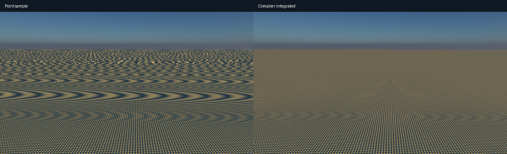
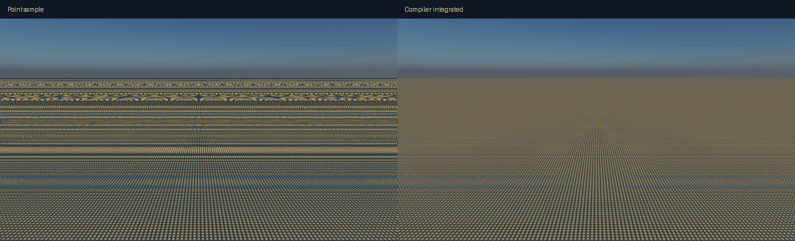
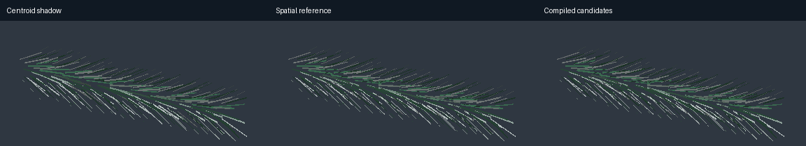
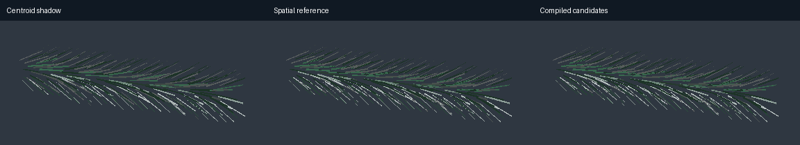

# Compiler frontiers: rendered material and deforming branch follow-up

The procedural integration experiment now produces an authorable material in the production renderer. The spatial branch experiment is correct in its tested domain, but candidate pruning alone did **not** improve GPU throughput. It remains experimental. A separate timing-readback bug found during validation is fixed.

## What changed

`packages/compiler/src/periodic-material.ts` compiles finite sums and products of integer-phase cosines into a Fourier polynomial. Products are expanded jointly, preserving sum/difference frequencies and correlated DC energy. Unsupported or excessive expressions fail compilation; the compiler does not silently remove terms to meet a cost budget.

The new `weave` material is available in the Studio pattern selector and survives document serialization and runtime conversion. Its two-color coverage is `(0.5 + 0.5 cos u)(0.5 + 0.5 cos v)`. The compiler generates a constant plus four conjugate frequency pairs. The renderer integrates these over the locally affine pixel footprint using sinc factors. World-origin phase reduction happens before float upload. The generated shader is checked against its compiler source by `build-material.ts --check`.

This integrates **albedo coverage**, with constant base roughness and no weave-generated bump. It uses the existing material x/z projection. It is not a yarn-fiber BRDF, arbitrary UV cloth, arbitrary procedural noise compiler, or an exact integration of all lighting over the pixel. Nonlinear perspective footprints remain an approximation. Existing authored materials retain their patterns; this does not replace the winter scene's materials.

## Rendered material evidence

Hardware: Apple M4 / Metal through hardware Chrome WebGPU. Image checks: 640 × 360, native resolution, spatial rendering without temporal accumulation, linear HDR readback. Three eight-frame camera paths cover resolved, grazing, and heavily minified patterns. References use 64 × 64 quadrature of the local footprint. A separate CPU reference intersects actual perspective subpixel rays with the plane, using 128 × 128 samples at 96 pixels in each of three poses; 64 × 64 checks convergence.

| Check | Result |
| --- | ---: |
| Maximum compiled image relative L2 across 24 views, versus 64² local-footprint reference | 0.0352% |
| Maximum point-sampled image relative L2 | 79.93% |
| Maximum 32² versus 64² reference difference | 2.31% |
| Maximum compiled error against independent perspective reference | 0.432% |
| Maximum independent-reference convergence difference | 0.0091% |
| Maximum error in successive-frame differences, compiled versus reference | 0.268% |
| Albedo phase difference after an integer-period billion-unit origin translation | 0 |

Fractional positive/negative origin phases are additionally checked in packing tests. The origin image test is a periodicity check, not an arbitrary translated-scene or atmosphere invariance claim. Relative L2 is an image metric, not a perceptual guarantee or a certified global error bound.





Performance uses the actual renderer at native **1920 × 1080**, three rotated mode orders, 16 warm-up and 48 measured frames per mode/trial, four-frame submission bursts. All measured frames have valid GPU timestamps. No temporal reconstruction or reduced resolution is involved.

| Mode | Trial 0 median / p95 | Trial 1 median / p95 | Trial 2 median / p95 |
| --- | ---: | ---: | ---: |
| Compiler integrated | 3.015 / 4.850 ms | 1.835 / 2.949 ms | 1.835 / 2.949 ms |
| Point sampled | 2.163 / 3.670 ms | 1.704 / 2.818 ms | 1.704 / 2.818 ms |
| 32² sampled reference | 45.318 / 46.596 ms | 45.285 / 47.383 ms | 45.351 / 48.103 ms |

The first trial is slower for the inexpensive modes; retain that variability rather than reporting only the best run. Across trials, integration is 15–25× faster than this expensive reference. In later trials it adds about 0.13 ms over the heavily aliased point sample. These are whole frames of a **single-plane fixture**, not winter-scene or future-game speedups. The reference is a validation method, not the previous shipping renderer.

## Spatial shadows under controlled deformation

The branch contains 240 finite flat needle plates. The compiler builds conservative possible-occluder lists for every position on each receiver plate, using full plate bounds and a minimum rest-space light elevation. Source geometry is keyed; changed geometry invalidates the product.

A single rest-space product supports the tested global affine shear/sway. Rays transform back into rest space; intersections retain their spatial positions. If the transformed direction exits the compiled light cone, the experiment uses all plates. This is **global affine deformation**, not nonlinear botanical bending, local articulation, alpha foliage, or multiple scattering.

An independent reference intersects the deformed, nonorthogonal world-space parallelograms using a plane intersection and Gram solve. It does not reuse the optimized local-space intersection implementation.

- 57,360 possible directed pairs reduce to 21,306 candidates: **62.9% removed**.
- The product occupies **86,188 bytes**; it is reused across poses without new tables.
- **8,192** randomized surface/light/deformation queries match independent visibility exactly, including an out-of-domain shear that triggers full-geometry fallback.
- **12** spatially rendered frames match the reference exactly in binary visibility.
- The previous centroid-shadow approximation disagrees on **12.3–16.4%** of visible branch pixels. Spatial evaluation fixes these errors; the candidate list only accelerates the selection of possible intersections.





GPU compute probe: 8,192 queries per dispatch, 16 repeats, eight alternating trials. Both modes use early exits and the same queries. Float32 GPU output matches the independent reference. Sorting queries by receiver is also tested, excluding sorting cost to favor the candidate approach.

| Query order | All plates | Compiled candidates |
| --- | ---: | ---: |
| Random | 0.172 ms | 0.180 ms |
| Grouped by receiver | 0.164 ms | 0.203 ms |

**Do not enable this candidate traversal as a production speed optimization.** Fewer nominal pairs did not mean less elapsed GPU time in either tested ordering. Variable lists, indexing and execution coherence are possible explanations, not measured attribution. This invalidates the assumption that geometric pruning alone is enough for this fixture. A future experiment should change the evaluated representation—such as a coherent whole-branch response—before expanding this traversal system. The full spatial reference remains useful for verifying that representation.

## Renderer bug discovered and fixed

The one-plane fixture has frames with no shadow draws. On this backend, the empty shadow pass left its end timestamp unwritten. Timing decoding correctly rejected the interval, but its exception bypassed `unmap()`. The pooled readback was then reused while still mapped, causing later GPU submissions to be rejected and image tests to read an old frame.

The renderer now omits the inactive shadow interval and always releases a mapped readback when decoding throws. Rejected timings count as dropped samples. Unit tests cover both failure conditions; the browser checks require complete frames, all expected timings, zero dropped timings, and independent changing-view image agreement. Pre-fix material runs are superseded and should not be cited.

## Winter control and verification

A fresh native-1080p winter run with production temporal rendering reports **6.16–6.23 ms median and 7.21–7.27 ms p95 GPU time** over three 121-frame measured trials. This agrees with the previous sustained-throughput result. It uses saturated four-frame bursts; it is not a 60 Hz presentation-latency measurement, and it does not establish a new winter-scene speedup from the weave work. Spatial controls measured 4.78 ms median / 5.83 ms p95.

Validation: 230 compiler/renderer/research/runtime tests passed; both TypeScript configurations, workspace boundaries, generated shader freshness, and targeted formatting checks passed. Material and branch hardware runs preserve their input bundles, source fingerprints and run manifests. Selected images and complete measurements are preserved in the adjacent JSON.

## Reproduce

```sh
bun tools/compiler-frontiers/build-material.ts --check
bun tools/compiler-frontiers/material-check.ts
python3 tools/compiler-frontiers/branch-spatial.py --prepare
bun tools/compiler-frontiers/branch-compile.ts
python3 tools/compiler-frontiers/branch-spatial.py
bun tools/compiler-frontiers/branch-check.ts
python3 tools/compiler-frontiers/rendered-report.py
bun tools/rendering-compiler/performance-check.ts --full --saturated --burst=4
```

Python requires NumPy and Pillow; use the bundled desktop runtime if the system Python lacks them. The previous six-option exploration is in [the original report](compiler-frontiers-2026-09-21.md).
