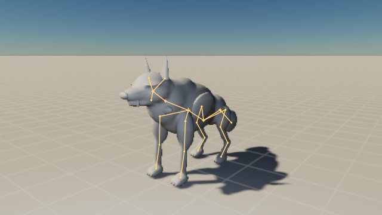
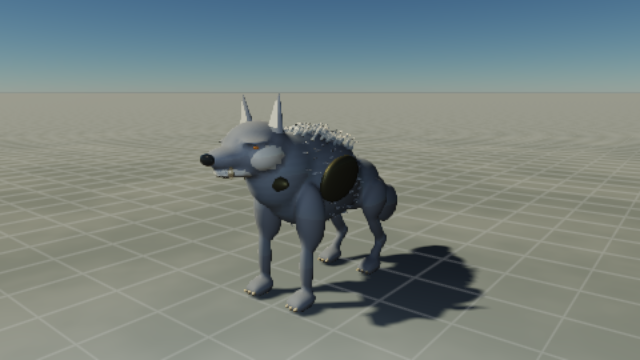

# Creature toolchain verification

21 September 2026. The implemented source/compiler/runtime/Studio loop works on two body plans. These are development fixtures, not approved AAA creatures. The [implementation map](../architecture/creature-authoring-implementation.md) describes the delivered interfaces; the [runbook](../creature-development-runbook.md) defines the art acceptance process.

## Software checks

The focused creature/groom suite passes 216 tests with 11,530 assertions across 37 files. Both TypeScript configurations and workspace boundaries pass. Tests cover source validity, exact preservation/rejection behavior, compiler dependencies and immutable cache handoff, projection ownership, cooked delivery, fixed-step replay, cloth/articulation, detail bindings, candidate jobs, picking provenance, and Studio/player encounter integration.

The final broader run, `bun test ./packages ./apps ./tools`, passes 544 tests across 99 files with 1,002,106 assertions. `bun run check` passes with 105 nonfatal lint warnings. `git diff --check` passes. Rendering regression fixtures were updated for the additional temporal instance data, previous deformation buffer, and appended water uniforms while retaining checks that the creature block preserves neighboring data and reuses its live deformation stream.

## Retained hardware evidence

Chromium hardware WebGPU reported `apple · metal-3`. Runs used a frozen source snapshot, a bounded browser lifetime, and the shared GPU lease. The [machine-readable record](creature-authoring-verification.json) retains each Studio source manifest and report. Generated browser directories also contain environment manifests, screenshots, built offline players, and console diagnostics.

| Study | Review sequence | Result | Evidence directory under `output/creature-validation-source/output/` |
| --- | --- | --- | --- |
| Ash Warden | Four matched candidate poses | All nine workflow checks passed | `browser-1790030374628-94058` |
| Reed Penitent | One matched candidate pose | All nine workflow checks passed | `browser-1790030418470-94203` |

The checks exercise opening a creature without a world; switching to clay and skeleton without changing source, camera, or pose; grounding a real rendered pixel against the displayed detail product; isolated candidate comparison; adoption and UI undo; playable encounter entry/exit and authoring-state restoration; offline cooked playback; and the exported playable encounter. Offline playback uses embedded compiled assets without source recompilation. These are functional checks, not judgments of gait, anatomy, or combat quality. The biped and wolf runs share the same frozen source snapshot; each retains its own manifest and report.

The shared renderer hardware regression also passed against the integrated temporal renderer: 19 Studio UI checks, water CPU/GPU agreement, material-origin rebasing, memory-budget rejection, instancing, all diagnostic modes, point lighting, shader diagnostics, and device-loss recovery. Its evidence is retained at `output/creature-validation-source/output/browser-1790030337966-93926/`. This protects the pre-existing Studio/player path as well as the new creature path.

## Clay before surface treatment

These 640 × 360 captures share project key `83d4143f254b1a33`, pose, camera, and lighting. Clay hides groom draw geometry and adds the rig overlay without deleting authored source. Both captures completed. Their source predates the final deterministic projection-order refinement; they document the visible form and groom-placement fixes, not a later renderer revision.

The review exposed overlapping body shells, a placeholder solid crest, coarse ears/toes, and groom roots embedded beneath the skin. The source now blends the body masses, uses tapered ear patches and a digitigrade hind chain, and projects coat roots onto the bounded, anatomically approved compiled body. Correspondence charts can remain invisible. The creature still reads as prototype art: the mane is sparse and spiky, facial forms need deliberate sculpting, and anatomy and motion need further comparative review. Materials do not close those gates.

## CPU cost

The retained benchmark measures 30 warm-up ticks followed by 120 fixed 60 Hz ticks at review/hero detail. It includes simulation and character extraction, with real foot-ground queries and an explicitly bounded flat-ground specialization for cloth and guide collision. Source was stable during the run.

| Study | Actors | Mean CPU ms | p95 CPU ms | p99 CPU ms |
| --- | ---: | ---: | ---: | ---: |
| Ash Warden | 1 | 3.00 | 3.92 | 4.54 |
| Ash Warden | 4 | 10.15 | 11.43 | 12.83 |
| Reed Penitent | 1 | 1.19 | 1.40 | 1.83 |
| Reed Penitent | 4 | 5.29 | 5.92 | 6.51 |

These values exclude rendering, shadows, upload, browser overhead, world simulation, streaming, and display pacing. The provisional 16.667 ms comparison consumes an entire 60 Hz frame. It is not a shipping frame budget or ordinary-hardware claim. Raw distributions, compilation time, resident typed-array bytes, vertex/guide counts, and source identities are in the JSON record and `output/creature-cpu-benchmark/`.

## Open acceptance gates

The optional E6 microdetail response experiment has not been promoted. Body geometric LOD, groom coverage/shadow/temporal error, full-scene hardware budgets, lower-power devices, anatomy/deformation art approval, convincing motion, and satisfying encounter play remain open. The bounded solver operates on source measurements rather than rendered silhouette or foot-slip optimization. See the [CPU experiments](creature-authoring-experiments.md) for the exact tested scopes and rejected preservation promises.

The runbook and authoring APIs are usable now. The original plan's finished-creature completion definition remains unmet until those visual, play, and performance gates have retained evidence.
