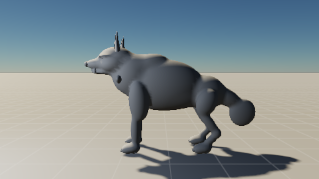
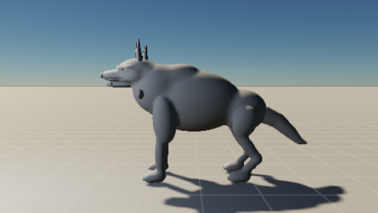
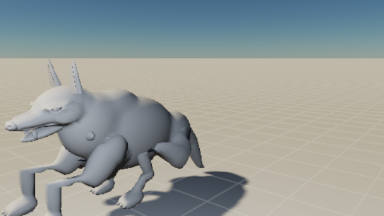
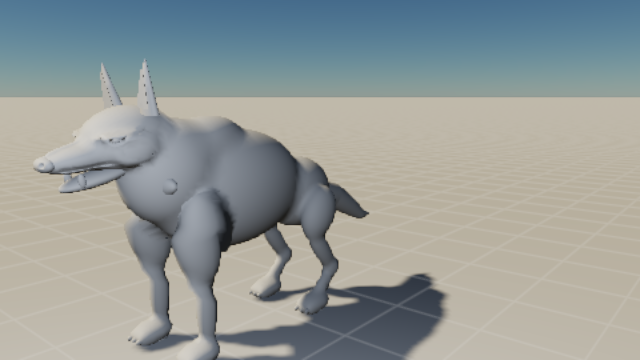
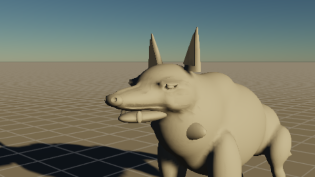

# Creature clay iteration: implementation and evidence

21 September 2026. Implemented solo. This phase gives agents a repeatable path from a visible defect to a bounded source change and retained comparison. Fields carry editable intent; the compiler spends additional samples near declared detail. The Ash Warden remains a development specimen with open art gates.

## Delivered loop

| Capability | Installed behavior | Boundary |
| --- | --- | --- |
| Local sculpt fields | Oriented ellipsoids, curve strokes, push/flatten/inflate, whole-field mirroring and explicit surface ownership | Additive displacement fields; no general topology-changing sculpt |
| Compiler sampling | Conforming local edge splits, shared midpoint reuse, material/source retention, chart tessellation targets, bounded budgets with diagnostics | Adds sculpt samples to the existing base surface; does not reconstruct lost implicit curvature or certify body LOD error |
| Visible-defect repair | Actual displayed pixel → source/region/rest point → bounded field fit → ordinary isolated candidate → compiled preview | Rest-space handles and pins; no rendered-image loss, automatic taste, or posed collision guarantee |
| Persistent review | Immutable observations, append-only assessments, source keys, evidence, intent and protected features; locked atomic CLI writes | Character edits reopen assessments; code revisions still require comparing capture manifests |
| Clay review atlas | Six anatomical views, six attack samples, three worst isolated-rig frames and three worst runtime contact frames; matched baseline/candidate HTML | Finite images, not continuous playback or automated visual acceptance |
| Whole-clip audit | Actual runtime at 60 Hz with physical root motion, world-space feet, contact residuals and conflict/unavailable diagnostics | Flat ground, maximum ten-second clips; no skin self-intersection or balance judgment |

The operation contracts and CLI examples are in [the authoring reference](../../packages/authoring/CREATURES.md). Follow [the runbook](../creature-development-runbook.md) for review order. The [retained notebook](creature-clay-notebook.json) is an actual review record, not a template.

## Changes driven by the clay study

The source revision narrows the muzzle/skull, adjusts the belly and throat, separates jaw ownership, replaces two tail masses with a curved tapered surface, and adds surface-scoped cheek, nasal, nostril, orbital and lip corrections plus eyelid sweeps. These are ordinary inspectable source controls. Cheek edits explicitly exclude eye surfaces.

Before and after the tail revision, with the same side camera and neutral clay:

The full motion sequence exposed a runtime defect absent from isolated rig review. A character-space landing target already contained the lunge's travel; placing it relative to the physically moved actor applied that travel twice. Contact placement now uses the clip reference frame while the actor continues to move. The regression samples the real runtime, checks 1.5 m root travel and the final feet relative to that root, and preserves the historical failing image.

The longer capture also exhausted the 64 MiB tracked GPU budget. Each material draw range had retained its own full current/previous deformation buffers. The renderer now shares a reference-counted stream for matching actor, mesh and binding data, advances history once per frame, and frees it after its last owner. Distinct actors remain isolated. The paired 36-capture atlas now peaks at **22.373 MiB** tracked GPU memory. This is a bounded scene memory observation, not a frame-time certification.

## Verification

The [machine-readable evidence](creature-clay-iteration.json) retains source/environment manifests, both Studio reports, the shared renderer report, cameras, diagnostics and all 145 runtime trajectory samples. Character source is `8a5c257efa0566f5`; the matched earlier character is `486a0f78cf590f2f`. Hardware runs used frozen source with fingerprint `cb9d162379220d132fec7987949f09fb6cd919f9eb36d8c141d571148369531c`, Chromium hardware WebGPU reporting `apple · metal-3`, and the shared GPU lease. No other task was contacted. A busy lease delayed one attempt; the later run acquired it normally.

| Hardware run | Result | Directory under `output/creature-validation-source/output/` |
| --- | --- | --- |
| Ash Warden Studio | Ten checks including pixel repair, compiled preview, four matched poses, adoption/undo, encounter restoration and offline cooked playback | `browser-1790032531347-2178` |
| Reed Penitent Studio | Same ten checks and four matched poses on the second body plan | `browser-1790032682851-2822` |
| Matched clay atlas | 36 complete captures, no error-level compiler diagnostics or browser console errors | `browser-1790032709698-2886` |
| Shared renderer | 19 Studio UI checks plus diagnostic rendering, memory rejection, instancing, water parity, material rebasing, point lighting and device-loss recovery | `browser-1790032732021-2953` |

The paired HTML review is `output/creature-validation-source/output/browser-1790032709698-2886/index.html`. Its images have a 640 × 360 output with 480 × 270 internal rendering under the low quality profile. They expose major form and movement defects; they are not high-resolution final-art evidence. Atlas GPU timestamp readings are not used as performance evidence.

The full CPU suite passes 557 tests across 106 files, including scoped eye protection, conforming local refinement, repair constraints/staleness, notebook persistence, actor-isolated stream lifetime and the landing regression. Both TypeScript configurations, workspace boundaries and formatting checks pass; 97 existing non-null-assertion lint warnings remain. `git diff --check` passes. The final additional scope-protection test does not change the runtime implementation captured above.

## Open gates

The face remains coarse: swollen cheek masses, irregular eyelid edges, inadequate lips and oral structure. The shoulder/chest transition does not yet explain a convincing load-bearing body. Compiler warnings still flag undersampled brows, jaw and toes, fallback influence envelopes and some omitted groom roots. Local subdivision cannot recover shape that the initial field extraction never represented.

The late landing residual is approximately 0.0000032 m while the contact is active. The **maximum whole-clip raw residual is 0.279657 m at tick 43**, during release into takeoff. That remains an explicit review item; a raw residual near a fading contact must be interpreted alongside the envelope and visible foot trajectory. Neither the regression nor the notebook claims the whole attack is accepted.

The next art pass should resolve facial planes and shoulder mechanics in clay, inspect takeoff continuously, and use explicit geometry or field-aware resampling where base extraction loses defining forms. Surface materials and groom must wait for those judgments. This phase implements the correction/review machinery and fixes demonstrated defects; it does not establish an Elden Ring-level creature.
