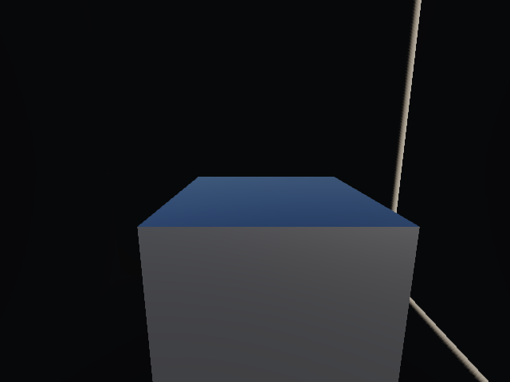

# Lighting audit and look development — 23 September 2026

**Wrela has a credible physically based shading foundation, but its lighting is not yet a complete AAA system.** Ordinary materials use real GGX reflection. Static diffuse GI works in bounded scenes, remains opt-in in the player, and fails the present world-scale quality/performance gate. Sun and local shadows work, but coverage, contact quality, indirect occlusion and reflections remain substantial gaps.

**Implementation follow-up:** [compiled lighting changes, before/after images and rollout gates](compiled-lighting-implementation-2026-09-23.md). This audit preserves the earlier baseline.

[Open the visual comparison board](lighting-audit-2026-09-23/index.html). [Measurements, source fingerprints and image provenance](lighting-audit-2026-09-23/evidence.json).

This audit adds reproducible diagnostic captures and research. It makes no production lighting changes. The live workspace contains ongoing work; findings refer to the frozen snapshots recorded in the evidence file.

## What we actually render

| Area | Present implementation | Important limit |
|---|---|---|
| Ordinary opaque materials | Metallic/roughness, height-correlated Smith GGX, Schlick Fresnel, energy sharing between diffuse and specular; filtered procedural detail | A legitimate PBR approximation, not a complete energy-preserving layered BSDF. Single-scattering GGX loses energy at high roughness. |
| Environment reflections | Eight GGX-filtered levels of the physical sky plus a split-sum integration lookup | Ordinary opaque materials reflect the sky, not nearby scene geometry. No general local specular occlusion. |
| Skin, fibers, cloth, foliage | Specialized wrap/transmission, anisotropic specular, sheen and foliage reflection/transmission budgets | These are bounded approximations; not volumetric skin diffusion or multiple-scattering hair. Anisotropic direct light still uses an isotropic sky reflection. |
| Coatings and glass | Ordered coatings, wetness, direct-light clearcoat; an environment transmission approximation for glass | Clearcoat sky reflection is added without matching base attenuation in that path. Glass is opaque and samples the environment; it does not show objects behind the glass. |
| Water | GGX/Fresnel, absorption, scattering, screen-space reflection/refraction, compiled surroundings and unresolved slope filtering | Screen-space visibility limits remain. The spectrum-water local-light loop omits the shared range/mask/shadow functions used by ordinary materials. |
| Default indirect light | Atmosphere-derived diffuse sky, approximate ground fill, some canopy visibility | No general geometry-aware world bounce or interior sky occlusion. Ambient illumination is not equivalent to scene GI. |
| Opt-in GI | Static triangle transport; one diffuse geometry bounce; nine SH coefficients; distance moments; receiver-to-probe triangle visibility; physical-sky transfer relighting | No recursive bounce, dynamic occluders, bounced point lights, emission, foliage, glass or water transport. No relocated probes or cascading volumes. |
| Sun shadows | One texel-snapped map, 3×3 comparison filtering, quality-dependent 1024/2048/4096 resolution | One coverage region, no cascades. Outside coverage is lit. Fixed filtering does not give general contact-hardening penumbrae. |
| Local shadows | Up to two cached cubemaps; six faces each; 3×3 filtering; 128/256/512 resolution by quality | Only two shadowed lights, out of four/eight/eight supported local lights. Bounded range and local-map depth limits apply. |
| Analytic sun | Exact-sphere finite-sun diffuse integration, with conservative eligibility and ordinary-map fallback | Not arbitrary terrain, foliage or buildings; not general specular area-sun integration. |
| Atmosphere/display | Physical clear-air scattering, approximate multiple scattering, clouds, aerial perspective; scene-linear HDR target and fitted filmic display curve | Physically inspired approximations and art controls coexist. Presence is not calibration. No photometric light-unit/exposure contract across the whole renderer. |

The important distinction is between **material response** and **light arriving at the material**. A correct GGX formula cannot fix a missing wall in the reflected lighting. Procedural materials can absolutely be PBR; large texture libraries are not required. Microfacet approximations themselves are standard, including their known single-scattering limitations. [PBRT microfacet theory](https://pbr-book.org/4ed/Reflection_Models/Roughness_Using_Microfacet_Theory), [Filament energy compensation](https://google.github.io/filament/main/filament.html).

Code anchors: [shared BRDF](../../packages/render-webgpu/src/brdf.wgsl), [scene light composition](../../packages/render-webgpu/src/scene.wgsl), [special material response](../../packages/render-webgpu/src/creature-material.wgsl), [glass/coatings](../../packages/render-webgpu/src/surface-appearance.wgsl), [water local lights](../../packages/render-webgpu/src/water-body.wgsl), [GI eligibility](../../packages/compiler/src/indirect-query.ts), [probe interpolation/visibility](../../packages/render-webgpu/src/indirect.wgsl), [sun map placement](../../packages/render-webgpu/src/shadows.ts), [local shadows](../../packages/render-webgpu/src/local-lighting.ts), [GI opt-in](../../apps/player/src/main.ts).

## Fresh measurements

Hardware adapter: Apple / Metal. Frozen production renderer, balanced quality. All captures completed without recorded GPU/browser errors. The Winter and local-light experiments use 32 GPU timestamps per condition in ABBA order at 640×480, excluding the first two settling frames in each group. These are short local observations, not sustained performance or other-hardware guarantees.

| Case | Result | Meaning |
|---|---|---|
| Winter environment lighting | Whole-frame median 2.621 ms, p95 3.539 ms | Current default control. |
| Winter with GI | Whole-frame median 15.335 ms, p95 18.285 ms | 5.85× the median cost; visible dark coverage boundaries. |
| Winter GI build | 3.775 seconds; 53,360 triangles; 405 excluded surfaces | Moving character, windy vegetation and water do not participate in this transport. Excluded surfaces can still receive its result. |
| Stationary local shadows | Six passes on first draw, zero on reuse, six after moving a caster | Cache and invalidation work. |
| Cached versus forced local-map rebuild | Both medians 0.721 ms in this replay | No measurable median timing win in this short trial, despite the pass-count reduction. Earlier timing wins are not universal. |
| GGX integration spot check | Maximum absolute coefficient discrepancy 0.009471 against independent 65,536-sample integration | Nine selected view/roughness cases; not a global error bound or visual approval. |
| Constant environment preservation | Maximum error 0.000488 across eight reflection levels | Prefilter normalization passes its existing tolerance. |

The newer Alpine scene was also captured freshly at native 1920×1080, with 48 frame-tagged samples per static view. GPU p95 was **21.30 / 21.17 / 21.56 ms** for near/gameplay/landscape, missing the scene's 12 ms target. CPU extraction plus submission p95 was **9.0 / 8.2 / 7.9 ms**, missing its 4 ms target. Capture completeness passed; performance acceptance did not. These are whole-scene costs, not isolated lighting costs, and must not be compared directly with Winter's lower-resolution results or Epic's console budgets.

## A new failure we can reproduce

The diagnostic puts the camera and a metal block inside a completely closed, nonemissive room under an outdoor sky. There are no interior lights. Physically, the room should receive no outdoor light through its opaque walls.

The block's central face has mean scene-linear luminance **0.060632**, both with default lighting and with GI enabled. Removing direct lighting leaves that value unchanged. Removing only the environment-reflection term reduces it to **0.000267**, a **99.56% reduction**. The remaining beauty value includes aerial perspective. This isolates unoccluded sky reflection as the dominant error on the block.

The diffuse-only diagnostic is almost black: full-frame mean luminance **9.75×10⁻⁸**. It is **not exactly leak-free**: the maximum RGB sample is 0.03528 at a rare boundary location. The earlier closed-box test therefore does not prove zero leakage for every receiver. Narrow bright seams also remain in the beauty image with reflections disabled; disabling direct illumination removes the prominent seams, consistent with the shadow map's receiver bias/filtering at wall joins. This is a thin-wall fixture; production wall thickness also needs testing.

All beauty comparisons use the same exposure. The diffuse diagnostic bypasses the beauty display transform and should be read as a diagnostic, not an exposure-matched artistic frame. Removing reflections is an ablation, not the proposed fix: a correct renderer should replace the outdoor sky with the actual blocked/local reflected environment.

## Look development: nature, finished games, and Wrela

The board preserves image proportions and provides source credits. Photographs, promotional game captures and Wrela fixtures differ in camera, weather, composition, exposure and grading. These comparisons identify visual cues; they do not measure error or rank engines by screenshots. Geometry and scene dressing contribute heavily to the gap.

**Photographed snow.** In Andreas Mischok's [Snowy Hillside](https://polyhaven.com/a/snowy_hillside), soft sky fill and local snow relief keep overlapping variations readable. Deep tree masses remain darker than open snow. Our Winter frame has useful cool shadows and a readable character, but broad surfaces look more like smoothly shaded clay, with limited local contact/bounce variation. The photographic preview is tone-mapped and the sky is cloudier, so its absolute color or contrast is not a calibration target. Snow grain, shape and material response need work alongside lighting.

**Land and air.** [NASA's Rockies photograph](https://scool.larc.nasa.gov/GLOBE/cumulus.html) shows large areas of light and shade together with distance separation. The [official RDR2 landscape](https://store.steampowered.com/app/1174180/Red_Dead_Redemption_2/) connects backlit vegetation, ground shadows and illuminated haze. Our fresh Alpine frame has real cloud volume and directional shadows, but shaded slopes and rock faces collapse into broad dark regions, contact cues are weak, and sparse stippled foliage exposes the underlying construction. Adding sky brightness would lift everything rather than explain those local differences.

**AAA atmosphere and composition.** The [official Horizon Burning Shores storm capture](https://blog.playstation.com/2023/03/29/pushing-the-envelope-achieving-next-level-clouds-in-horizon-forbidden-west-burning-shores/) uses a bright sky opening, a dark dominant mass and receding land to organize attention. Its saturated storm is an art-directed exemplar, not an instruction to make Wrela orange. Guerrilla also reports a lighting optimization that increased cloud-shadow reach while reducing cost: quality and speed can improve together when shared transport removes duplicated work.

**Materials and interiors.** The fresh family gallery makes metal, rough diffuse and glass-like responses visibly different. The glass sphere nevertheless behaves like tinted environment imagery rather than a window into the scene, and the metal cannot reflect its neighboring spheres. The sealed-room test is a more decisive acceptance check than an attractive outdoor sphere. Skin/cloth/foliage should additionally be judged on suitable thin and curved shapes: spheres alone cannot validate their specialized responses.

**Shadows.** Current shadow maps provide useful grounding and readable large forms. They do not yet deliver consistent small contact detail, arbitrary large-world coverage or source-size-dependent softness. The sealed-wall seams are an actual captured defect. Motion shimmer, moving foliage and grazing-angle acne require separate motion tests; still captures cannot certify them.

## Position relative to AAA engines

| Reference | Published capability or visual lesson | Wrela gap / lesson |
|---|---|---|
| Unreal Engine 5.8 / Lumen | Dynamic diffuse interreflection, scene reflections, sky occlusion, emissive contribution, broad scene integration | Our ordinary BRDF foundation is comparable in category; our transport coverage and robustness are much narrower. [Epic overview](https://dev.epicgames.com/documentation/en-us/unreal-engine/lumen-global-illumination-and-reflections-in-unreal-engine). |
| Unreal virtual shadows | Demand-driven cached pages, directional clipmaps and contact-hardening soft shadows | Start with near/far coverage and separate static/dynamic work; a full virtual-map system is not automatically the best browser implementation. [Epic VSM documentation](https://dev.epicgames.com/documentation/en-us/unreal-engine/virtual-shadow-maps-in-unreal-engine). |
| Snowdrop / Avatar | Scene-aware ray-traced GI/reflections, small indirect shadows, changing doors and weather | Dynamic interior transitions and local environmental response are useful acceptance targets. This does not imply unrestricted path tracing. [Massive's renderer discussion](https://www.massive.se/article/snowdrops-ray-tracing-shines-a-light-on-pandora/). |
| Frostbite | Published PBR calibration practices; GIBS caches indirect illumination on scene surfels using hardware ray tracing | Cache light where it is useful, share it over time, and treat material/exposure conventions as a system. Availability in the engine does not establish use in every shipped game. [Frostbite PBR](https://seblagarde.wordpress.com/2015/07/14/siggraph-2014-moving-frostbite-to-physically-based-rendering/), [EA GIBS](https://www.ea.com/seed/news/siggraph21-global-illumination-surfels). |
| Decima / Horizon and RAGE / RDR2 | Strong authored integration of sky, atmosphere, terrain and ambient illumination | A coherent playable valley is a better milestone than accumulating isolated feature checkboxes. Rockstar explicitly describes sharing scattering data across view, reflection and sky-irradiance systems. [Rockstar SIGGRAPH abstract](https://advances.realtimerendering.com/s2019/index.htm). |

Epic documents roughly **4/8 ms at 1080p for Lumen GI and reflections** for 60/30 fps console targets. Current 5.8 documentation also describes **Lumen Lite**: world-space irradiance probes with occlusion and a cheaper final gather; Medium uses SSR for smooth reflections. This is relevant evidence that carefully bounded probe methods remain useful. It is not an apples-to-apples benchmark against our Apple/WebGPU whole-frame timings. [Current Lumen performance guide](https://dev.epicgames.com/documentation/en-us/unreal-engine/lumen-performance-guide-for-unreal-engine).

Overall, the stronger AAA systems are substantially ahead in complete-scene lighting. The missing work is mostly transport, visibility, filtering, coverage, calibration and integration, rather than inventing a different basic specular formula.

## How the compiler can improve quality and performance together

Our opportunity is to compile **what light can do in an authored place**, not only the triangles and material code. This is an extension of established precomputed transport and runtime caching, not a claim that other engines lack compilers. Source semantics can make valid regions, material structure, openings, repetition and edit dependencies explicit.

### 1. Compile visibility on the receiving surface

Today each GI-shaded pixel can evaluate up to eight receiver-to-probe intersection queries; dense cells fall back to the full hierarchy. Instead, compile surface patches with valid probe neighborhoods, conservative clear/blocked relationships and a boundary fallback. Use source terrain/solid structure to reject probes inside matter and separate rooms, overhangs and open ground. Reserve detailed queries for genuinely unresolved boundaries and dynamic changes.

This can give tighter contact light with less repeated geometry traversal. It is not safe to replace actual visibility with an unqualified sphere or a list of sampled clear rays. Thin walls, negative/nonuniform transforms, rebasing, doors and seams are required adversarial cases. The previous cell-pruned BVH experiment made Winter slower; retain it as negative evidence. The already accepted conservative cell lists reduced scene-pass time by 32% and 52% in two small fixtures with zero measured image difference, as recorded in the [earlier implementation evidence](lighting-upgrade-2026-09-23.md). Neither result establishes the new proposal's performance.

### 2. Compile static multi-bounce response, relight it cheaply

The current nine-coefficient sky transfer is a useful start. For fixed geometry and reflectance, incident-light changes can reuse a precomputed transport operator. Compile multiple diffuse bounces for terrain, walls and stable props; retain a compact basis for broad sky light and separate high-frequency sun/aperture information. Runtime applies the current lighting coefficients instead of rediscovering all static bounce paths.

This is especially valuable for snow, pale stone and interiors. Nine SH coefficients cannot preserve a sharp sun, small doorway or mirror reflection. Sun direction currently rebuilds our field; directional bins or another representation need explicit transition/error tests. A moving door or changed material can affect indirect light beyond its immediate bounds, so invalidation must follow transport dependencies. Maintain a bounded dynamic correction and fall back where its validity is unknown. [Original PRT](https://www.microsoft.com/en-us/research/publication/precomputed-radiance-transfer-real-time-rendering-dynamic-low-frequency-lighting-environments/), [production probe extensions](https://arxiv.org/abs/2009.10796).

### 3. Give diffuse and glossy light the same surroundings

Compile local reflection/visibility products for rooms, rock formations and canopy regions; add parallax-aware scene reflection captures where they help. Rough surfaces can use cheaper low-frequency radiance; smooth hero materials need a richer representation or limited screen/world-space queries. Apply actual visibility to the specular environment, not a global ambient-darkening multiplier. Reuse source dependencies across diffuse GI, reflections and fog without pretending their angular bandwidths are identical.

The sealed-room test should pass before adding more visual shine. Local reflection captures, static transport and runtime probes can be emitted from semantic source; they need not become manually painted asset libraries. Measure build latency, resident bytes and invalidation cost as well as frame time.

### 4. Spend shadow work where its detail is visible

Compile stable terrain/architecture casters separately from moving characters and foliage; reuse static depth where projection and content remain valid. Combine blocker depths before filtering. Add a near/far realization so nearby feet, stones and leaves receive enough resolution without growing one map for the entire world. Select shadow detail in light/receiver space independently of camera detail: an off-camera tree can cast a prominent on-camera shadow.

Use analytic blockers only in certified domains. Tree wind and a changing sun invalidate different dependencies; neither is a reason to blindly rebuild all static work, nor permission to reuse stale shadows indefinitely. Contact-hardening and source-size models should follow a measured coverage improvement.

### 5. Compile smaller material programs and better unresolved appearance

The renderer already partially evaluates plain/foliage/bark paths and specializes water. Extend this only where source facts prove branches, lights or layers absent. Share expensive light products; carry slope/normal/coverage statistics as authored detail becomes subpixel. This can remove both aliasing and unnecessary work. Maintain correlated response where normal, visibility and material vary together; averages of each factor generally do not reproduce the average shaded result.

Add inexpensive GGX energy compensation and consistent coat attenuation after white-furnace tests. Unify local-light range/shadow behavior across water and solids. These improve correctness but are not automatically performance wins by themselves. The combined implementation must beat its matched quality baseline; GI-off remains a separate, cheaper baseline.

## Recommended next milestone and gates

Build **one continuously playable lighting valley**: open snow/stone, a shaded canopy, an overhang or room with a moving door, a wet rock/metal prop, the creature, a brook and a lantern. Keep material albedo and exposure fixed while diagnosing transport. Judge daylight, overcast, low sun and night, and walk between them.

1. **First:** shared sky/scene visibility, local reflection context, water light-policy consistency and contact-shadow joins. Pass the sealed-room test and a doorway transition. Preserve intended gameplay fill as an explicit art control.
2. **Then:** surface-aware GI placement/interpolation and chunked coverage. Remove visible seams while eliminating the expensive repeated queries that failed Winter.
3. **Then:** static multi-bounce relighting, dynamic correction and near/far cached shadows. Confirm whole-scene quality/cost, including editing and traversal spikes.
4. **Alongside:** material calibration, furnace checks, roughness/grazing-angle sweeps, and source-derived filtering. Validate snow/skin/foliage on representative shapes.

Proposed acceptance: exact-black/near-numerical-floor transport in a closed nonemissive room; a correct illuminated interior when its door opens; no obvious field boundaries or local-light leaks; no unstable highlights/shadows during motion; small registered reference crops of bounce, specular and contact lighting; the existing Alpine **12 ms GPU p95 / 4 ms CPU p95 at native 1080p** targets on this machine, followed by weaker hardware. The timings are targets, not achieved promises. Keep light-pass and whole-frame measurements separate and report memory, compile time, rebuild spikes, source coverage and reference error.

The useful ambition is better lighting at lower cost than a naive implementation of the same effects. Beating today's GI-off frame time while adding all of these effects is an experiment, not a conclusion of this audit.

## Reproduction and validation

- `bun tools/lighting-audit.ts` freezes source and captures the sealed/open room diagnostics.
- `bun tools/lookdev-snapshot.ts --capture=lighting` replays BRDF checks, cached local shadows and Winter GI.
- `bun tools/lookdev-snapshot.ts --capture=materials --families` captures material-family comparisons.
- `bun tools/lookdev-snapshot.ts --capture=alpine --profile=balanced` captures the integrated scene and its budgets. A nonzero exit when budgets fail does not mean image capture failed; inspect the report.

The new harness passes focused formatting and completed all seven GPU captures. The browser TypeScript target passes. The full workspace check reports three existing errors in `tools/fixtures/shoot-qualification.ts` at lines 54, 55 and 63; it reports none in the new audit files. No production files were modified for this study.
