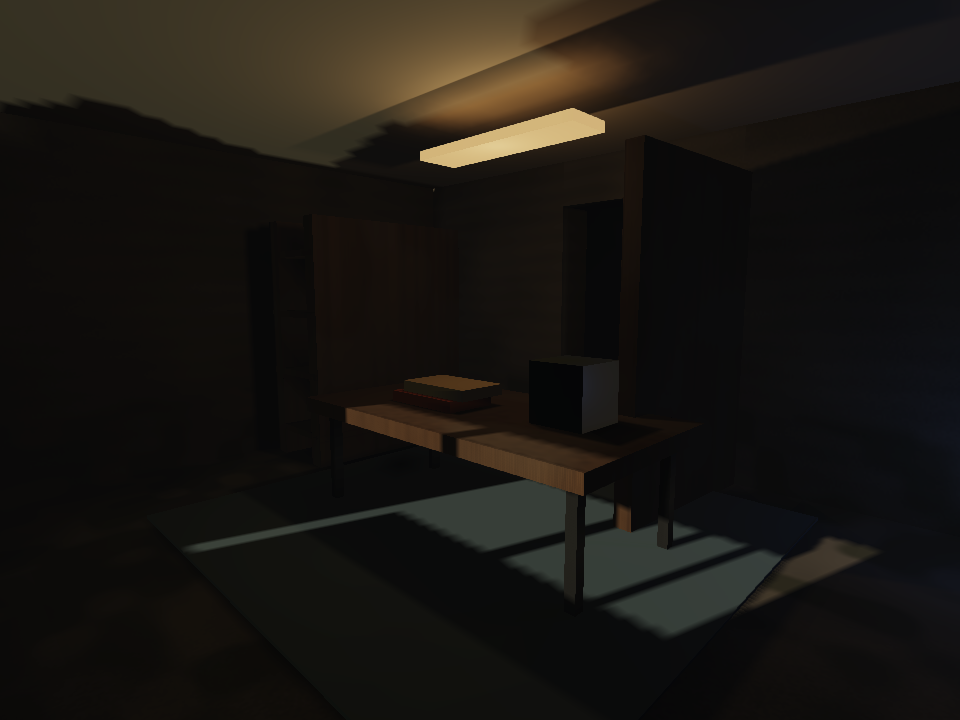
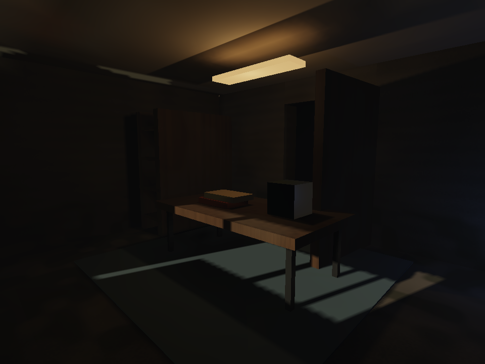

# Lighting quality goal — 23 September 2026

The user requested a sustained push to a brutally honest 10/10 default lighting system. This goal is **active and not achieved**. Feature completion and passing unit tests do not establish visual quality.

## Acceptance bar

One authored scene must work through the automatic lighting system across daylight, furnished interiors, cave darkness, night, foliage, polished/wet surfaces and moving characters/doors/lights. Representative routes must be inspected in motion. Matched offline reference renders establish transport errors; real photographs and matched shipped-game examples establish the visual target. Exposure, geometry and material differences must be disclosed rather than attributed to lighting.

Performance acceptance includes initial preparation, traversal into new geometry, moving-light shadow updates, CPU frame stalls, GPU slow frames, memory, and source edits. The current Apple Metal measurements do not establish ordinary-hardware acceptance across vendors. The target hardware matrix and fixed budgets still require measurement; no claim of universal speedup is accepted.

## Current evidence and failures

The [previous refinement checkpoint](lighting-refinement-2026-09-23.md) improved static bounce/reflection continuity and shadows. Its GPU results were mixed. Static cached-region restoration was fast, but neighboring preparation still took seconds. No matched AAA comparison or comprehensive dynamic reference validation was completed.

| Requirement | Status |
|---|---|
| Automatic path without per-environment lighting mode switches | Present; broad quality not yet accepted |
| Persistent compiled lighting after scene/browser restart | Implemented; room/Winter reload pixel-equivalence passed |
| Preparation ahead of camera movement and local edit dependencies | Neighbor prefetch implemented for unchanged resident geometry; local edit dependencies missing |
| Adaptive detail around difficult lighting features | Partial spatial sampling; no reference-driven acceptance |
| Moving doors/characters affect indirect visibility and bounce | Missing |
| Detailed local reflections with correct positional behavior | Missing |
| Stable, soft direct shadows and scalable light populations | Partial; eight-light ceiling and moving-update costs remain |
| Enclosed fog and exposure transitions | Missing |
| Finished connected visual benchmark with reference images | Connected diagnostic scene and diffuse point references added; finished art, motion and matched AAA references still missing |
| Cross-vendor ordinary-hardware acceptance | Missing |

## Work sequence

1. Make existing correct static work reusable across sessions, validate source invalidation and rendered equivalence, then prepare ahead of traversal.
2. Build the connected visual/motion benchmark and record failures explicitly.
3. Improve sample placement and receiver coverage using those failures, preserving conservative wall visibility.
4. Add bounded dynamic transport corrections; verify opening/closing doors and moving lights.
5. Improve reflection detail, shadow stability and interior atmosphere/exposure.
6. Repeat visual/reference/performance acceptance across the hardware matrix. Only mark the goal complete when the evidence supports it.

## Persistence implementation

The first implementation adds content-derived source keys, a versioned compiled product and an automatic browser IndexedDB cache. It stores compact Float64 query geometry, field coefficients and receiver bindings; restoration uses fresh runtime/GPU identities and the current source meshes. Source geometry, normal/color/material-coordinate buffers, semantic picking identities, material transport, absolute transforms, camera region and emitter positions/ranges participate in the key. Sky and light color/intensity remain runtime relighting inputs. Source buffers follow the existing immutable-buffer contract.

Writes run after the product becomes usable. The store retains at most 32 records / 128 MiB of conservative serialized accounting, with a 64 MiB per-record limit. Failure, incompatible versions and malformed records rebuild through the normal compiler. This cache is acceleration data, not authored source or a distributable cooked-world package. Sky visibility persistence, regional dependency invalidation and prefetch are not implemented by this change.

The browser check reloads the page between cold and restored furnished-room/Winter captures, requires zero radiance recompilations on each hit, and compares scene-linear image hashes as well as transfer coefficients. The [frozen browser run](lighting-goal-2026-09-23/persistence.json) passed without GPU errors: furnished room 1497 → 29 ms, Winter 3261 → 301 ms to radiance readiness. Both transfer and scene-linear image hashes matched exactly after page reload. These measurements include the radiance initial fade for cold construction but exclude world/asset preparation and independent sky-cache readiness; they are not total game startup times. Restore active CPU was 9.6 ms for the room and 96.5 ms for Winter, cooperatively spread with observed maximum slices of 2.4 and 3.2 ms. Initial persistence writes took 6.6 and 63.7 ms wall time. GPU frame cost and image quality are unchanged by persistence. One Apple Metal browser run is not general hardware acceptance.

## Neighbor preparation checkpoint

Camera translation now starts one bounded neighboring-region preparation job after moving toward an edge. Rotation and stationary views schedule none; large teleports use ordinary foreground preparation. A ready region is consumed directly, while an unfinished matching job is promoted instead of restarted. Geometry and emitter-position/range changes cancel incompatible speculative work. In-memory retention protects the active product and keeps the existing four-region / 32 MiB policy; products over 16 MiB do not speculate a second region. These accounting limits exclude temporary compiler objects.

Moving/alternate receivers are prepared cooperatively for the incoming field, using their captured absolute positions. Actual motion after that snapshot still triggers the bounded live admission path. The compiler uses feature-detected [background task scheduling](https://developer.mozilla.org/en-US/docs/Web/API/Scheduler/postTask), falling back to timers where unavailable. It keeps the two-millisecond slice target; individual operations can exceed it.

The [final resident-geometry walk](lighting-goal-2026-09-23/traversal.json) traversed 22 metres at a simulated four metres per second, rendering each animation frame. Both cold and page-restored runs consumed one prepared region with **zero boundary wait, zero foreground region rebuilds, zero incomplete draws and zero deferred receiver admissions**. The cold run compiled one neighbor; the restored run loaded both regions from storage and compiled none. Initial scene-linear and transfer hashes matched across reload.

| Measurement | Cold | Restored |
|---|---:|---:|
| Initial radiance readiness | 1184.9 ms | 195.5 ms |
| Frame interval median / p95 | 16.7 / 18.3 ms | 16.7 / 18.1 ms |
| Maximum observed frame interval | 26.5 ms | 23.1 ms |
| Lighting application median / p95 | 0.7 / 0.9 ms | 0.7 / 0.9 ms |
| Frames | 332 | 331 |

These are one Apple Metal browser run. Frame intervals are not GPU durations or a general 60-fps acceptance result. Initial readiness now includes preparing moving-receiver bindings, unlike the earlier persistence measurement. The [initial traversal experiment](lighting-goal-2026-09-23/initial-traversal.json) was 352 ms late at the boundary and retained deferred receiver work. It also synchronized GPU timings every frame; the final walk uses ordinary asynchronous rendering, so their frame-interval numbers are not directly comparable. The evidence remains retained instead of replacing the failed checkpoint.

Unchanged resident geometry is an explicit limitation. Streaming new geometry can still invalidate the whole radiance and sky products. This does not close the local dependency, dynamic occlusion or visual-reference milestones.

The checkpoint repository suite ran 1,097 tests: 1,095 passed and two failed in concurrently changing authoring/toolkit tests. All eleven focused persistence and region-preparation tests passed. The two failures were reported to the owning task; this is not recorded as an all-green repository checkpoint.

## Connected scene exposes the remaining quality gap

`tools/lighting-route-check.ts` now captures a furnished room connected to an exterior and a geological cave, with production pine geometry/materials and a moving door. Day/night and open/closed/fixed-door cases share camera/material/light settings. This is diagnostic geometry, not a finished AAA environment. The initial cave end cap had a five-centimetre gap; subsequent comparisons overlap that cap, and the fixture now forwards production render-product metadata. Do not interpret those fixture repairs as engine lighting improvements.

The [initial twelve-view run](lighting-goal-2026-09-23/route-initial.json) passed draw completeness and GPU validation but failed the visual bar: weak interior gradients, visibly jagged doorway shadows, coarse local reflections, and a moving door that does not participate in indirect visibility. At night the dynamic closed-door image had about ten times the mean HDR brightness of the fixed-door control, although both were very dark. That control isolates mobility admission; it is not a path-traced truth image.

### Lighting work can be much cheaper in a mixed environment

Every local lamp previously forced explicit needle shadow geometry for every tree, regardless of the lamp's finite support. Shoot selection now tests conservative group/shoot bounds, including world transforms and the complete wind envelope. Unbounded lights retain the previous conservative behavior. Directional shadow detail uses its existing projected-size policy outside local-light support.

The [paired renderer check](lighting-goal-2026-09-23/shadow-selection-pair.json), at 960×720 balanced/spatial on the same Apple Metal browser, measured:

| View | Before GPU median | After GPU median |
|---|---:|---:|
| Exterior | 50.53 ms | 13.24 ms |
| Furnished room | 9.31 ms | 6.55 ms |
| Closed cave | 50.66 ms | 12.19 ms |

These are whole-renderer GPU durations, not isolated lighting costs or cross-hardware guarantees. Scene-linear identity hashes and captured identity PNG hashes match exactly in all three pairs. The visible camera geometry and coverage are preserved; directional foliage shadows can differ because their existing cheaper representation is now eligible. Motion/shadow-detail acceptance remains outstanding. An earlier pair had similar exterior/room results but a 14.75 ms cave median; the spread is retained in the working output rather than treated as guaranteed performance.

### Independent diffuse references, not a feature-count score

`tools/lighting-reference-check.ts` compares receiver interpolation with 4,096- and 16,384-ray surface-point cosine integration. Both use the same representative material albedo and bounded diffuse path lengths; the reference removes spatial interpolation and the low-order angular approximation. It uses a uniform unit sky, authored point lights and emission, without direct sun, procedural texture integration, glossy transport or spectral effects. It is a controlled diffuse reference, not complete physical ground truth.

The [baseline](lighting-goal-2026-09-23/reference-baseline.json) finds valid room receivers whose first sixteen nearest probes are all occluded, while valid farther probes exist. The default receiver lookup now expands a failed short search to a bounded 64 candidates, preserving exact wall-segment tests. This improves coverage, but neither the candidate budget nor interpolation is an error certificate.

Small emitting geometry also received inadequate stochastic sampling. The compiler now derives an area/power distribution from emissive source triangles and combines it with direction sampling using multiple-importance weights. This avoids double counting and unstable close-emitter estimates. Analytic rectangular-emitter tests validate diffuse energy at near, ordinary and far distances, and an opaque blocker test rejects hidden sources. No extra runtime lighting mode or authored surrogate light is required. The persistence format version is bumped to reject obsolete products.

The [emission/reference checkpoint](lighting-goal-2026-09-23/reference-emission.json) still has substantial spatial errors: the room ceiling can miss most of the pendant's contribution despite a correct point estimator. A correct estimator at a few probes does not provide correct near-field lighting everywhere. This remains a major open issue.

Three attempted placement changes were rejected and removed from the default implementation:

- [Pure visibility-based spacing](lighting-goal-2026-09-23/reference-visibility-placement-rejected.json) spent too much of the budget on inaccessible regions, missed room receivers and badly overestimated cave sky light.
- [Broad coverage plus reserved visibility repair](lighting-goal-2026-09-23/reference-hybrid-placement-rejected.json) improved some coverage but still missed the rear wall and failed close-emitter gradients.
- [Reserved probes near emitting surfaces](lighting-goal-2026-09-23/reference-emitter-placement-rejected.json) smeared near-source brightness across distant receivers. One rear-wall emission estimate was roughly 180 times the reference. More probes near a source are unsafe without a corresponding local-support/positional model.

The default retains the previous broad spatial placement. Next work must separate sharp, nearby source transport from smooth cached bounce, while addressing dynamic occlusion. This conclusion is consistent with the need for visibility-aware spatial queries in [DDGI](https://jcgt.org/published/0008/02/01/) and selective update policies in its [production extensions](https://jcgt.org/published/0010/02/01/); those papers do not establish that this implementation meets their quality or performance results.

## Position-correct static emitter checkpoint

The compiler now separates direct emitted radiance from the shared probe transport and computes its diffuse contribution at each admitted static receiver. Source-area and cosine-direction sampling combine with multiple-importance weights; exact static geometry supplies visibility. The renderer replaces only the direct-emission part of each probe contribution before clamping, keeping the shared bounced light and existing reflection path. This is automatic. Moving receivers retain the previous probe path; moving blockers remain an unresolved limitation.

The [controlled twelve-point reference](lighting-goal-2026-09-23/reference-local-emission.json) reduced summed absolute RGB emitted-light error by 81.3% relative to the preceding probe interpolation. The open-room ceiling red channel changed from zero to 0.0824 against a 0.0771 reference; the open-room floor changed from 0.00031 to 0.01421 against 0.01636. This is not an 81% improvement in total image quality. Several bounce errors remain, and the closed-room floor and open rear-wall estimates became worse. The reference shares the bounded diffuse path estimator and representative material assumptions described above.

The first rendered prototype exposed faceting in the pendant's ceiling glow. The compiler now refines coarse receiver carriers more closely near source bounds, under the existing global vertex budget; it falls back to ordinary refinement when extra detail would exceed the limit. Authored geometry/interpolants and picking identities are preserved. The [coarse prototype](lighting-goal-2026-09-23/local-emission-coarse.json) and [refined comparison](lighting-goal-2026-09-23/local-emission-refined.json) are both retained. All three refined before/after geometry identity hashes matched exactly; no GPU validation errors occurred.

| Refined comparison, 960×720 Apple Metal | Before GPU median | After GPU median |
|---|---:|---:|
| Day room | 8.32 ms | 8.65 ms |
| Night room | 8.39 ms | 7.80 ms |
| Night cave, dynamic door closed | 11.99 ms | 11.47 ms |

These mixed frame results do not establish a general speedup. Cold day-room preparation increased from 5.76 to 11.84 seconds in the browser pair, and the night material-emission edit rebuilt in 15.47 seconds versus 4.02 seconds. Reported product memory rose from 20.79 to 31.66 MB and receiver vertices from 55,006 to 61,134. This cold/edit cost is not accepted as the final performance target. Persistent storage and exact carrier reuse avoid repeating local-emission queries for compatible products; the latter is independently tested against fresh compilation. A single opaque triangle can skip all emitter queries only when its convex shadow volume contains the entire source bounds; partial source visibility never takes that shortcut. Additional cooperative yields were added after this capture to split refinement/enclosure work more finely, but a new browser slice measurement is still required.

The captured cave still excludes the moving door from indirect visibility. The local emitter improvement therefore changes an already incorrect dynamic-door image; that is a known failure, not evidence of improved cave lighting. Dynamic visibility/transport is the next correctness milestone.

The pre-refinement repository checkpoint passed **1,111 tests, zero failures**. After refinement, exact carrier reuse and finer cooperative yields, **29 focused tests / 378 assertions**, TypeScript and browser TypeScript passed. Persistence format version 6 invalidates obsolete emitter/receiver products. The goal remains active and unachieved.

The [updated persistence check](lighting-goal-2026-09-23/local-emission-persistence.json) passed with exactly matching HDR images and transfer hashes across reloads. Furnished-room readiness was 1,139→44 ms; Winter was 2,780→174 ms. Both restored without compilation. Cold preparation maximum observed slices were 4.4 and 4.7 ms, respectively; restored maxima were 2.5 and 3.8 ms. Those scenes are different from the larger connected room/cave benchmark, so these figures do not erase its cold-preparation regression.

A subsequent [ray-query implementation comparison](lighting-goal-2026-09-23/scalar-ray-query.json) removed temporary per-triangle vector allocations. All 50,000 queries returned identical complete hit records. Six alternating-order trials measured 48.5–53.1 ms before and 38.6–42.4 ms after. This is a compiler-kernel measurement, not yet a whole-preparation or GPU speedup.

The earlier [shader early-rejection pair](lighting-goal-2026-09-23/early-rejection-pair.json) independently preserved every HDR beauty/identity value in all three views. Exterior and cave GPU medians improved (13.43→12.32 and 12.71→11.01 ms), while the room changed from 6.42 to 7.01 ms. This optimization rejects wrong-pass shoot instances before deformation/radiance work; its mixed measurements are recorded separately from the lighting-quality changes.

## Selective moving-door transport experiment

This is compiler research, **not enabled runtime dynamic GI**. A transient small BVH for a rigid moving door shares the static world's BVH. Layered ray/visibility queries match rebuilt geometry; transient layered products are explicitly rejected by the static persistence writer. Stable emitter distributions are shared when added geometry is nonemissive.

The first [per-probe dependency experiment](lighting-goal-2026-09-23/dynamic-probe-experiment.json) recorded traced segments and retested probes whose paths intersected the old/new door bounds. Five pose changes dirtied 18–19 of 192 probes. All transfer, sky-visibility and direct-emission arrays matched full recomputation exactly, but updates took 19–28 ms of synchronous CPU work plus dependency queries—too much to simply put on the rendering thread.

The next [per-path experiment](lighting-goal-2026-09-23/dynamic-path-experiment.json) reduced retracing to 386–443 of 12,288 deterministic paths, retaining raw input-space contributions rather than a 9×27 matrix per path. The [sparse refinement](lighting-goal-2026-09-23/dynamic-sparse-path-experiment.json) retained exact equality after every opening/closing pose while reducing raw contribution storage from 10.9 to 1.46 MB; recorded segment storage is another 2.85 MB. These figures exclude JavaScript object/array overhead. Warm updates took 9.1–10.2 ms, dependency queries 0.42–0.65 ms, and small-query construction about 0.2 ms (one 0.57 ms outlier). The first changed pose took 13.1 ms plus 1.87 ms dependency work. Initial recording took 144 ms. These are synchronous CPU prototype timings, not game frame times or broad-hardware acceptance.

Reprojection rebuilds affected probes in the original deterministic path order. It does not accumulate subtract/add drift. The [static parity check](lighting-goal-2026-09-23/dynamic-refactor-parity.json) confirmed identical full transport, sky and direct-emission coefficients for 64 samples against the frozen pre-refactor estimator, plus identical complete hits for 50,000 geometric queries. Sparse replay, isolated-path retracing, unchanged emitter reuse and added-emitter invalidation are also unit-tested.

This does **not** update static receiver mixture visibility or the receiver-local emission term when the door moves. It also lacks runtime scheduling, moving-emitter invalidation, skinned/deforming blockers, streaming dependencies and motion-rendered acceptance. Enabling only the probe portion would leave incorrect light leaks. Complete those coupled dependencies and measure the full pipeline before enabling dynamic transport in the automatic renderer.

The final checkpoint after the ray-query/path refactors passed **1,115 tests, zero failures**, both TypeScript configurations, and workspace boundaries. The measured host is an **Apple M4 with eight GPU cores and 16 GB RAM**, confirmed locally without retaining device identifiers. Cross-vendor acceptance and a full-resolution performance bar remain open; the paired scene measurements above use 960×720 spatial antialiasing.

The first [1920×1080 temporal-antialiasing checkpoint](lighting-goal-2026-09-23/full-hd-temporal.json) completed without GPU errors. Whole-renderer GPU medians were 14.35 ms exterior, 12.39 ms room and 17.24 ms cave; p95 values were 14.81, 12.91 and 17.63 ms. These are stationary diagnostic views with fog/clouds disabled, not a full-game or motion acceptance test. The cave already exceeds a 16.67 ms GPU budget without additional gameplay rendering, so 1080p/60 acceptance is not achieved.

## Deep-path energy correction and compact receiver data

An independent analytic enclosure test exposed a larger physical bias than the earlier same-estimator references could detect. A closed diffuse enclosure with uniform emission has steady-state radiance `Le / (1 - albedo)`. The [old bounded tracer](lighting-goal-2026-09-23/energy-cutoff-baseline.json) lost 15.7%, 48.7% and 80.9% at albedos 0.4, 0.7 and 0.9, respectively, with 16,384 reference samples. This was not a probe-interpolation error.

The compiler now follows deeper paths, samples emitters at every scattering event, counts emission at the terminal hit, and uses compensated Russian roulette after six scattering events. A 128-scatter guard bounds pathological paths. Independent deterministic dimensions separate continuation, source and termination decisions. This follows the estimator principles described in [PBRT's path tracer](https://pbr-book.org/4ed/Light_Transport_I_Surface_Reflection/A_Better_Path_Tracer); that source does not validate our implementation.

The [convergence run](lighting-goal-2026-09-23/energy-deep-convergence.json) is within 0.6% of analytic energy in all four enclosures at 65,536 samples. At the production 64-sample count the 0.9-albedo case is 18.7% high: convergence does not establish low-sample visual quality. A channel-wise analytic regression covers two receiver positions and three normal directions, including different RGB reflectances. The controlled point reference still shares representative albedo and this path estimator, so it remains narrower than an independent full-render physical reference.

The [rendered transport pair](lighting-goal-2026-09-23/deep-transport-pair.json) keeps exact camera identity and reports no GPU errors. Whole-frame medians changed 9.63→9.83 ms in the day room, 8.91→9.57 ms in the night room and 12.91→10.75 ms in the night cave. No runtime speedup is claimed: the shader representation is unchanged. Cold day-room readiness changed 11.83→11.89 seconds; active preparation changed 9.70→9.80 seconds. The day room gained bounced light but exposed conspicuous patchy ceiling interpolation. This is a failed visual acceptance result despite the improved physical estimator.

The [new point references](lighting-goal-2026-09-23/deep-transport-reference.json) expose significant spatial errors, including excessive local-light bounce deep in the open cave. Moving-door occlusion is still absent from the default runtime. The [deeper-path moving-door prototype](lighting-goal-2026-09-23/deep-dynamic-path.json) retains exact selective-versus-full transport across all poses, but warm selective CPU time rose to 32–38 ms, with 47 ms on the first update. Dependency storage rose to 5.65 MB before JavaScript overhead. It is not acceptable as synchronous per-frame work and is not enabled.

Static direct-emission data is now one vec4 per receiver, with shared per-probe direct SH and a separately relit diffuse buffer. Previously every receiver repeated four probes' evaluated direct irradiance. This removes repeated compiler evaluation/storage and four per-vertex shader reads while keeping the same nine-term diffuse gather for moving receivers. Persistence version 8 rejects old layouts and old path transport.

The [compact-data comparison](lighting-goal-2026-09-23/compact-emission-pair.json) reduces this connected scene's reported compiled product from 31.66 to 25.37 MB. Camera identity is exact, no GPU errors occurred, and beauty differences are limited to 22–42 HDR channel values out of over two million, with normalized L1 below 1e-8. Frame timings are mixed (day room 9.44→13.50 ms, night room 9.57→8.78 ms, cave 12.78→12.26 ms); this is an accepted memory reduction, not a demonstrated general rendering speedup. Cold/edit preparation remains around 10–12 seconds and is unresolved.

### Spatial correction experiments

Doubling the existing broad probe placement to 384 is **rejected as the default fix**. The [controlled comparison](lighting-goal-2026-09-23/dense-probes-rejected.json) reduces the sum of absolute RGB error across twelve points for local-light bounce (0.1561→0.1287) and emitted light (0.0867→0.0619), but increases sky error (0.2418→0.3048). Some surfaces improve while others borrow the wrong transport or lose their valid coverage. More samples alone do not fix the representation.

A [surface-quadrature experiment](lighting-goal-2026-09-23/surface-quadrature-experiment.json) integrates diffuse transport at the receiving position and normal, avoiding spatial and output-angular interpolation. The fixed normal reduces its output from nine SH coefficients to one 27-input RGB transfer. At 64 samples, summed absolute RGB errors are 0.0509 sky, 0.0597 local bounce and 0.0249 emission in these twelve points. At 256, local bounce improves to 0.0169, but other channels are not monotonically better. Low-sample variance remains substantial: one cave-middle local-bounce estimate is still over twelve times the reference.

This is **not enabled surface-cache rendering**. The experiment establishes that targeted surface transport is promising, but it does not validate an interpolation lattice, texture/vertex payload, preparation cost, moving blockers, or motion quality. It is neither a finished lightmap system nor evidence of 10/10 lighting. The next useful experiment is a bounded surface cache with explicit geometry ownership, interpolation measured between samples, and a rendered comparison against the current probe system. The existing probe path remains the fallback for geometry that the cache cannot represent accurately.

## Emissive brightness edits reuse transport

Runtime preparation now normalizes the relative intensities of static emissive sources and applies their common amplitude as a separate GPU gain. Uniform positive scaling preserves the normalized basis; an all-off edit keeps the preceding basis and uses zero gain. Initially dormant emitters prepare a unit basis. Relative source-strength changes, source-color changes and geometry changes still invalidate the appropriate source product. Moving emitters remain outside static transport. Authored emission/material values are preserved; only compiler snapshots are normalized.

A gain edit updates four bytes and invalidates the relighting compute result, preserving all geometry/receiver buffers. Direct emission, emitted bounce and reflections share the gain. Persistence version 9 validates this runtime input. CPU tests cover two differently colored sources, proportional dimming, off/on transitions, initially dormant sources, and invalidation for a relative-strength or color change.

The [positive-gain rendered pair](lighting-goal-2026-09-23/emission-gain-pair.json) has exactly identical HDR beauty and geometry identity in all three views. Two brightness edits changed readiness from 10.67/10.69 seconds to 0.5/0.5 ms, with one total radiance build instead of three. GPU frame measurements were mixed and do not establish a frame-cost reduction.

The [off-inclusive follow-up](lighting-goal-2026-09-23/emission-gain-off-pair.json) likewise performs all brightness edits with one build. The off transition takes 0.4 ms versus 4.02 seconds before. Its HDR image is **not identical** to the old off path: normalized L1 is 2.26%. The new path retains the previously refined receiver carrier, whereas the old path rebuilt with no emitting-source refinement. Geometry identity is exact, but the retained carrier exposes the existing jagged diffuse interpolation on the ceiling. That visible defect is retained in the before/after captures and is still a quality failure.

The [updated persistence run](lighting-goal-2026-09-23/emission-gain-persistence.json) preserves exact transfer and HDR image hashes across page reload, with zero restored recompilations. Restored readiness is 34.4 ms for the furnished room and 187.7 ms for Winter. These are two scenes on the current M4 host, not cross-vendor startup acceptance.

The first [triangle-owned surface lattice experiment](lighting-goal-2026-09-23/surface-lattice-experiment.json) tests interpolation, not just samples at the measurement points. One-metre triangular lattices use 64 cosine-weighted paths per node and replace only direct emitted light with the existing receiver-local result. Summed absolute RGB errors across the twelve reference points are 0.0637 sky, 0.0201 local-light bounce and 0.0925 emission. Sky and point-light transport improve substantially over the default probe interpolation, but emitted-light error is slightly worse (default 0.0867). In particular, coarse ceiling interpolation spreads too much bounced emission from nearer the pendant. The prototype remains disabled; a surface cache needs feature-aware refinement and stable sampling, not merely different storage. Its barycentric interpolation and direct-emission separation have independent geometry/analytic tests.

## External engine comparison: measured budgets, not a score

Epic's current [Lumen performance guide](https://dev.epicgames.com/documentation/en-us/unreal-engine/lumen-performance-guide-for-unreal-engine), checked 23 September 2026, describes 4 ms and 8 ms budgets at 1080p for its 60/30-fps console targets. Those budgets cover GI, reflections and associated translucent/fog lighting, not the complete renderer. It also documents a lower-cost irradiance-field path, coarse rough reflections versus dedicated rays for smoother surfaces, and bounded cache updates. These are relevant design precedents for specialization and reuse, not evidence that our current implementation matches Lumen. Our whole-frame M4 measurements cannot be ranked against those console subsystem budgets.

Epic also documents [noise limits from small bright emissive surfaces](https://dev.epicgames.com/documentation/unreal-engine/lumen-global-illumination-and-reflections-in-unreal-engine). Unity's [Adaptive Probe Volume documentation](https://docs.unity.com/en-us/engine/6000.0/manual/lighting-overview/lighting/probevolumes/concept) describes automatic geometry-dependent placement, per-pixel interpolation and streaming, but acknowledges that placement may not align with walls or lighting boundaries. These do not excuse our current leaks or patching; they identify the error cases a production system must explicitly handle.

A matched real-world/Cornell image comparison, a matched shipped-game scene and a full physical render reference remain missing. Documentation and selected screenshots are not a visual parity test. Our current ceiling artifacts, static-only occlusion and rough low-frequency reflections are sufficient to reject a 10/10 claim regardless of feature count.

The repository checkpoint after deep transport, compact receiver data, runtime emission gain and the research surface-lattice helper passed **1,121 tests, zero failures, 1,647,457 assertions across 241 files**. Both TypeScript configurations and workspace dependency boundaries passed. The surface lattice remains research-only; the checks do not close the rendered interpolation, dynamic visibility, reflection, motion or hardware acceptance gaps.

The [finer lattice experiment](lighting-goal-2026-09-23/surface-lattice-refined-experiment.json), at 0.5-metre spacing and 256 paths per node, reduces summed sky error to 0.0451, local-light bounce to 0.00846 and emitted light to 0.0655. It spends about 24.6 seconds preparing the selected triangle patches across both door poses, excluding the existing default compilation and reference integration. The ceiling still overestimates emitted bounce. This cannot simply become the default at that preparation cost.

A useful bounded next candidate is to apply triangle-owned surface transfer first to sky and point-light diffuse transport on coarse rigid receivers, retaining the existing receiver-local emission and probe-emission bounce. That isolates the two channels with the strongest improvement while emission refinement is investigated independently. Admission must preserve the source triangle, side and authored normal; arbitrary neighboring geometry cannot share a chart. The intended GPU result is relit once per surface-cache sample and gathered through compiled barycentric weights, removing repeated nine-term angular evaluation from admitted static vertices. This proposal is not yet implemented in the default renderer and has no measured GPU benefit.

The [reflection-disabled render](lighting-goal-2026-09-23/reflection-ablation-route.json) retains the ceiling's jagged bright boundary. Reflections are therefore not the cause of that particular defect; improving reflections alone cannot fix it. The [indirect-only diagnostic](lighting-goal-2026-09-23/indirect-only-route.json) is also retained. Its PNG uses the engine's raw diagnostic display rather than the beauty view's exposure/tone mapping, so its apparent brightness must not be compared directly with the beauty PNG. The diffuse surface-cache investigation remains justified; local glossy reflections are a separate unresolved requirement.

## Certified surface-cache renderer trial

The [guarded lattice experiment](lighting-goal-2026-09-23/surface-lattice-guarded-experiment.json) adds conservative whole-cell visibility tests. A wall can intersect one original floor triangle, so triangle ownership alone does not prove safe interpolation. Uncertain or occluded cells are rejected. All twelve selected reference locations remain admitted, preserving their preceding error values, while only 25–66% of cells in their containing patches pass. A dedicated partition regression verifies rejection across an intersecting wall. This is useful coverage evidence, not a whole-scene visual result.

A bounded native renderer trial is in progress. It prioritizes coarse rigid constant-normal triangles, aligns the sample lattice with their refined receiver mesh, and rejects vertices incident to any uncertified carrier cell. Up to 2,048 samples store fixed-normal sky/local-light transport. Existing reflected light and position-correct emitted-light terms remain separate. The relighting pass resolves each sample once; admitted vertices gather three values instead of repeating four nine-term SH evaluations. The trial uses the automatic path and introduces no authored lighting switch. Persistence version 10 describes the trial layout.

The first browser attempt was rejected by the old vertex-stream bounds check before rendering the new payload. That check now distinguishes ordinary probe pairs from compact surface-record IDs, with malformed-ID regression tests. The subsequent rendered comparison is pending; this implementation is **not yet visually or performance accepted**.

The [first successful native comparison](lighting-goal-2026-09-23/native-surface-pair.json) preserves exact geometry identity and reports no GPU errors. It admits 5,108 receiver vertices with 2,041 samples and adds 1.18 MB to the compiled product (25.37→26.55 MB). The large jagged bright ceiling boundary is removed in the day-room capture, while smaller wall-adjacent seams remain. Day-room HDR normalized L1 changes by 16.29%; this is an image difference, not an error reduction. The night-room difference is 1.78%, and the cave 0.66%. Cold readiness increases from 12.12 to 14.10 seconds. GPU medians are mixed and worse in both room views in that first run.

The compiler now preserves the constant-geometric-normal proof through receiver refinement. The renderer can then omit the hidden-side diffuse gather and use its existing compiled reflection specialization. A [separate comparison](lighting-goal-2026-09-23/native-flat-proof-pair.json) has exactly identical HDR beauty and identity values in all three views; GPU timings remain mixed. No general speedup is established by this proof-preserving change.

Visibility certification now runs before surface tracing. Nodes referenced only by rejected cells perform no path tracing; an entirely partitioned test patch traces zero paths. A [longer, reversed-order run](lighting-goal-2026-09-23/native-surface-steady-reverse.json) uses 120 warmup and 120 measured frames per view. Against the original probe-only renderer, GPU medians are 11.14→11.21 ms (day room), 10.88→9.44 ms (night room), and 12.06→12.71 ms (night cave). Cold readiness is 12.02→13.51 seconds. The final HDR differences are identical to the first native comparison. This supports a partial visible correction, but **does not establish simultaneous general frame-time and preparation improvements**. Full-HD, persistence, motion, new geometry and broader hardware acceptance remain necessary.

The native-cache checkpoint passes **1,124 tests, zero failures, 1,631,046 assertions across 242 files**, plus both TypeScript configurations and dependency boundaries. The [persistence comparison](lighting-goal-2026-09-23/native-surface-persistence.json) restores exact HDR images and probe-transfer hashes with no recompilations: furnished room 45.7 ms and Winter 175.3 ms. CPU persistence tests additionally compare the full surface payload.

The [1920×1080 temporal comparison](lighting-goal-2026-09-23/native-surface-hd.json), with 120 warmup and 120 measured frames per view, keeps exact geometry identity and has no GPU errors. Whole-frame medians after the surface change are 15.14 ms exterior, 12.58 ms room and 17.17 ms cave. The room is unchanged from 12.58 ms and cave is close to its 17.10 ms baseline; the cave remains over the 16.67 ms target before full game costs. Changing camera regions also exposes a preparation regression: 4.07→5.87 seconds for the room view. Surface transport reuse is therefore necessary before calling the compilation path efficient.

The next implementation retains each accepted lattice's immutable geometry certificate and direct-emission separation alongside its compact transport. Neighboring regions reuse matching patches only under the compiler's existing identical-geometry and identical-light-position/range certificate. Refined receiver carriers are also reused. Certificates survive persistence; malformed patch offsets/layouts are rejected before use. Focused tests show reused surface fields exactly match fresh compilation and that restored products can supply reuse. A rendered timing comparison is pending.

The [reuse comparison](lighting-goal-2026-09-23/native-surface-reuse-pair.json) preserves every HDR beauty and identity channel in exterior, room and cave views. Room-region readiness improves 5.87→5.20 seconds; active compilation improves 5.79→5.13 seconds. The new region reuses 749 of 2,041 surface samples and 90,096 receiver emission terms. Surface rays decrease 1,220,761→767,249. Initial readiness remains about 13.5 seconds. GPU medians remain mixed; this is a preparation improvement, not a frame-time speedup.

Region retention now counts actual shared immutable query geometry, refined receiver streams and patch certificate arrays once. Equal-but-independent objects are counted separately. The 32 MiB retained-product target and four-region limit remain. Prefetch admission uses a shared-resource size estimate rather than rejecting every single product above 16 MiB; completed products still pass actual unique retained-size eviction. This is a retained compiler-data estimate, **not total JavaScript heap or peak allocation accounting**. Targeted tests cover sharing, independent copies, return traversal and cancelled/stale preparation. A new connected outdoor→room→cave walk measures whether the larger scene can actually prepare ahead fast enough.

The [first connected walk](lighting-goal-2026-09-23/connected-traversal-stale-failure.json) **fails lighting-readiness acceptance**. Both cold and restored runs travel 25.15 m in about 6.3 seconds with no geometry-incomplete frames, but neither switches to the requested next lighting field before the walk ends. The cold run starts one foreground build without prefetch; the restored run starts prefetch but does not complete it in time. Thus smooth frame intervals (about 16.6 ms median) and geometry completeness concealed stale lighting. The harness now explicitly counts frames/time spent waiting for the requested region and reports whether it remains pending at the end. No successful lighting traversal is claimed for this scene.

This also exposed inconsistent numeric-memory estimates: cold query geometry omitted the optional emission lane while restored geometry counted it, and restored order storage was counted as Uint32 despite restoration to JavaScript numbers. Both now reserve 24 numeric triangle lanes and eight-byte order entries consistently. Persistence version 11 invalidates older accounting. The estimate still excludes object/array overhead and is not a heap measurement. The changed reported byte values are an accounting correction, not new rendering allocations.

An exact spatial index for receiver-probe selection is being evaluated next. It preserves the original 24 m support, source-order distance ties, nearest-16 search and nearest-64 retry after complete occlusion. Tests compare nearest sets over radius edges/ties and final visibility-filtered mixtures on both sides of walls. A source-frozen kernel comparison will determine whether this actually reduces the remaining preparation cost.

The [receiver-index kernel run](lighting-goal-2026-09-23/receiver-index-kernel.json) compares 24,454 receiver queries from the connected scene. Every final eight-value mixture is exactly equal to exhaustive search. Six alternating-order rounds measure exhaustive 976.6–983.6 ms (981.6 ms median), indexed 923.6–929.6 ms (925.2 ms median): a **5.7% kernel improvement**. This is smaller than hoped and is not a whole-frame or whole-preparation result. Visibility queries remain in this kernel; avoiding the full distance scan alone does not solve the region-readiness failure.

The [index-only rendered comparison](lighting-goal-2026-09-23/receiver-index-rendered-pair.json) preserves every beauty and identity channel. Room-region readiness improves 5.26→4.84 seconds; cold exterior readiness is 13.51→13.37 seconds. GPU timings remain mixed. The broader checkpoint before the subsequent witness optimization passes **1,127 tests, zero failures, 1,536,336 assertions across 244 files**.

The next optimization retains one previously blocking triangle per probe and retests it for each new receiver ray. Only a newly verified intersection may reject visibility; misses visit the full BVH, and clear results are never cached. A reusable traversal stack avoids per-query stack allocation. The first attempt is [retained as a failure](lighting-goal-2026-09-23/receiver-witness-rejected.log): query 2,720 disagreed with the exhaustive baseline because triangle barycentric tolerance bypassed the original BVH leaf bounds. The corrected implementation retests that leaf box as well as the triangle. Regression tests include rays just outside exact leaf boundaries, segment endpoints, changed receiver sides and 10,000 varying static queries.

The [corrected coherent-query kernel](lighting-goal-2026-09-23/receiver-witness-kernel.json) matches **all 24,454 complete receiver mixtures exactly**. Six alternating-order trials measure exhaustive 966.8–981.6 ms (971.9 median) and indexed/coherent 509.8–529.0 ms (514.6 median), a 47.1% reduction in this kernel. Of 656,203 visibility queries per indexed trial, 443,046 return through a freshly retested blocker. This is not yet a whole-preparation or rendered performance claim.

The [coherent-query rendered comparison](lighting-goal-2026-09-23/receiver-witness-rendered-pair.json), against the index-only baseline, preserves every HDR beauty and geometry-identity channel in all three views with zero GPU errors. Cold readiness improves **13.75→10.25 seconds**; room-region readiness improves **4.98→3.06 seconds**. GPU medians are mixed, so this establishes a preparation improvement, not a frame-time claim. The five focused compiler/persistence/runtime suites pass 26 tests and 11,786 assertions. Connected traversal still needs revalidation and may remain limited by the retained-memory budget.

The [connected walk after the coherent query](lighting-goal-2026-09-23/receiver-witness-traversal-failure.json) still **fails lighting readiness**. Cold traversal has 212 stale-region frames (3.534 seconds); restored traversal has 34 (0.567 seconds). Both end with another region pending. Only one 28.54 MB product remains resident, and neither run prefetches because the retained-size forecast exceeds the 32 MiB target. The cold run does complete one region transition at 19.04 m, improving on the preceding no-transition run but remaining visibly late. Initial restored HDR and transfer hashes are exact. The harness incorrectly treated a new region compiled during the walk as an initial reload recompile; its validation now records and checks startup build/storage counters separately. That harness repair does not change the failed traversal result.

## Analytic polygon emission: better reference, rejected default cost

A bounded CPU experiment clips an emitting polygon to the receiver hemisphere and subtracts opaque triangle shadow volumes before integrating its projected solid angle. The cosine polygon boundary integral is established in the [polygon-light literature](https://eheitzresearch.wordpress.com/415-2/); this experiment implements diffuse integration, not an LTC specular renderer. Singular geometry or exhausted triangle/polygon budgets return uncertainty and retain sampling. Analytic rectangular view factors independently test near/far energy, complete/partial/overlapping shadows, blockers beyond the source, horizon clipping and large-world translation.

The [first scene experiment](lighting-goal-2026-09-23/polygon-emission-rejected.json) admits 1,332 of 1,555 sampled receiver queries, but takes 280.6 ms median versus 73.9 ms for existing sampling. Reusing the existing whole-source hemisphere/occlusion rejection [reduces that to 231.0 ms](lighting-goal-2026-09-23/polygon-emission-culled-rejected.json), still **3.11 times the sampled cost**. Across 43 admitted nonzero points, summed RGB error against the 4,096-sample estimator decreases from 0.02340 to 0.00141. That estimator is finite and shares the existing visibility conventions; these numbers are not complete physical ground truth. The algorithm remains a research/reference helper and is **rejected as the default renderer path** at this cost.
