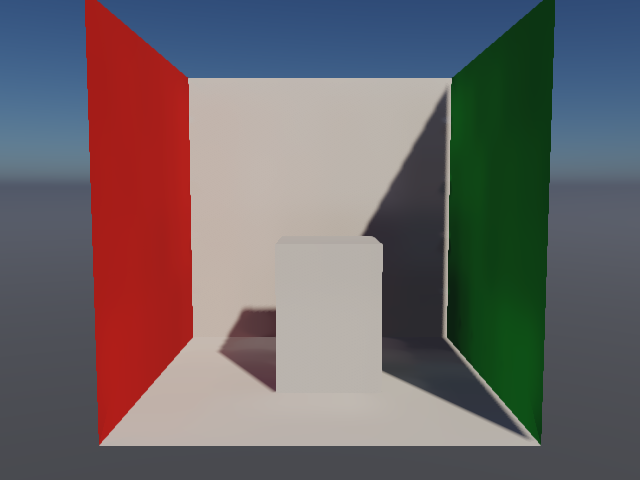
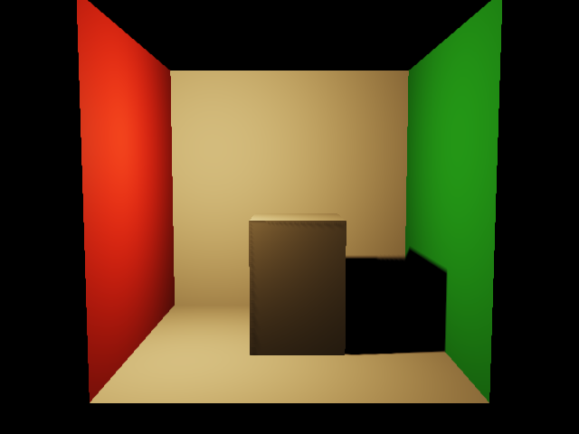
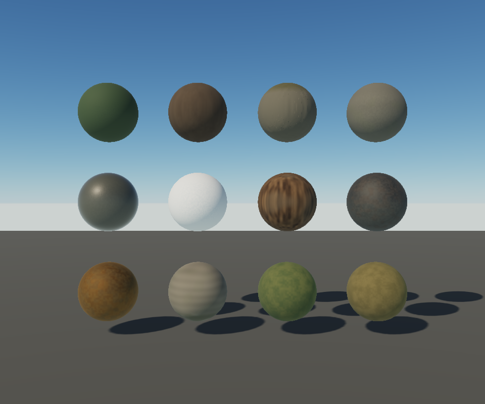

# Lighting implementation — September 23, 2026

Implemented GGX environment reflections, atmosphere-driven static diffuse transport, conservative compiled GI blocker lists, finite local-light influence, and cached point-light shadows. **World GI remains opt-in** because Winter failed the performance and coverage gates. These changes do not establish full GI or physically complete material models everywhere.

## Default rendering changes

- The old five-direction rough-sky approximation is replaced by eight GGX-prefiltered mip levels and a height-correlated Smith split-sum BRDF lookup. The reflection source is the same sun-free physical sky as diffuse lighting; direct sunlight remains separate. The source updates with the sky dependency cache, while the BRDF lookup builds once. Together they own 382,288 bytes (0.365 MiB). Ordinary opaque shading couples reflected and diffuse energy. Water uses the same environment integration. This is single-scattering GGX environment lighting, not traced scene reflections or multiple-scattering compensation.
- Point lights can author `range` and `shadows`. Finite range has smooth compact support; the renderer compiles conservative surface/light masks and skips provably irrelevant lights. Legacy lights without a range preserve their attenuation. This preserves the existing softened inverse-square light model rather than introducing photometric units.
- Up to two influential local lights receive six-face depth maps, with 3×3 comparison filtering. Stationary maps persist across frames. Source geometry, transforms, skin, deformation, wind, coverage, and origin changes invalidate them; intensity and color edits reuse depth. Low/balanced/high resolutions are 128/256/512 per face. Two balanced maps occupy 3 MiB plus frame/matrix buffers. Maps remain allocated when no local light is active, but submit no shadow passes.
- Winter lanterns have a 14 metre range. Their decorative emitter shell is nonoccluding; the roof and post still cast shadows. Explicit `castsShadow: false` is respected by directional maps, analytic sun blockers, local maps, and static GI extraction.

Analytic camera geometry uses its source triangle mesh for local shadows. Batching keeps distinct source meshes separate for those passes. Local shadows have a 120 metre maximum depth range and cover at most two lights; this is a bounded implementation, not omnidirectional shadows for every light. The existing directional shadow system remains a single map rather than cascades.

## Compiler products

Each GI interpolation cell receives a conservative list of potentially intersecting triangles, including interpolation bias and numerical receiver offsets. Cells with more than 48 candidates retain the original BVH query. Empty cells avoid ray intersections entirely. This removes repeated discovery work without weakening occlusion on accepted cells.

Physical-sky mode compiles nine incident-sky bands plus one directional-sun response into each probe. A GPU matrix application relights the field from the physical sky without retracing geometry when intensity or color changes. Sun direction still invalidates the transport. Explicit constant-light sources retain the independently sampled reference path. The field remains static, one-bounce diffuse GI: animated geometry, foliage, glass, water, emission and bounced point-light illumination are outside its transport contract. CPU probe coefficients are the seed; physical relighting updates GPU coefficients.

The player exposes `?gi=1` for deliberate review. Its 12×6×12 grid follows a snapped 48×12×48 metre camera-target volume. Small camera moves reuse the volume. The default player retains atmosphere lighting because the world preview did not pass its rollout gate.

## Measured evidence

Frozen source, Chrome 153, Apple M4/Metal, 640×480. The cooperative GPU lease was held for measurement. These are short local observations, not sustained or cross-hardware promises. Exact source fingerprints, frame reports, timings and errors are in [the recorded results](lighting-upgrade-2026-09-23.json).

| GI scene pass | Full BVH | Compiled cell lists | Change |
|---|---:|---:|---:|
| Colored box | 1.442 ms | 0.983 ms | 32% lower |
| Alpine rock/ground | 4.260 ms | 2.032 ms | 52% lower |

Sixteen GPU timestamp samples per condition, ABCCBA order, two settling frames excluded per group. Compiled and full-BVH images had **zero measured difference** in both scenes. The closed-box leak check remained exactly zero. CPU/GPU interpolation differed by at most 0.000129 linear radiance; rebase disagreement was at most 0.000123. This validates the fixtures, not every authored scene.

The local-light fixture rendered six faces initially, zero on stationary reuse, and six after moving a caster. Whole-frame median was 0.786 ms cached versus 0.983 ms with forced rebuild, 32 samples each in ABBA order. The final frozen-source replay measured 1.442 ms cached versus 1.573 ms forced rebuild. The deterministic pass-count reduction is stronger evidence than the timing delta across these noisy short trials.

GPU BRDF lookup checks against independent 65,536-sample hemisphere integration had maximum absolute coefficient error 0.00948 over nine selected roughness/view combinations. Constant-environment preservation across all eight mips differed by at most 0.000489. These are numerical spot checks, not a global error bound. Changing sun intensity reused the compiled field and changed its GPU coefficients. All captured production frames completed without GPU validation errors.

## Rejected world-GI rollout

The 12×6×12 Winter preview measured **15.86 ms versus 3.08 ms** for the environment fallback, whole-frame medians, with a roughly 2.04 second cooperative build. A denser 16×8×16 grid over 24×8×24 metres still cost **15.53 ms versus 3.54 ms**, took 6.83 seconds to build, and showed visible coverage edges. The earlier whole-world coarse grid left unacceptable dark regions.

The final source replay confirmed the default-off decision: 16.06 ms with GI versus 2.82 ms with environment lighting.

A cell-pruned BVH experiment regressed Winter to **38.34 ms versus 2.56 ms**. It was removed from production. Its [rejected patch](lighting-pruned-cell-bvh-rejected.patch), source snapshot and measurements are preserved. More elaborate hierarchy specialization is not automatically faster on this shader workload.

The next world-GI milestone must address probe placement, coverage transitions, and dense-world visibility cost together. Enabling GI by default before those gates pass would worsen the game. The successful cell-list optimization and sky-transfer machinery remain available for bounded scenes and further measured experiments.

## Verification and reproduction

The focused renderer/compiler/runtime suite passed 140 tests with 52,778 assertions after the final emitter exclusion check. TypeScript checks for both targets, workspace boundaries, and the production scene, relighting, reflection-prefilter, BRDF lookup and isolated water-reference shaders passed. The independent water phase GPU check passed: 0.543% relative RMS error, 1.234% maximum relative error, five compiled-path cases, and no GPU errors. The water phase harness explicitly retains controlled Schlick environment transport; it does not substitute for the separate production GGX lookup accuracy check.

Run `bun tools/lookdev-snapshot.ts --capture=lighting` for reflection math, physical-sky relighting, local-shadow behavior and the Winter preview; `--capture=gi` for paired visibility timing, leakage and numerical image comparisons; `--capture=materials` for the material gallery. Captures and reports are written beneath their frozen snapshot. Use `--capture=water-reference` for the independent water phase integration harness.
