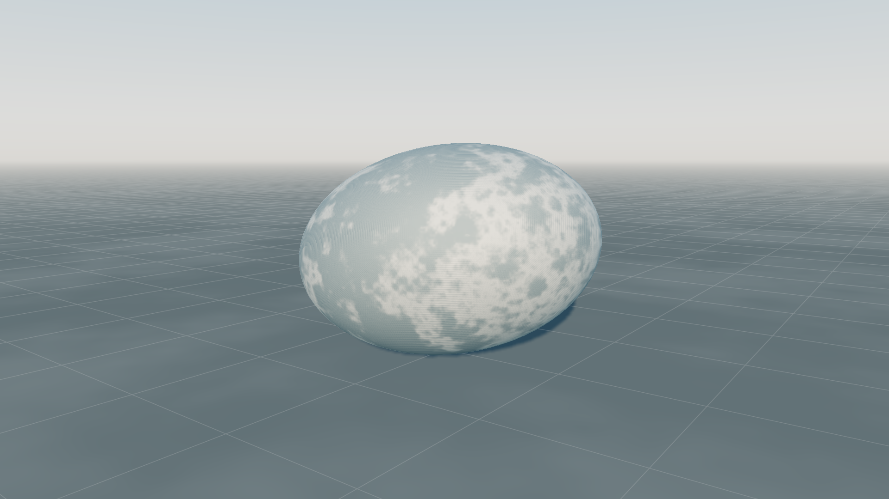
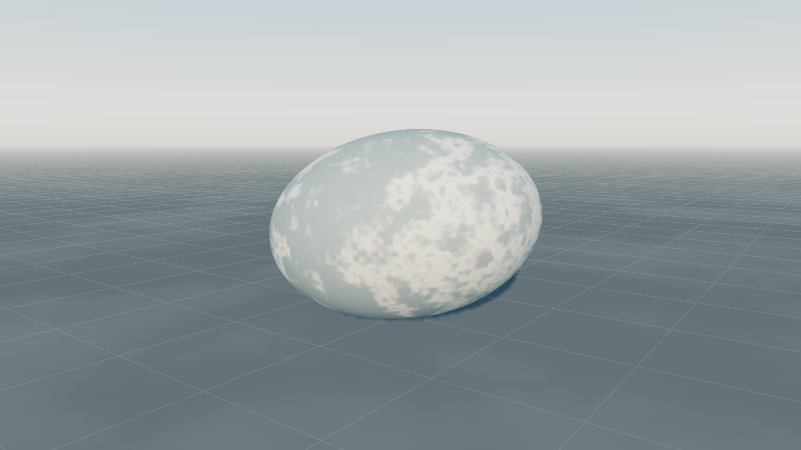

# Rendering compiler implementation and acceptance

Implementation of [the final research design](rendering-compiler-final.md). The current stack makes compiled geometry, filtered water, physical atmosphere and conservative visibility part of production rendering. Earlier opt-in experiments below are preserved as historical evidence; they do not describe the current defaults or establish current performance.

## Production behavior

Static primitive products provide exact transformed quadric intersections and projected camera/shadow proxies, with shared material, identity and depth output. Parametric meshes are an explicit geometry cost control; the projected error budget remains 0.25 pixels. Source meshes remain available for collision and authoring. Runtime visibility preserves expected identity accounting and separates camera work from shadow-caster work.

Water evaluates the authored correlated wave source through the production GGX response. Coherent phase orbits can use a fitted response polynomial or guarded phase warp, including finite shutters and remainders. Degenerate and unsupported domains use bounded regular quadrature. The same physical sun/sky transport is used by direct, regular and dense-reference evaluation. Reflection and transmission use opaque color/depth snapshots, bounded screen-space tracing, Fresnel response and absorption; rays outside the screen use the documented physical environment fallback. These approximations do not establish full global illumination.

Physical atmosphere is automatic: authored turbidity, fog density and sun direction produce density/transmittance tables and camera/light-dependent sky/aerial products. Sun, sky and aerial perspective use the same spectral extinction model. A 16×32 height/solar-zenith table integrates first-scattered sunlight and Lambertian ground transport, then sums 16 nonnegative orders of an isotropic scattering closure. Passive scattering and ground albedo bound its energy without a singular infinite-series division. This 4 KiB table rebuilds only when composition or ground albedo changes; camera and sun motion reuse it. Sky/aerial products rebuild each frame to avoid stale transport. The diffuse closure is an approximation rather than a general radiometric certificate; terrain volumetric shadows and full global illumination remain outside its scope.

`renderCompiler.geometry` defaults to `auto`; `water` defaults to `auto`; visibility is enabled. Explicit `parametric`, `analytic`, `direct`, `regular`, `reference` and visibility-off options are diagnostic controls. `shutterSeconds` accepts 0–4. No obsolete renderer must be enabled to obtain the new stack.

## Reproducing acceptance

```sh
bun test tools/rendering-compiler/manifest.test.ts
bun tools/rendering-compiler/profile.ts --smoke
bun tools/rendering-compiler/verify.ts --small
bun tools/rendering-compiler/verify.ts
bun tools/rendering-compiler/verify.ts --low
```

The isolated Chrome hardware-WebGPU runner takes a cooperative GPU lease and records source/environment manifests. A source change during a run, software adapter, GPU validation error, nonfinite output, or missing/duplicated/rejected identity fails acceptance. `--small` stages the suite at 640×360, `--preview` captures Winter only, `--targeted` omits Winter, and `--scenario=water` isolates one workload. Water is always capped at 640×360, including its dense diagnostic capture. Start with the 320×180 two-frame smoke before advancing to larger workloads. Hardware profiles on one adapter are not multiple-hardware coverage.

The version-2 authored Winter trajectory keeps the bunny, footprint trail, brook, wet stones and background vegetation in view. Inputs are fixed source documents, camera, light and time, evaluated through the real browser compiler/runtime. Other fixtures cover close/grazing/inside/near-plane/distant primitive views, changing water roughness, sphere/floor lighting and hidden-object visibility. Images use unclipped scene-linear `rgba16float` readback; beauty, depth, normal and identity PNGs support visual inspection.

Controls answer specific questions: production versus the valid parametric mesh, production versus disabled visibility, and production water versus denser integration of the same BRDF. They do not compare a new visual capability to a different older lighting model and call their difference an error. Visibility requires exact GPU identity pixels and actual removed work. Geometry controls must actually select a parametric realization somewhere rather than silently falling back. The distant primitive anchor is approximately 744 metres away so the coarse control fits the unchanged 0.25-pixel budget at 1080p.

Timing uses five rotated/reversed trials by default, with a full trajectory warmup before each condition. Only frame indices with attributed timestamps in every condition are compared. Reports include distributions of each trial's p50/p95, all raw observations, CPU submission, memory and observed timestamp quantization. Water captures use matched 640×360 resolution; its timings use matched 320×180 resolution and a 17-frame trajectory to bound the dense control workload. Both water conditions wait for GPU timing readback after each frame, avoiding query-ring drops. The wait/readback is outside GPU timestamps and CPU render-submission timing; this serial workload is not a frame-pacing measurement. Other balanced workloads use 1920×1080 and 91 frames unless `--small` stages them at 640×360. Captures, source compilation and initialization are outside measured frames and reported separately. CPU timing covers submission of pre-evaluated packets. Callback intervals are not display presentation times.

Reports distinguish successful finite/completeness checks from the design's proposed quality and speed targets. Every matched control reports whether median trial p95 improves by at least 20%; a dense-reference speedup does not by itself establish matched judged quality. Dense scene quadrature has no independent convergence certificate, so its linear RMS and highlight deltas are reported as control comparisons. Geometry differences between valid realizations and sparse trajectory deltas likewise do not establish independent image error or temporal stability.

Metal pass timestamp intervals can overlap; scene includes water, and atmosphere/shadow/scene/water/display intervals must not be summed into exclusive cost. End-to-end GPU duration and matched whole-workload controls are the performance evidence. The observed timestamp lattice on this adapter is 65.536 microseconds, so tiny single-sample differences are not speedup evidence.

Independent water verification executes the unchanged production WGSL on hardware and compares it with a separate CPU normal-vector GGX integral using 16,384 and 32,768 midpoint samples. The 84-query domain includes 48 coherent/near-degenerate finite-shutter cases and 36 ordinary spatial-footprint cases, with constant reflected sky and an unoccluded directional light. Roughness spans sharp and broad responses. CPU reference convergence is checked independently; this is a measured domain, not a general error certificate. Its gates are ≤1% aggregate relative RGB RMS, ≤5% maximum query-relative error and ≤10⁻⁶ reference convergence. This checks response mathematics, while the dense scene capture separately exercises spatial filtering and full water transport.

## Current validation status

Production integration is implemented, but final GPU acceptance is **not complete**. Full-resolution profiling of the sharp-water integration stalled the machine and the user reported that Codex crashed. All GPU testing was stopped and the owned test browser and its orphan processes were terminated. The rejected implementation multiplied three quadrature orders and could shade 262,144 times per pixel. Its excellent 84-query numerical result did not justify that production cost.

The replacement caps ordinary sharp highlights at 64 complete response samples, the coherent regular fallback at 256, and the explicit dense diagnostic reference at 2,048. Coherent conditional attempts precede the fallback, so 256 is not a bound on the entire coherent invocation. The 36-case independent CPU spatial-footprint test passes at 0.5545% aggregate relative RMS and 1.2338% maximum query error; the assembled shader passes Naga CPU validation. Two water-budget tests pass with 2,163 assertions. These are CPU results, not GPU acceptance. Browser verification now has 30-second round-trip deadlines, a ten-minute overall deadline, and an isolated process group that is forcibly cleaned up on timeout, interruption and normal completion. The diagnostic profiler now defaults to 640×360 and eight frames; `--full` explicitly requests the former 1920×1080, 24-frame workload. These measures reduce exposure but do not prove that a workload is safe or fast on every shared GPU.

GPU verification has resumed in stages under the bounded runner. The production water and per-sample analytic MSAA shaders passed the small smoke, and 1080p production profiling completed safely. Final matched whole-scene measurements are in progress. Independent [atmosphere edge checks](../../output/rendering-validation-snapshot/output/browser-1790027765959-76551/atmosphere-edges.json) passed eight cases covering day, sunset, both sides of the horizon, high altitude, planet shadow and exposure changes, with zero GPU errors and unchanged linear radiance under exposure changes. These are behavioral checks, not an independent path-traced atmosphere reference. The [versioned results snapshot](rendering-compiler-results.json) distinguishes rejected/intermediate measurements from final acceptance.

The production-default [UI and playable-game verification](../../output/rendering-validation-snapshot/output/browser-1790028194962-80554/verification.json) passed 19 UI checks, six game checks and device-loss recovery with zero GPU errors on stable snapshot `55abdc8178d2d4fde7767ba371fcc7f38b80a78c6b101100882c3f0af8d37a14`. The cooked local player opened in 2,781 ms with zero source compilations. Native keyboard input moved the bunny; 35 bounded live-physics route batches advanced 1,919 ticks, restored all three lanterns and returned home to win. Pause, save/import, all quality profiles, mobile layout, failure and restart passed. The deterministic route uses the actual input/collision/update path; it is a gameplay correctness check, not a real-time frame-rate measurement.

The new diffuse transport removes the black horizon from the earlier single-scattering preview. A [matched Winter water comparison](../../output/rendering-validation-snapshot/output/browser-1790027859590-77761/comparison.json) at 640×360 measured 0.5984% relative linear RGB RMS against dense integration, with a 0.01 denominator floor. The remaining distant wave bands also appear in the dense reference: they reflect the authored two-wave repetition, rather than an additional compiler filtering artifact. This does not establish AAA art quality or a general temporal error bound.

Useful failures are preserved: the first production water/atmosphere preview under `output/browser-1790024076914-58217` exposed a dark physical sky, water tracing bands and expensive water evaluation. The next preview under `output/browser-1790024551780-59602` improved illumination and composition but retained water bands and unacceptable GPU cost. Pass profiling under `output/browser-1790024704451-59977` exposed overlapping Metal timestamp intervals; the invalid exclusive-overhead calculation was removed. These are development evidence, not accepted final visuals.

The production work covers stages A–E: product contracts and persistence, static primitive realizations, water response selection, conservative visibility/finite sun, and atmosphere/water transport. The research gates are interpreted according to the workload. A compiler optimization must beat a valid matched-quality control. A new lighting or transport capability must demonstrate its stated quality and acceptable whole-game cost; an arbitrary 20% speedup over a renderer without that capability is not a meaningful acceptance requirement. Cross-hardware coverage, wider adversarial visibility validation and an independent reference for the complete atmosphere remain validation limits. The proposed stage F residual-lighting and visible-crowd experiments are future research, not omitted production fallback paths. No world-best performance or 1080p/60 Hz achievement is claimed without measurements.

## Historical first integration (superseded)

Historical balanced evidence is stored in [the compact versioned snapshot](rendering-compiler-results.json). [The full raw report](../../output/browser-1790022473440-54978/rendering-compiler.json) includes every identity, capture and timing sample. [The run manifest](../../output/browser-1790022473440-54978/run-manifest.json) confirms unchanged source fingerprint `345c22412a83668e59c7b4aba5b1c455a433f54546dbb1b5248aab44ff33865e`. This was Chrome 153, hardware WebGPU, balanced 1920×1080; every scenario completed with zero reported errors and finite captured output.

The complete CPU suite passed 297 tests. Both TypeScript configurations, package boundaries and repository formatting passed. The new manifest/metric/accounting tests passed 3 tests with 13 assertions. The historical-source [full UI/game verification](../../output/browser-1790022566939-55120/verification.json) passed 19 UI checks, device-loss recovery and the cooked player trail. The player opened in 537 ms without source compilation, native input moved the bunny, deterministic live-physics route batches restored all lanterns and returned home, and pause/save/restore/quality changes retained completeness. The earlier pre-shadow-correction UI run remains under [its original report](../../output/browser-1790022325300-54557/verification.json).

| Scenario | Control GPU p50 / p95 (ms) | Alternative GPU p50 / p95 (ms) |
|---|---|---|
| Winter valley / analytic | 11.665 / 12.386 | 11.338 / 13.369 |
| Winter valley / regular water | 11.665 / 12.386 | 8.716 / 15.401 |
| Primitive / parametric | 9.437 / 14.549 | 9.830 / 14.483 |
| Primitive / analytic | 9.437 / 14.549 | 9.241 / 16.450 |
| Water / regular integration | 13.042 / 13.763 | 25.428 / 27.066 |
| Sphere lighting / finite sun | 12.124 / 13.828 | 12.059 / 14.025 |
| Sphere lighting / atmosphere | 12.124 / 13.828 | 12.976 / 14.352 |
| Hidden spheres / visibility | 5.636 / 14.090 | 11.469 / 14.680 |

All variants have 91 attributed GPU samples except regular water (65). Timings vary between runs; these single-run full-frame measurements establish no repeatable whole-scene speedup. In particular, no representative workload reaches the proposed ≥20% GPU p95 improvement. The more expensive regular water path is a quality control for filtered appearance. Defaults remain direct and the optional techniques remain experimental.

The historical-source [low-profile run](../../output/browser-1790022592309-55219/rendering-compiler.json) also completed every scenario with zero errors and stable source. It used 1280×720 output with the low profile’s existing internal resolution/shadow settings on the same hardware. Winter GPU p95 was 3.736 ms direct, 3.736 ms analytic, and 4.391 ms regular water; water-only direct/regular measured 5.243/10.158 ms. Reported Winter owned GPU memory was approximately 20.6 MB. Visibility retained exact identity pixels but did not improve p95 in this run (1.442 ms baseline versus 3.932 ms selected). Full distributions, memory and identity counts are included under `lowProfile` in the versioned snapshot. A lower quality profile on the same adapter is not evidence for another lower-power GPU.

The visibility control culled 24 of 26 surfaces while preserving captured identity **and beauty** pixels exactly. Finite-sun and atmosphere paths reported selected and changed linear output. Their physical correctness is not established by comparison to PCF/previous fog. Atmosphere interpolation remains uncertified; the selected table includes exhausted cells that retain the existing fallback.

The first full-screen analytic proxy attempt is retained under [its output directory](../../output/browser-1790021937762-53247/). Winter analytic GPU p95 was 18.678 ms versus 14.680 ms direct. A conservative projected rectangle removed that substantial regression in a subsequent run, but did not establish the promotion target. That initial run also stopped because its parametric control remained outside the 0.25-pixel budget. The distant camera now lies approximately 372 metres away; the finest control's conservative bound is 0.153 pixels with the budget unchanged.

Image review of [the first complete rectangle run](../../output/browser-1790022219878-54375/rendering-compiler.json) found fine stripes from analytic shadow self-intersection. Explicit curved-hit slope bias removed the visible pattern in the corrected close-up and grazing captures. Close-up relative RGB RMS difference against extraction fell from 6.24% to 1.13%; grazing fell from 6.83% to 1.87%. These are direct-control differences, not errors against an independent reference. Camera-inside and near-plane views also rendered successfully, while independent geometric accuracy and temporal quality gates remain open.

The visual failure is preserved for comparison:



Corrected historical-source close-up:



The historical-source low-profile run also completed with zero errors and stable source identity: [raw report](../../output/browser-1790022592309-55219/rendering-compiler.json). It uses 1280×720 output and the normal low-profile internal resolution, and exercises the same five scenarios and completeness/image checks. Its timings and capture deltas are included under `lowProfile` in the versioned results. This tests a lower-cost profile on the same adapter; it is not evidence from a second or lower-power GPU.
