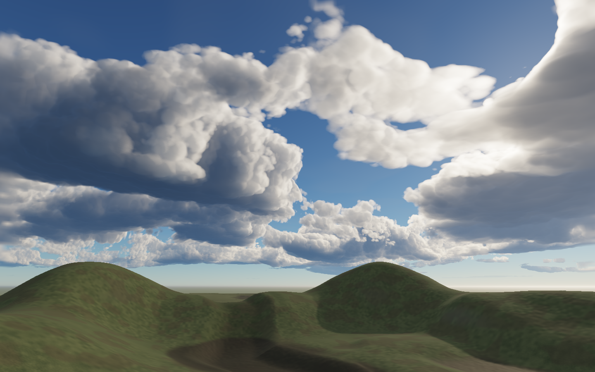
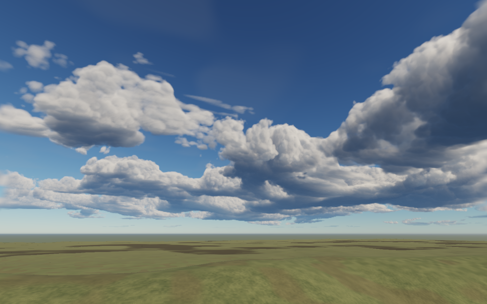
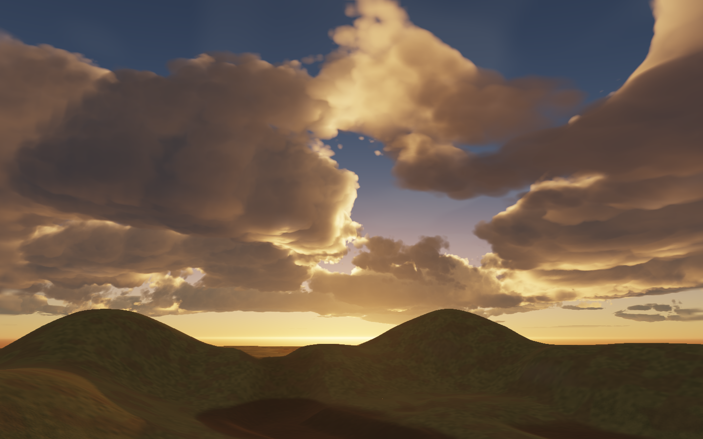

# Cloud shapes and group elevations — September 23, 2026

Clouds previously shared a 1,100 m lower boundary, while developed formations frequently approached the same upper profile. Changing the tops alone mostly inflated the existing banks. This revision varies whole cloud groups' elevations as well as their development and thickness.

The main cloud field now has group bases ranging from 850 to 1,950 m. A smooth independent weather field controls that elevation. The body translates with the group, and its vertical profile uses the remaining available thickness. Regional maturity and cellular updrafts distinguish shallow banks from taller growth and introduce more variation in spacing. The existing finer erosion and sunset illumination are retained.

The upper support bound includes the highest possible base. The regional empty-space bound includes the derivatives of both the new development curve and the changing base elevation. These bounds preserve the intended support of the revised density model; this art pass does not establish new image-error or performance guarantees.

## Iteration and review

Six visual variations explored expanded ceilings, localized updrafts, vertical stretching, cellular base elevations, an envelope-only elevation change, and smooth independent elevations. Stretching and cellular elevation produced conspicuous hanging curtains and thin detached strips. The retained version translates coherent shapes using a smoother elevation field.

Seven native high-quality views render through the current production scene compiler and renderer: side light, back light, front light, storm, sunset, blue hour and zenith. All captures are complete with no recorded browser errors. A second camera direction was reviewed at balanced quality in daylight and sunset. The final shader hash matches the source used by the production capture, despite unrelated files changing in the shared checkout.

This was a visual-only pass, as requested. Captures can share the GPU and are marked as unsuitable for performance comparisons. Earlier numerical-error and timing results describe the earlier density field. Existing overhead softness, some storm integration banding, and the blue-hour fixture's excessive exposure remain limitations.

Raw captures, shader identity and experiment paths are recorded in [the evidence summary](sky-cloud-shapes-2026-09-23-results.json). The accepted daylight baseline is [the earlier capture](sky-clouds-2026-09-23-cumulus-side.png).

## Continuing look development

`bun tools/sky-art-review.ts --high --visual-only` captures the current production renderer without waiting for an exclusive performance-test lease.

`tools/sky-art-replay.ts --bundle=<fixture.js> --cloud-shader=packages/render-webgpu/src/atmosphere-clouds.wgsl --frames=cumulus-side,golden` substitutes only the cloud shader in a frozen scene. This kept art iteration moving while unrelated water-shader edits temporarily prevented fresh builds. `--study=<authored-study.json>` supports another camera or quality setting. The replay preserves the exact resulting bundle, shader, study, and identities alongside the captures; it does not report performance measurements.
