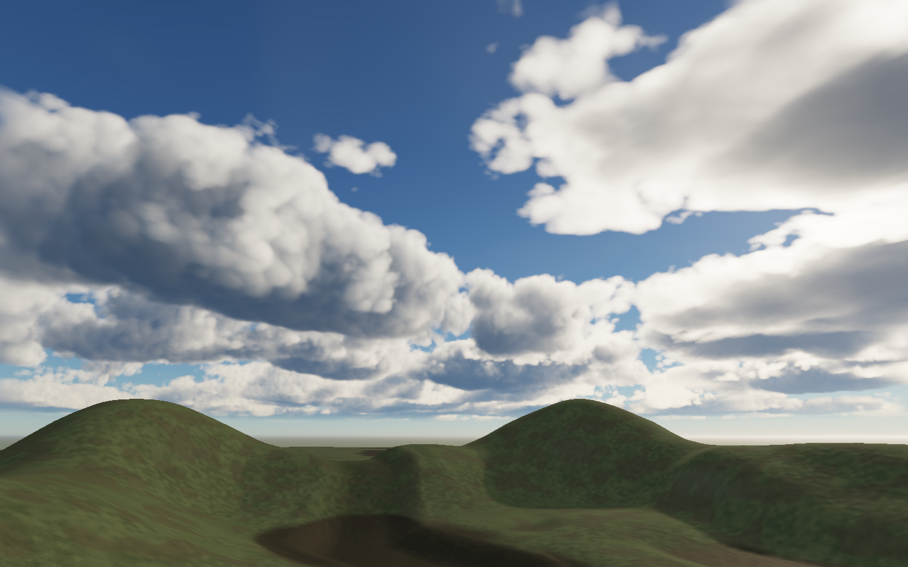
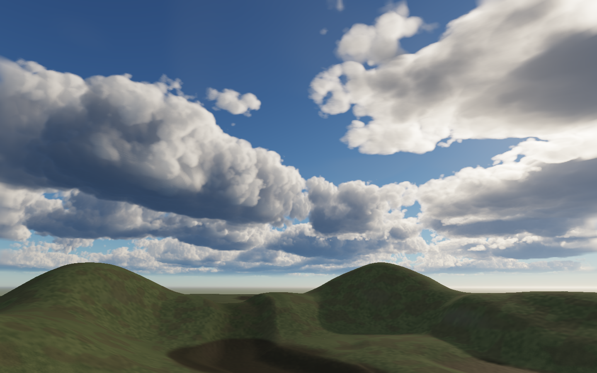
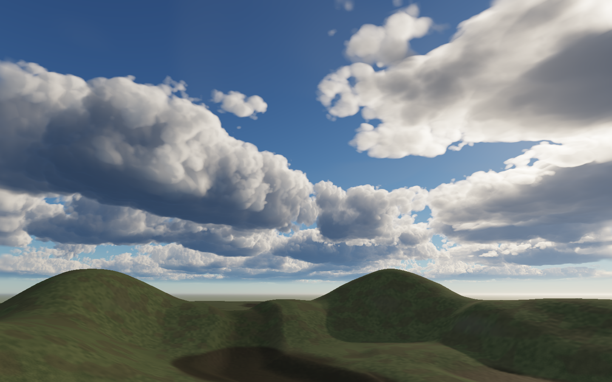
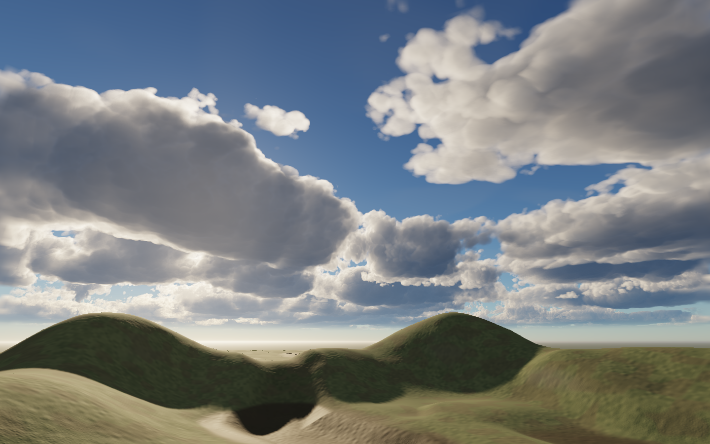

# Cloud definition and transport reuse — September 23, 2026

The daylight revision gives the clouds denser bodies, clearer optical folds and less uniformly soft outlines. It removes the broad nine-tap image blur and the finest noise octave from directional shading. Sunset keeps the existing lighting approach. This is an improvement toward the visual target, not a claim that the sky has reached the reference quality.

## References inspected

- [Guerrilla / PlayStation: Burning Shores cloud development and official captures](https://blog.playstation.com/2023/03/29/pushing-the-envelope-achieving-next-level-clouds-in-horizon-forbidden-west-burning-shores/). Inspected the close flight view, sunset towers and ground-level sunset landscape. The useful art cues are connected large volumes, overlapping shadows, bright rims and a hierarchy of detail. The article describes compressed voxel clouds and shared lighting; our implementation remains procedural and does not reproduce their voxel pipeline.
- [NASA S’COOL photographic reference collection](https://scool.larc.nasa.gov/GLOBE/cumulus.html). Inspected [Jeff Caplan’s Rocky Mountains photograph](https://scool.larc.nasa.gov/images/Cu14.jpg) and [Kevin Larman’s Colorado cumulus congestus](https://scool.larc.nasa.gov/images/Cu1.jpg). Firm growing tops coexist with softer dissipating edges. Dark undersides belong to coherent volumes rather than a uniform coating of small bumps.
- [Red Dead Redemption 2 landscape reference](https://www.peakpx.com/en/hd-wallpaper-desktop-vjsel). This secondary screenshot source is useful for the relationship between fine ground detail, a broad dark cloud base and distant atmospheric layering; it is not evidence of Rockstar’s implementation or an unmodified rendering configuration.
- [Continuum’s February 2026 development account](https://continuum.graphics/progress-update/2026/03/09/109358/february-2026-progress-update/). Their discussion independently identifies overly local edge darkening and loss of form from integration error. It informed the separation of silhouette detail from broad transport, rather than simply increasing noise contrast.

## Visual change

Density gain rises from 12 to 24 while retaining the established regional layout and original erosion frequencies. Coarse volume gradients govern directional escape. Medium erosion affects the local optical boundary, while the finest erosion still affects density without becoming a field of lit bumps. Daylight replaces the first 300 metres of blurred shared shadow depth with an analytic integral of a clamped affine density approximation. This is exact for that local approximation, not for the actual nonlinear cloud field. The shared grid still supplies long-range occlusion.

Balanced quadrature rises from 192 / 40 m to 256 / 30 m so the sharper density is actually integrated. The savings below therefore include a more expensive fresh ray. High remains 384 / 20 m. No post-process sharpening is used.

Matched balanced images, both rendered at 1440 × 900:

Native high-quality daylight:

The remaining art gap is especially visible in nearby cloud tops: their internal structure is still smoother and less varied than the strongest reference photographs. The slab-based procedural organization also gives less individual cloud identity than authored or simulated towers. More small noise everywhere would repeat the earlier lumpy failure. The blue-hour fixture also retains its pre-existing +4.5-stop exposure: its blown-out horizon and bright terrain are not a visual acceptance result, even though it passes the numerical checks.

## Where the compiler helps

`cloud-transport.ts` specializes the actual diagonal coordinate map. Solving `Dworld · motion + Dwind · delta(wind × time) = 0` emits the density-coordinate motion used by both evaluation and reconstruction. It also emits the clipped affine integral and the endpoint rule for projective depth intervals. This is a small explicit specialization, not a general cloud IR compiler or a claim of research novelty.

Each freshly integrated pixel retains its extinction-weighted distance and a support radius spanning its occupied integration segments. Reprojection checks the projected endpoints of that interval. Perspective projection along a line is fractional-linear, so positive-depth endpoints bound its image. The geometric bound concerns the retained integration support; it does not prove radiance accuracy or disocclusion safety. Opacity-contour rejection, bounded recorded age, and an accumulated bilinear-filter variance estimate are separate empirical guards. Fresh rays are not blended with history.

Rejected pixels are compacted into queues partitioned into 16-row bands, preserving some ray coherence while avoiding mostly idle SIMD waves. A direct full-frame kernel handles initial views and discontinuities. Large changes in camera, coordinates, weather or lighting invalidate history. Clear-only views bypass history reuse. Low/high quality and the explicit `cloudReconstruction: "full"` control remain available.

Additional resident storage is approximately 10.5 MiB at balanced and 34.6 MiB at high: one additional color image, two support/age images, the compacted-ray queue and a history uniform. Resource accounting includes these buffers separately from textures, and disposal is tested.

## Measurements

Apple M4 / Metal WebGPU on this development machine. These are local hardware observations, not broad-hardware guarantees. Complete-frame replays use the same 1024 × 768 scene and camera scripts, with 60 measured frames per case. Frozen bundles preserve the original and updated renderers without rewriting the dirty checkout.

| Complete frame, p95 | Earlier renderer | Updated renderer | Reduction |
| --- | ---: | ---: | ---: |
| Walking | 26.28 ms | 16.12 ms | 38.7% |
| Turning | 15.40 ms | 14.68 ms | 4.7% |
| Weather playback | 23.20 ms | 14.88 ms | 35.9% |
| Static | 4.85 ms | 4.46 ms | No cloud update; not an optimization claim |

Mean complete-frame costs changed from 4.27 to 3.30 ms walking, 2.85 to 2.84 ms turning, and 4.20 to 3.24 ms weather. Static mean varied from 1.77 to 1.97 ms. The optimization targets update spikes, not already-cached frames.

The isolated 768 × 512 cloud test interleaves reconstruction and full redraw of the **same updated field**. This comparison isolates reuse from the visual revision:

| Scenario | Full redraw | Reuse | Worst sequence RMS |
| --- | ---: | ---: | ---: |
| Still, forced update | 9.21 ms | 3.51 ms | 0.000002 |
| Walking, 2 m/update | 9.18 ms | 4.46 ms | 0.000772 |
| Turning | 8.95 ms | 6.65 ms | 0.001877 |
| Wind, 11 m/update | 9.08 ms | 6.32 ms | 0.003789 |
| Weather | 8.95 ms | 4.69 ms | 0.002830 |
| Changing light | 9.11 ms | 4.72 ms | 0.000579 |
| Strong cirrus plus wind | 9.40 ms | 6.13 ms | 0.003837 |

These kernel savings are 26–62%; they exclude lighting-grid, scene and display costs. Real static production frames already reuse the whole view. Worst-pixel errors can be substantially larger than RMS at a small number of moving edges; the RMS gate is an empirical regression criterion, not an invisibility guarantee. Cirrus uses a different drift model, so low-cloud covariance alone is not a proof for the entire composite.

## Verification and rejected experiments

- Seven field cases compare the final 256-sample integration against 1024/2048-sample references. Worst final RMS is 0.002943 (gate 0.004), worst reference-convergence RMS is 0.000271 (gate 0.001). Shared lighting remains an approximation common to those references.
- Eleven 12-frame reconstruction sequences include moving cameras, wind, weather, light, strong cirrus, clear transition, source switch, camera cut and an 8192 m origin rebase. Every sequence passes the 0.004 RMS gate with no GPU validation errors. Cuts/rebases refresh fully.
- The emitted WGSL integral was tested on 129 endpoint pairs against 32,768-step numerical quadrature; maximum error was 1.10e-7. CPU property tests audit coordinate covariance and projective interval enclosure, including singular and camera-plane rejection.
- The final workspace type check is blocked by concurrent, unrelated changes in `packages/render-webgpu/src/material-specialization.ts` (the latest diagnostic concerns optional `pointLights`). Earlier root and browser checks passed; this is not counted as a clean final workspace check.
- Focused atmosphere/compiler/history unit tests pass. Production resource ownership, buffer/texture byte accounting, timestamp brackets, reuse and camera-cut dispatch are covered. Generated WGSL matches its compiler source. Workspace boundaries and focused formatting pass.
- Production captures cover seven lighting/view cases at balanced and high, plus low-quality daylight. The existing atmosphere edge check passes eight HDR/day/sunset/altitude/exposure cases.
- An early linear view-quadrature experiment was rejected: 96 steps took about 6.7 ms with RMS about 0.012, versus the original 192-step result near 6.5 ms / 0.003. Increased erosion frequencies and fine-noise directional normals also failed the visual target. Their evidence remains under `output/sky-transport-baseline` and the intermediate browser captures.
- A timing bug initially dropped every expensive turning update. Moving the queue clear before the timestamped compute interval fixed the missing intervals on this Metal backend. The retained final complete-frame evidence contains 60/60 timings per case and zero dropped samples. Earlier deceptively fast turning results are excluded.

See [machine-readable results](sky-clouds-2026-09-23-results.json) for sample distributions, raw evidence paths and frozen bundle hashes. Final art bundles are `output/browser-1790176605085-23027` (high), `output/browser-1790176607552-23049` (balanced), and `output/browser-1790176609764-23074` (low). Replay uses `bun tools/sky-replay.ts --bundle=<fixture.js>`; the art fixture accepts `--full` to disable cloud reconstruction.
