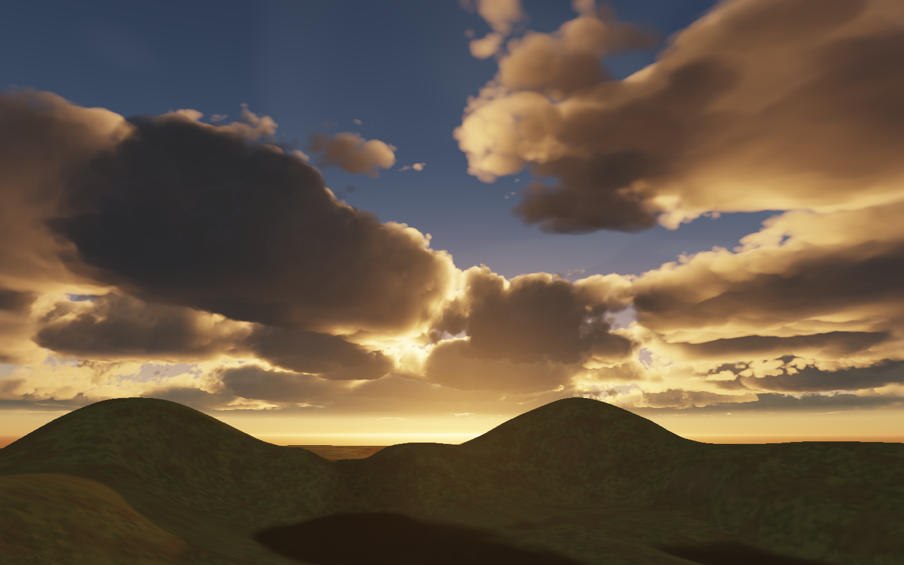
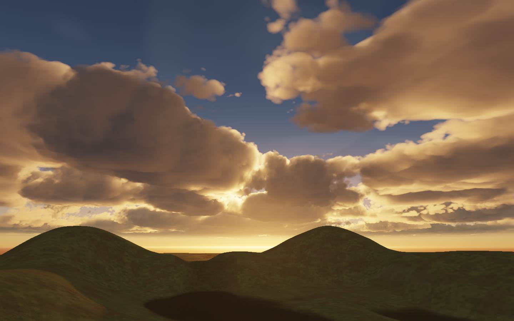

# Sunset cloud illumination — September 23, 2026

The denser daylight clouds exposed a low-sun lighting weakness: long grazing shadows extinguished the short multiple-scattering approximation, and the dense-body sky fill left the faces nearly charcoal. The revision restores warm internal illumination and more of the overhead sky contribution. It changes the renderer, with identical exposure, weather and cloud density in the comparison.

## Implementation

The existing cloud-light grid now stores an isotropic late-scattering term in its previously unused ambient alpha channel. Orders 4–7 use weights `0.7^n` and extinction multipliers `0.5^n`. One exponential and three successive square roots evaluate the four terms once per grid cell. The uncached path evaluates the same expression. No textures, density samples, or resident bytes were added.

The extended multiple-scattering sum is normalized by `1.533 / 2.1411733`, preserving its zero-optical-depth integrated phase weight. This is an artistic octave approximation, not a proof of physical energy conservation or a claim of novel transport research. The late orders use the broad shared shadow field; the established local daylight shadow correction is unchanged. The extension fades out between solar direction y = 0.15 and 0.45. Dense-body sky fill increases at low sun and fades out below the horizon. Moon scattering remains unchanged.

[Epic's volumetric-cloud documentation](https://dev.epicgames.com/documentation/unreal-engine/volumetric-clouds?application_version=4.27) describes both the role of multiple scattering in thick clouds and the energy loss of finite octave approximations. This is the physical motivation for the experiment; our coefficients and angle-dependent blend remain renderer-specific art choices.

The high-quality side-lit and front-lit daylight, storm and zenith captures are pixel-identical to their immediate predecessors. Lower-angle backlighting changes slightly. The sunset change is intentional. The existing blue-hour fixture still has its excessive +4.5 EV exposure; its numerical pass is not visual acceptance.

## Validation

- Seven GPU field cases pass the existing error gates. Worst 256-sample RMS against the reference is 0.002942; reference convergence is 0.000271; worst cache-only RMS is 0.001197. No GPU or browser validation errors.
- An independent CPU sum checks the actual compiled GPU tail at 65 optical depths. Maximum absolute error is 3.10e-8. Values are finite, nonnegative and monotone; the zero-depth normalization passes.
- A new descending-sun sequence initially failed: three-frame lighting history reached RMS 0.007691. During moving low-sun illumination, history now permits one reuse. The same sequence passes at 0.003485, below the unchanged 0.004 gate. Stable sunset light still allows seven reuses; daylight or deep-night light changes retain the existing three-frame policy.
- All 12 reconstruction sequences / 144 frames pass, including camera motion, wind, weather, sunset, cirrus, source switching, cuts and rebasing. The largest sequence RMS is 0.003837. RMS is a regression criterion, not a guarantee that every edge error is invisible.
- Six focused unit/integration tests pass, including resource ownership, dispatch/timestamps and the history policy. Focused formatting passes. The workspace type check remains blocked by the unrelated optional `pointLights` diagnostic in `material-specialization.ts:35`.

## Cost and evidence

The isolated changing-sunset test takes 6.75 ms with reuse versus 8.95 ms for a full redraw of the same updated field on this Apple / Metal device. This is about 25% less cloud-kernel time, excluding the light-grid and rest of the frame. The stricter sunset history costs more than the rejected stale-light version.

Complete-frame replay uses frozen before/after bundles at balanced quality, 1024 × 768, with 60 valid timings per case and zero dropped samples. Walking mean was 2.95 ms before and 3.05 / 3.12 ms afterward; weather was 4.37 versus 4.09 / 3.75 ms; turning was 2.81 versus 4.11 / 2.98 ms. Turning p95 was 14.61 versus 26.41 / 14.22 ms. These variable local runs do not establish a speedup or zero performance cost. A second baseline replay could not acquire the GPU lease while another task's vegetation benchmark was running; it produced no timing evidence. Memory usage is identical in matched cases.

Raw evidence and frozen bundle hashes are recorded in [the results file](sky-sunset-lighting-2026-09-23-results.json). Native high captures are in `output/browser-1790177945968-25489`; balanced captures are in `output/browser-1790178102759-25740`. The later deep-night history guard is unit-tested and does not alter these static views or the sunset sequence.

## Remaining visual priorities

Cloud identity is the largest remaining gap: many bodies occupy similar heights and form elongated banks. Introduce stronger variation in vertical development and separation before adding more fine detail. Growing edges should stay firm while selected dissolving edges become wispy. Distant overlapping layers should read as separate depths. These are follow-up directions, not changes made in this lighting revision; indiscriminate noise or sharpening would risk repeating the earlier lumpy result.
