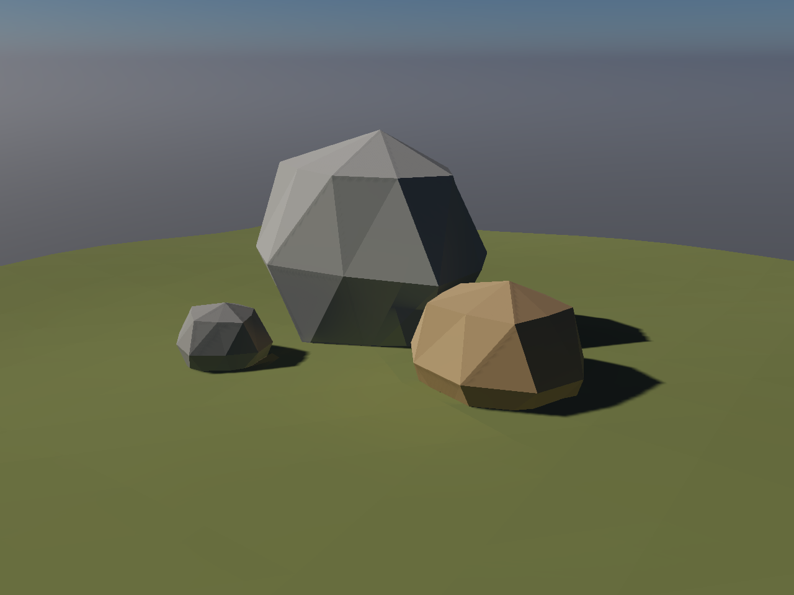
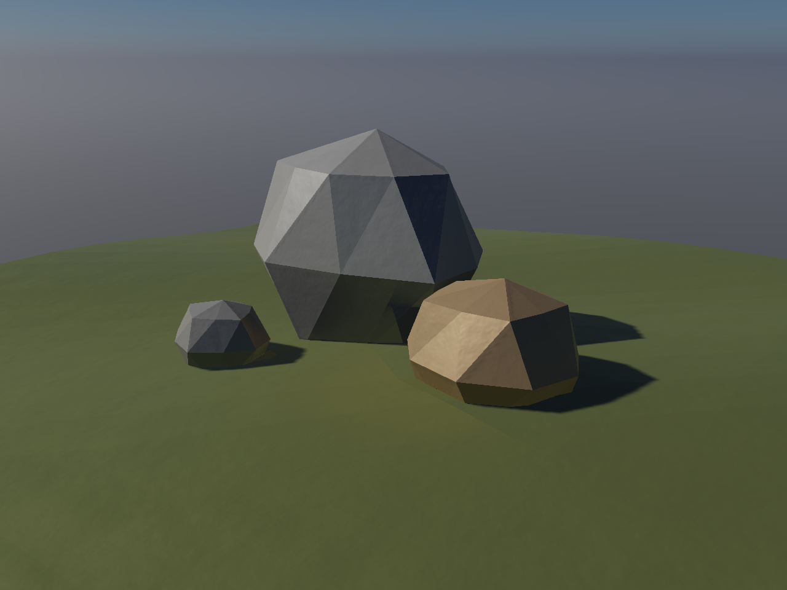
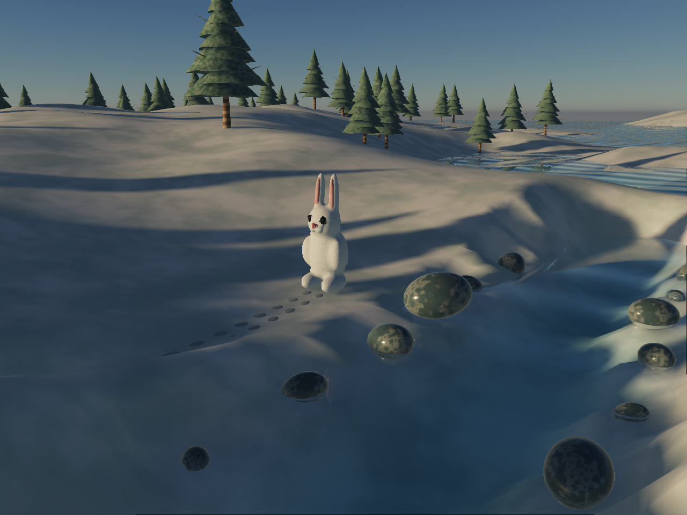
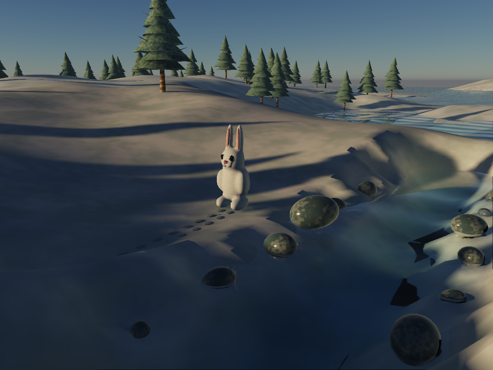
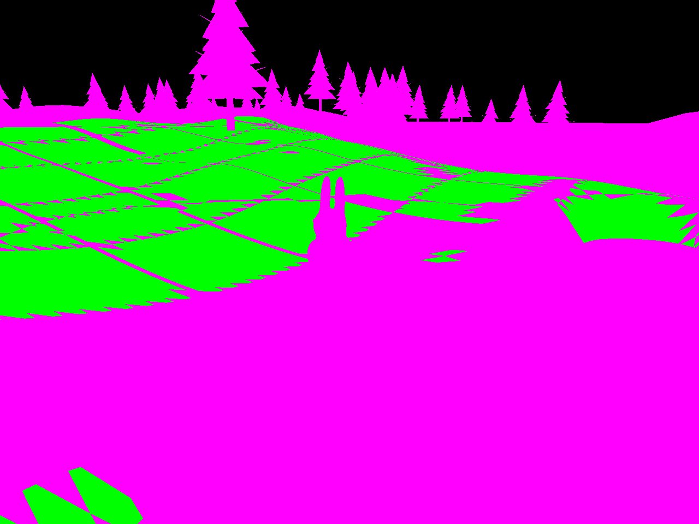

# Curved receivers and compiled visibility — September 23, 2026

The compiler now accelerates static curved terrain and detailed material receivers while preserving their indexed geometry and shading normals. In the final matched 1280×960 captures, the alpine scene is **10.1% faster** and its detailed-material variant **11.8% faster**, with identical scene-linear RGB values in every tested view. The preceding trial measured 11.8% and 12.8% respectively.

**The world rollout gate failed.** Winter improves only 1.5% in the final trial, its existing dark terrain/water coverage bands remain, and the additional compiler stage takes 5.77 seconds. The preceding trial improved 0.8%, and earlier repeated trials range from a small slowdown to a small saving. These results support a bounded receiver optimization inside the reference solver; they do not support making that solver the product's world lighting.

Player and Studio continue to share one lighting system with no bounce-lighting switch. This work adds no product toggle. It also does not add visible bounce lighting to ordinary play. The intended default remains compiled world transport once coverage, cost and transitions meet the product bar.

[Measurements and provenance](triangle-lighting-2026-09-23/evidence.json) · [Full captured results](triangle-lighting-2026-09-23/triangles-raw.json) · [Lighting contract](../architecture/indirect-lighting.md) · [Earlier nature / AAA lookdev](lighting-audit-2026-09-23/index.html)

## Final measurements

Apple / Metal, 1280×960, balanced renderer with spatial antialiasing. Conventional medians of 24 whole-frame GPU timestamp samples per condition, ABBA order, five settling frames per group. Build and upload work are excluded. The control retains the same probe coefficients, flat-surface cache, material, camera and lighting, and removes the triangle product and its appended query payload.

| Scene | Control frame | Compiled frame | Change | Compiled visible surface pixels | Additional cache build |
| --- | ---: | ---: | ---: | ---: | ---: |
| Curved alpine terrain / rocks | 15.270 ms | 13.730 ms | 10.1% lower | 39.7% | 0.284 s |
| Same scene with procedural normals / rough metal | 20.218 ms | 17.826 ms | 11.8% lower | 39.7% | 0.194 s |
| Winter world | 63.177 ms | 62.226 ms | 1.5% lower; inconclusive | 23.4% | 5.773 s |

The sealed control admits no triangle product. Its measured 5.9% timing difference (3% in the preceding trial) despite no changed geometry or payload illustrates the noise in these short trials; it is not an optimization result. The separate inward-facing flat-room fixture passes its existing sealed-space darkness and image gates.

Maximum and mean triangle-cache image differences are zero for the initial camera, a shifted camera, reduced sun intensity and a nonzero world-origin rebase. That is agreement with the existing transport solver, not ground-truth realism or proof for every scene. A diagnostic using a larger 4,096-node hierarchy budget is preserved; it still has a finite traversal budget.

Winter admits 8,829 of 53,360 static receiver triangles across 28 surfaces. It adds 142,240 bytes of CPU vertex proofs and 1,002,560 bytes of packed query regions. The field plus retained proof payload is 8,211,600 bytes. Total field construction is 8.40 seconds, with a largest observed cooperative CPU slice of 3.6 ms. The preceding trial took 11.23 seconds with a 4.1 ms maximum slice. The 2 ms slice target is not a deadline.

The renderer's observed allocation rises by 2,742,256 bytes when the Winter cache first becomes active. This includes new packed mesh buffers while the earlier mesh resources remain resident, as well as the added field payload. The analogous small-scene increase is 280,896 bytes. Shared source arrays are not duplicated on the CPU; temporary compiler objects and driver/pipeline memory are additional.

## Lookdev

The small fixture exercises curved geometry, material response and shadow preservation. It is an engineering scene, not an AAA art-quality claim.

The same geometry retains procedural material normals and rough-metal response:

Winter with the common environment-lighting path:

Winter with the experimental transport solver and the new optimization. The irregular dark patches remain in the solver's image and therefore still fail world acceptance:

Green marks pixels consuming a compiled receiver product; magenta retains the existing queries. This is **optimization coverage**, not a map of where GI is physically correct. Many terrain pixels, all moving receivers, foliage and water still use the general path.

## Implementation and limits

The compiler bounds receiver-to-probe visibility over whole triangle groups and a 60-degree shading-normal cone. Conservative shadow half-spaces establish clear or blocked probes; uncertainty retains short lists of exact triangle intersections. A blocker inside the segment's probe-end tolerance cannot establish a blocked certificate. Exhausted proof budgets preserve the ordinary hierarchy query. These use floating-point margins and numerical reference checks, not exact arithmetic. Cost estimates avoid building already-cheap regions and reject lists that do not predict enough saved intersection work. Estimates schedule work; they are not correctness proofs or measured GPU savings.

A flat vertex attribute stores a probe-cell identity, a region address and an encoded geometric normal. Every triangle sharing a provoking vertex belongs to the same certificate. The shader uses it only inside the matching interpolation cell and a slightly smaller normal cone. Original positions, indices, normals, material coordinates, picking identities and draw ranges remain intact. Material normals, probe moment weights, angular clamps, irradiance and reflections still evaluate as before.

Only immutable matching source buffers, ranges and absolute poses can consume the product. Edited, copied, moved, removed, dynamic, deformed, displaced, thin/transmitting and alternate-representation receivers discard stale proofs. Original geometry is recovered without undoing a changed draw range. Separate shader variants keep triangle-cache work out of ordinary draws.

Bounds: 65,536 receiver triangles, 32 triangles per provoking-vertex group, 512 hierarchy visits and 256 candidate triangles per probe/group, 48 retained unresolved blockers per group, 4 MiB of appended regions, and 4 MiB of vertex proofs. A bounded 16,384-entry FIFO reuses triangle shadow cones during compilation. Empty products retain no cache mesh or shader selection. `surfaceCache: false` remains the existing engineering reference control; normal solver use attempts both supported cache products automatically.

This product caches visibility, not resolved radiance on curved surfaces. It still requires the existing probe-volume build, per-pixel eight-probe weighting, local reflection evaluation and contact queries. Camera-volume coverage, changing sun direction, foliage, moving occluders, point-light bounce and water remain open world-lighting work. Visibility shortcuts alone have not made this world solver affordable.

## Rejected experiments and corrected assumptions

- Clear/blocked masks alone preserved the small images but did not produce a consistent performance gain. Short unresolved blocker lists were added.
- Deindexing every receiver triangle introduced a maximum 0.016968 linear RGB image difference in Winter and increased frame time. A geometry-only diagnostic reproduced the entire difference; switching the visibility proof on that geometry changed zero pixels. Preserving indexed geometry removed the discrepancy. The detailed renderer cause of the repacking sensitivity was not established.
- Rebuilding each shadow cone repeatedly took roughly 106 seconds in an early world trial. Reuse, constant-time FIFO eviction and moving repeated plane-support calculations out of vertex loops reduced subsequent additional builds to 5.77–13.10 seconds. This is still too expensive for interactive world rebuilds.
- At 1280×960, repeated world captures measured roughly 2%, 0.8% and 1.5% lower frame time. At 640×480, repeated indexed trials included 22.249 → 21.430 ms and 21.037 → 21.201 ms. No repeatable world benefit is claimed.

The raw failures and intermediate source snapshots remain under `output/triangle-lighting/`. The correct next investment is to resolve and reuse lighting itself on terrain/curved receiver products, then cook and stream it with world chunks. Continuing to optimize the per-pixel visibility query alone does not address the measured world cost or the failed image coverage.

## Verification and provenance

58 focused tests pass across compiler transport, source identity/invalidation, renderer packing, batching and integration. New regressions exercise shared provoking vertices, material draw ranges, edited copies, a wide normal cone, packed query agreement, probe-end tolerances and independent shared-vertex allocation bounds. Both TypeScript checks and dependency boundaries pass. Checks on the changed transport/fixture files pass; pre-existing renderer-entry import/style violations are preserved.

The frozen pre-change renderer and current renderer produce identical uncached images. GI-off frame medians are both 1.049 ms; ordinary uncached GI is 3.473 → 3.408 ms, within short-trial variability. This guards against exaggerating the cache win by slowing its control. [Raw renderer control](triangle-lighting-2026-09-23/kernel-raw.json).

The existing flat-surface GPU suite also passes all image, sealed-room, camera, relight, rebase and restore gates. Its final frame medians are matte 9.241 → 6.488 ms, metal 10.224 → 6.619 ms, sealed 14.352 → 10.093 ms. Those are the prior flat-cache optimization's results, not new triangle-cache gains. [Raw flat-surface regression](triangle-lighting-2026-09-23/rectangles-raw.json).

Final triangle GPU source fingerprint: `9f3c08a85c497cdfb43843e3c738cbec44309ececc024bdfb6af5b6a545aa888`, frozen at `output/triangle-lighting/1790205030586-70379/source/`. The prior trial, renderer control and flat-room regression use fingerprint `325118b90b771234d7da5672eca691159bac0a6ebf54580c7a7d99eb2cfe097b`, frozen at `output/triangle-lighting/final-source/`. The lighting implementation differs only by the final compiler allocation/endpoint guards and their CPU tests; renderer sources are unchanged. Pre-change control: `fc6ef490e92695481db9441aeec8e380a6e88081a4cb4b746ba676da8aa718a1`. Documentation was completed after the captures. The preceding trial is preserved in [its raw report](triangle-lighting-2026-09-23/pre-guard-raw.json).

Reproduce the triangle captures with `bun tools/triangle-lighting-check.ts --large`; `--winter` selects the world and `--quick` selects the alpine fixture. Source freezes automatically. Run GPU harnesses sequentially under the shared hardware lease. The kernel-control and flat-surface tools should run from a frozen snapshot in a shared checkout.
