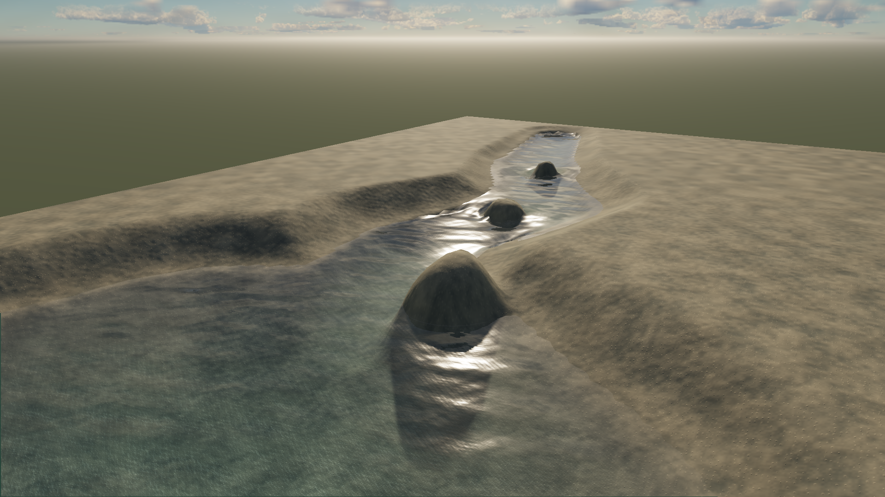

# Water: closing the visual gap

September 23, 2026 · Wrela research and look development

**Implementation follow-up:** [working changes, verification and remaining limits](IMPLEMENTATION.md) · [new visual review](implementation.html). The study below records the pre-implementation baseline.

**Recommendation: keep the shared semantic water foundation, correct its crest math, and build one convincing creek-to-lake scene with persistent foam, wet banks, and reliable environmental reflections. Follow with a small breaking-surf scene. Choose richer ocean synthesis by measured need.**

[Open the visual study](review.html) · [Measurements and provenance](measurements.json) · [Source probes](source-probe.json) · [Motion checks](motion.json)

This is an investigation, with fresh hardware captures and a diagnostic experiment. It does not change the production renderer. The comparison targets are Horizon Forbidden West for shoreline and local effects, Sea of Thieves for readable ocean form, and real photographs for reflection, transparency, foam, and contact. They are selected strong references, not an exhaustive ranking of current games. The literature search includes 2024–2026 material; the newest implementation examined in detail is Keen Games’ 2025 Enshrouded talk.

**What the pictures actually show**

| Study | Wrela observation | Reference cue | Consequence |
|---|---|---|---|
| Open ocean, daylight | Useful long waves and fine ripples; broad pale reflection ribbons; almost no readable whitewater | The publisher’s Sea of Thieves image separates dark troughs, lit crests and patchy foam | Correct crest compression, introduce foam lifetime, add bounded crest transmission and more directional reflectance |
| Creek, daylight | Water reads as a glossy strip in a smooth excavated channel; rounded obstacles repeat; wet edge is visibly stepped | The real stream has irregular submerged stones, clear foreground water and strong vegetation/mountain reflections | Terrain, bed and reflected surroundings must participate in look development |
| Lake, noon | Bed remains visible but looks like one continuous noisy surface; little material or depth hierarchy | The real stream’s submerged stones remain individually legible beneath alternating reflection and transmission | Author bed composition and optical depth together; use measured absorption/scattering rather than overall tint adjustments |
| Shore and impacts | No equivalent surf shot; weak localized aeration around current obstacles | HFW references show distinct impact zones and broken foam patterns; the real surf photo has gaps between advancing fronts and a wet beach strip | Add spatially localized, persistent events and shore memory |
| Low sun / cloud-heavy preset | Strong highlight, but water still appears as a continuous polished sheet | A changing reflection footprint must coexist with water form and local foam | Validate finite-sun response, filtered directional slope statistics and temporal behavior together |

These are qualitative comparisons. Cameras, water depth, exposure, wind and grading are not matched across sources. The Sea of Thieves image is publisher-selected promotional imagery, not a capture we made. HFW’s waterfall-impact example has much higher flow energy than our creek; it establishes layering, not the amount of foam to paste everywhere. The NOAA sea-foam photograph is an unusually thick accumulation, useful for foam structure rather than typical ocean coverage. No numerical “AAA score” is implied.

The most important authoring deficit is the absence of a complete environment. A water shader cannot reflect trees, dark banks or large rocks that the scene does not contain. Conversely, beautiful scenery must not hide bad water contact. Keep this diagnostic fixture and create a separate art-directed scene using the same source and renderer.

**Two concrete source findings to address first**

**1. Choppiness and crest foam disagree.** In [the CPU spectrum evaluator](../../../packages/compiler/src/water-spectrum.ts), height is `a sin(θ)` while horizontal displacement is `−q a cos(θ)`. For one wave travelling along x, the horizontal derivative is therefore `1 + q a k sin(θ)`: positive crests expand and troughs compress. The [GPU evaluator](../../../packages/render-webgpu/src/water-body.wgsl) and [synthesis shader](../../../packages/render-webgpu/src/water-spectrum-gpu.ts) agree with that convention. But the foam shader requires *both* a compressed Jacobian and positive wave height. CPU/GPU agreement alone did not catch this physical mismatch.

The read-only probe sampled 19,200 ocean locations across three times. Height and determinant have correlation **+0.839**. Only **0.047%** of samples satisfy the preliminary crest condition `det(J) < 0.9 && height > 0`; reversing the horizontal displacement/Jacobian sign gives **9.99%**. These are analytic eligibility fractions, not rendered foam coverage, and 9.99% is not a target.

The paired GPU diagnostic reverses displacement and Jacobian contributions without changing production files. It changes crest shape and eligibility but does **not** produce a finished whitewater look: the current foam still lacks persistent ocean state and rich breakup. [Baseline](ocean-day.png) / [diagnostic](ocean-sign-diagnostic.png). The diagnostic leaves CPU queries unchanged and is explicitly unsuitable for shipping.

The real correction must update horizontal displacement, its velocity, all Jacobian consumers, CPU queries, GPU synthesis and conformance references together. Add a single-wave physical test for compressed crests and orbital direction, then retain numerical parity and inverse-query checks. Do not simply invert the foam mask to hide the geometry error.

**2. Wind authoring saturates.** `compileWaterSpectrum` uses `min(1, windSpeed / 6)`. With all other source fields fixed, **6, 8, 15 and 30 m/s produce identical carrier arrays**. Wind changes neither the spectral peak nor the distribution in that range. The spectrum is a useful bounded procedural construction, but its m/s control currently promises more physical meaning than it implements. Preserve explicit artistic overrides while adding a calibrated sea-state mode.

**Other important limits found in source**

- **Ocean foam is instantaneous.** With no domain, `waterBodyGrid` returns zero velocity and foam. Ocean whitewater is recomputed from crest compression each frame, with no transported residual after a breaker passes. Creek foam does have advected concentration, generated from a Froude-like speed/depth threshold and decayed over time.
- **The creek’s bed, silhouette and solver use one grid.** The 128² fixture has approximately **22 × 38 cm** cell spacing. Increasing the entire simulation resolution is an expensive way to improve visible bank edges, stones and foam. Preserve one semantic bed, but derive different render and simulation resolutions with explicit error limits.
- **Fine wave motion does not follow the local current.** Generated phases use the source’s uniform flow velocity; the solved per-cell velocity affects foam breakup, not the generated wave normal field. Visual flow around obstacles needs a locally advected detail layer or compiled flow coordinates.
- **Scattering is a color approximation.** `waterBodyScattering` combines tint, ambient sky and a sun term; source optics exposes absorption but not independent scattering coefficients or a phase function. It cannot express water types or backlit crests as reliably as a bounded participating-medium model.
- **Caustics multiply the already-lit background sample.** The focusing approximation can brighten indirect light and shadowed surfaces, rather than redistributing only transmitted direct illumination. It also lacks a receiver-space visibility solution. This matters more in clear shallow water than in deep ocean.
- **Reflections depend on the camera.** Eight coarse screen-space steps, three refinements and a sky fallback cannot recover off-screen trees, cliffs or structures. A better traversal improves hits; it cannot recover absent information.
- **Temporal reconstruction is disabled for the whole scene whenever compiled water is present.** This fixed the earlier stationary-view shaking, but the cost includes lost temporal stabilization on surrounding foliage and geometry. Current water vertices explicitly carry invalid history. Re-enabling jitter without separate water history is not a fix.

**Production techniques worth borrowing**

| Evidence | What is established | Wrela decision |
|---|---|---|
| [Horizon Forbidden West, Malan, SIGGRAPH 2022](https://advances.realtimerendering.com/s2022/SIGGRAPH2022-Advances-Water-Malan.pdf) | Authored wavefront/guide/animation curves drive compiled deformation data; localized simulated surface effects cover river and waterfall details. The talk describes tessellation and foam limitations as well. | Compile semantic breaker paths and local effects; evaluate cheap runtime products. Our procedural source can generate those products. |
| [Lopatin, Vossers, Malan-Revell, SIGGRAPH 2024](https://www.siggraph.org/wp-content/uploads/2024/09/talks.html) | The rolling-wave talk’s abstract describes approximation curves for overhangs and changing topology under strict budgets. The full implementation was not available for inspection. | A single-valued heightfield is insufficient for a curling breaker. Prototype bounded curve/sheet geometry for hero surf. |
| [Rare, The Technical Art of Sea of Thieves, 2018](https://history.siggraph.org/wp-content/uploads/2022/09/2018-Talks-Ang_The-Technical-Art-of-Sea-of-Thieves.pdf) | FFT ocean, approximate crest scattering, foam feedback/dispersion, weather-dependent foam, and local shallow-water effects are documented. | Prioritize foam memory and crest lighting alongside wave synthesis. FFT alone does not reproduce the look. |
| [Keen Games, Enshrouded, GPC 2025](https://static.graphicsprogrammingconference.com/public/2025/talks/water-simulation-rendering-in-enshrouded/Mantler-Koenen-water-simulation-rendering-in-enshrouded.pdf) | Stackable simulation columns feed sparse SDF bricks. Dirty regions, LOD feedback, half-horizontal-resolution surface data, reflection fallbacks and shoreline fields reduce work. | Borrow sparse updates, explicit shoreline products and separate render resolution. A full brick-tree water renderer is unnecessary for our current creek. |
| [Epic, Single Layer Water](https://dev.epicgames.com/documentation/en-us/unreal-engine/single-layer-water-shading-model-in-unreal-engine) | A dedicated participating-medium path, water tile classification, optional lower-resolution refraction and reflection composition are documented. | Separate optical transport from detailed surface normals and shade expensive transport only where needed. |
| [AMD, FidelityFX SSSR](https://gpuopen.com/manuals/fidelityfx_sdk/techniques/stochastic-screen-space-reflections/) | Hierarchical depth traversal, roughness-based ray allocation, tile lists and denoising form a practical reflection pipeline. | Adapt the principles to WGSL. The native SDK is not a drop-in browser dependency. Start with spatial reconstruction while temporal water is unresolved. |
| [Bruneton, Neyret, Holzschuch, 2010](https://morpho.inrialpes.fr/Publications/2010/BNH10/) | Wave detail moves from geometry into normals and then statistical reflectance with distance. | Keep our existing moment-filtering approach; improve its calibration and directional covariance. |
| [Horvath, EncinoWaves / DigiPro 2015](https://github.com/blackencino/EncinoWaves) | The author’s implementation includes TMA, JONSWAP, Pierson–Moskowitz spectra and directional spreading. | Use a physical spectrum as the common authoring source, with sparse-carrier and FFT realizations. |
| [Valve, Water Flow, 2010](https://cdn.akamai.steamstatic.com/apps/valve/2010/siggraph2010_vlachos_waterflow.pdf) | Flow maps provide spatially varying movement of normal detail. | Derive a flow field from river geometry and the solved current, with explicit artistic constraints. |

The useful production pattern is a collection of specialized representations sharing one authored meaning. Precomputation is compatible with semantic authoring when generated caches are reproducible, versioned and disposable. Requiring every detail to remain an analytic expression at runtime would undermine the compiler thesis.

**Fluid research: where it helps and where it does not**

| Technique | Best role here | Limits / adoption gate |
|---|---|---|
| Existing finite-volume shallow water | Conserved local depth/current, disturbances, river flow and gameplay queries | Depth-averaged; no overturning or airborne sheets. Measure active-area work before moving authority to the GPU. |
| Cascaded spectral ocean | Broad directional wave statistics, swell plus local wind sea, large extents | Periodicity, shallow interactions and breaking need additional treatment. Compare against sparse spectral quadrature at equal height/slope energy. |
| [Water wave packets, Jeschke & Wojtan, 2017](https://research-explorer.ista.ac.at/record/470) | Dispersive wakes and localized wave propagation with wavelength/amplitude control | More compelling if boats become central. Packets describe surface waves; they do not make a waterfall solver. |
| Compiled breaker sheets / local deformation clips | Curling crests, waterfall lips, rock impacts and characteristic rapids | Bound footprints, expose phase/height/direction, keep collisions tied to the authoritative body. Avoid obvious repeated timing. |
| [Wētā, Guided Bubbles and Wet Foam, 2022](https://www.wetafx.co.nz/videos/guided-bubbles-and-wet-foam-for-realistic-whitewater-simulation) | An offline reference for entrained bubbles becoming surface foam and for convincing foam organization | Borrow appearance and event relationships; the coupled bubble/foam solve is not established as a browser runtime budget fit. |
| [Adaptive Phase-Field-FLIP, Braun/Bender/Thuerey, 2025](https://animation.rwth-aachen.de/media/papers/94/2025-Siggraph-Adaptive_Phase_Field_FLIP.pdf) | Offline high-energy reference generation or future compact effect compilation | Very large adaptive two-phase simulation is a research advance, not evidence of a sub-millisecond game solver. |
| Bounded GPU particles / local 3D liquid | Hero splashes, falling sheets and impact droplets | Adopt only when sheets plus particles visibly fail. Budget simulation, rendering, collisions and transparency together. |
| Neural fluid surrogates / compressed volumes | Potential offline fitting or cache compression | No verified portable, deterministic browser solution in this study that closes our immediate visual gap. Do not make the next milestone depend on one. |

Use a coherent state hierarchy: CPU-authoritative low-frequency water; local visual residuals for high-frequency detail; event IDs for disturbances and foam; no synchronous GPU readback for gameplay. If a GPU residual alters visible heights substantially, expose and test that discrepancy rather than pretending buoyancy sees it.

**Authoring a believable body of water**

Promote the source from a surface plus tuning values to a small set of environmental relationships:

| Authored intent | Derived products | Review view |
|---|---|---|
| Channel, basin, shore type, bed material and obstacle shapes | Shared bathymetry; render bed; solver coefficients; shore distance/direction; local depth and obstacle influence | Wet boundary, depth, collision difference, solver-cell overlay |
| Wind sea and independent swell: direction, period, height, spread; optional fetch/depth calibration | Normalized directional spectrum; geometry carriers or FFT plan; moment statistics; displacement bounds | Wave energy by band, crest geometry, near/far continuity |
| Clear / mineral / sediment-rich water, with physical coefficient overrides | Absorption, scattering and directional phase response | Fixed-depth wedges and neutral-color targets |
| Riffle, eddy, breaker, waterfall impact, calm pocket | Local flow constraints, deformation instances, whitewater source masks, spray emitters | Effect support, phase, foam birth/age/velocity |
| Porous bank, rock contact, drying rate, water-level range | Persistent wetness and run-up envelopes applied to terrain/materials | Wet/dry history and changing shoreline |
| Gameplay relevance and visual importance | Simulation region, update policy and realization budget | Cost, error and fallback reason |

Agents should author these relationships and receive machine-readable diagnostics. The editor should expose a few meaningful controls, presets and debug overlays. Keep grid size, FFT dimensions, ray counts and buffer packing in a technical inspection view. Changing sea state should not require retuning a dozen unrelated foam/noise parameters.

For the first creek, specify a coherent physical composition: one main current, a shallow riffle, a deeper quiet pool, an asymmetric rock group, a damp gravel shelf and vegetation reflected in the pool. A calm pool needs less foam and finer motion than the riffle. Scale exposed bed stones independently of the solver grid. Keep shoreline irregularity tied to material and erosion, rather than applying uniform noise everywhere.

**Where the compiler can save the most work**

| Priority | Proposed compiler/runtime change | Why it fits our source | Validation / main risk |
|---|---|---|---|
| 1 | Separate static bed, current state and optional history buffers | Bed is immutable between edits; current spatial water does not consume previous water deformation | Packing/upload comparison; world-origin changes and terrain edits must invalidate correctly |
| 1 | Classify water patches as dry, shallow, deep, foam-active and reflection-relevant | Domain, bed, optics and displacement bounds are known | Conservative classification; changing level and moving geometry must invalidate assumptions |
| 1 | Compile shore/contact fields and stable flow coordinates | River/basin/obstacle structure is already explicit | Contact error in metres and pixels; no swimming flow or disconnected wet boundary |
| 1 | Remove absent feature work through a bounded set of shader specializations | Zero choppiness, zero caustics, no opaque receivers, no foam and no local lights are meaningful cases | Avoid combinatorial pipeline variants; inspect timings and code size |
| 2 | Share spectrum maps among equivalent bodies | Maps depend on normalized carriers, choppiness, time and phase origin | The present per-object allocation repeats work. A shared global phase/origin convention is required first |
| 2 | Per-cascade spatial resolution and update schedule | Carrier wavelengths and angular speeds are known | Phase interpolation, not naïve normal blending; track highlight and motion error at low sun |
| 2 | Select sparse carriers versus FFT using a device cost model | One spectrum can lower to either implementation | Match variance, dispersion, seed behavior and CPU-query accuracy; do not choose solely by carrier count |
| 2 | Move unresolved wave energy into directional slope covariance | Wave derivatives and filtering are known | Conserve variance across LOD; evaluate extra texture channels against visible benefit |
| 2 | Reflection relevance and optical-thickness bounds | Static geometry and terrain can bound possible contributors | Use probes/planar captures or bounded scene proxies for misses; never infer an empty reflected world from a screen-space miss |
| 3 | Compile local high-quality simulation into curve/sheet/effect products | Semantic event geometry supplies support, timing and parameters | Perceptual variation, looping, collisions and export/cache size |
| 3 | Active simulation tiles and conservative regional scheduling | Source rates, terrain bounds and gameplay regions are known | Dormant water may still receive incoming flux; preserve boundary exchanges, volume, wake-up and replay |

Keep proven static facts separate from runtime estimates. A depth interval can justify skipping transmission when its maximum possible contribution is below a specified radiance tolerance. A roughness heuristic cannot certify that a bright off-screen reflection is irrelevant. Store the chosen realization, assumptions, error tolerance, resource estimate and source key so both agents and humans can inspect them.

Concrete opportunities from the present implementation:

- **Grid upload:** 128² cells currently occupy 786,432 bytes for static/current/previous records, before the header and carriers. A current-only float4 upload is 262,144 bytes: a **66.7% reduction in grid payload**, approximately **31.5 MB/s less upload at 60 Hz**. This is byte arithmetic, not a measured speedup. Keep immutable bed storage resident and reconstruct history only when a consumer needs it.
- **Spectrum maps:** each body currently allocates six RGBA16F 256² layers with mips, approximately **4 MiB**. Zero-choppiness creek water writes identity-Jacobian information that could be omitted by a dedicated representation. Half-width-and-height 128² maps would reduce map memory to roughly 1 MiB, but short-wave quality must be tested.
- **Synthesis work:** the current build evaluates **3,538,944 carrier contributions per updating body per frame**, each containing sine and cosine work. Compare phasor/recurrence synthesis, tuned cascade sizes and FFT using GPU timing. Precomputing dense basis textures may replace arithmetic with excessive bandwidth; it is not automatically faster.
- **Opaque snapshots:** color plus depth consume **23.73 MiB at 1080p**. Half-resolution in both dimensions would be 5.93 MiB; half-horizontal would be 11.87 MiB. Render normals/contact at full resolution and reconstruct transport depth-aware. Preserve thin foreground silhouettes and clear shallow detail.
- **Geometry:** derive render subdivision from projected curvature, shoreline error and local-event support. Refining only the bank and breaker region is more useful than raising every solver cell or every ocean ring.

The browser baseline should use standard compute, rasterization, indirect dispatch/draw and feature-detected optional capabilities. The [current WebGPU specification](https://www.w3.org/TR/webgpu/) does not establish a portable browser hardware-ray-tracing path; native wgpu extensions should not be confused with that baseline. A compiler-generated coarse BVH/heightfield/proxy fallback can be investigated without making RTX hardware a requirement.

**Fresh measurements**

Chrome, `apple · metal-3`, native 1920×1080, balanced quality. Each experiment uses water on/off/off/on, 45 warmup frames and 120 measured dynamic frames per leg. The off control retains the opaque scene and the fluid simulation. All three benchmark source fingerprints were stable and identical. The cooperative GPU lease excludes other participating benchmark tools, not all possible desktop GPU activity.

| Experiment | Water-on whole-frame GPU p50 | Water-on whole-frame GPU p95 | Off-control GPU p50 | Incremental median estimate |
|---|---:|---:|---:|---:|
| Ocean | 1.573–2.097 ms | 2.818–3.867 ms | 0.655–0.786 ms | 1.114 ms |
| Creek, 128² | 12.321–12.976 ms | 16.384–17.039 ms | 6.619–8.651 ms | 5.014 ms |
| Creek, optical transport disabled | 12.059–12.190 ms | 14.877–16.974 ms | 6.226–10.027 ms | 3.998 ms |

The estimated increment subtracts the mean control medians from the mean water-on medians. **It is not a water p95.** The optical ablation retains geometry, spectrum synthesis, shadows and opaque snapshots; it removes reflection/refraction/absorption work in the response. The difference of about 1.0 ms between experiments is suggestive, but control drift prevents claiming a precise transport cost or a 20% optimization win.

The creek’s fluid-step medians were **3.2 and 1.8 ms** in its water-on legs, with p95 values **3.9 and 2.1 ms**. Its measured upload median was **790,784 bytes/frame**. These load-sensitive numbers reinforce the need to reduce CPU work and uploads; they do not demonstrate a regression against earlier runs. The ocean has no local fluid solver in this fixture.

The new presented-frame check ran at **640×384** and covered ocean and creek under default, temporal-requested and spatial policies. All six cases had **zero frozen-frame differences**, continued to animate and reported no GPU errors. They all used reconstruction `none`: this verifies the fallback’s stability, not a functioning temporal-water solution.

The fresh lookdev runs also executed the existing GPU conformance check without failure. This study did not change production code, so the full repository test/build suite was not rerun. It does not certify weak hardware, underwater rendering, boats, world streaming or a full playable scene.

**A sequence that closes the gap**

| Order | Deliverable | Acceptance gate |
|---|---|---|
| 1 | Correct crest/orbital convention and honest wind behavior; add foam diagnostics | Single-wave physical invariants, CPU/GPU parity, inverse queries and frozen presented-frame checks all pass |
| 2 | One integrated creek and quiet pool with real bed composition, wet banks, local current detail and reflection fallback | Clear bed at near-normal view, environmental reflection at grazing view, continuous contact while orbiting; foam born at energy sources and advected into a visible wake |
| 3 | Persistent ocean foam and better optical response; calibrated swell/wind source | Foam survives a crest and disperses; independent swell/wind directions; stable highlights and plausible depth transition under daylight, low sun and cloud-heavy lighting |
| 4 | One bounded beach-break or waterfall-impact hero region | Curl/sheet silhouette, foam trailing the event, spray with depth and wetness after retreat; no synchronized duplicate breakers |
| 5 | Transport scheduling, buffer separation, cascade sharing/LOD and fluid active-region work | Paired source-stable measurements on an integrated laptop GPU and a modest discrete GPU; record p50/p95, uploads and water-owned memory |
| 6 | Separate opaque and water temporal histories | Stationary camera/time is stable, moving camera has no ghost trails, disocclusion recovers, surrounding foliage regains temporal stabilization |

Performance work in step 5 should begin alongside steps 2–4 where it is straightforward, especially buffer separation. The ordering prevents a new expensive fluid architecture from becoming a prerequisite for basic visual coherence.

Use the earlier **2 ms p95 water-GPU / 0.5 ms p95 CPU-fluid / 48 MiB water-owned memory** figures as provisional design targets, not achieved results. Define whether transport snapshots and shared spectrum caches count in the ledger before certifying them. If those targets are too restrictive for the actual scene on target hardware, revise scene complexity or tiered realization using measured evidence.

For every visual milestone, capture a fixed near-bank shot, a rock/current close-up, a pool at normal and grazing views, and a low ocean view. Review frozen time, camera motion and moving water separately; add a 10-second orbit and interaction clip. Track foam residence time/coverage, dry-edge error, reflection-miss behavior and spectral slope energy. Add underwater crossing and boat wakes when those become part of the intended experience. Still images alone cannot approve temporal quality.

**Evidence and reproduction**

- [Raw ocean benchmark](ocean-benchmark.json), [creek benchmark](creek-benchmark.json), [transport ablation](creek-no-transport-benchmark.json), and [measurement summary](measurements.json).
- [Read-only source probe](source-probe.ts): run `bun docs/research/water-frontier-2026-09-23/source-probe.ts` from the repository root.
- [GPU-only sign experiment](sign-study.ts): run `bun docs/research/water-frontier-2026-09-23/sign-study.ts`. This deliberately differs from the CPU evaluator; it is visual evidence only.
- Existing capture tools: `bun tools/water-lookdev.ts --ocean --bench`, `bun tools/water-lookdev.ts --bench`, `bun tools/water-lookdev.ts --bench --ablate=transport`, and `bun tools/water-motion-check.ts`.
- Lighting captures: `--ocean --lighting=sunset`, `--ocean --lighting=overcast`, and `--lake --lighting=noon`. The cloud-heavy preset still has visible sky gaps; it is not a uniformly overcast reference.
- [Reference credits, URLs and image provenance](references.json). Game images and photographs are comparison references, not proposed game assets. No generated imagery was used.
