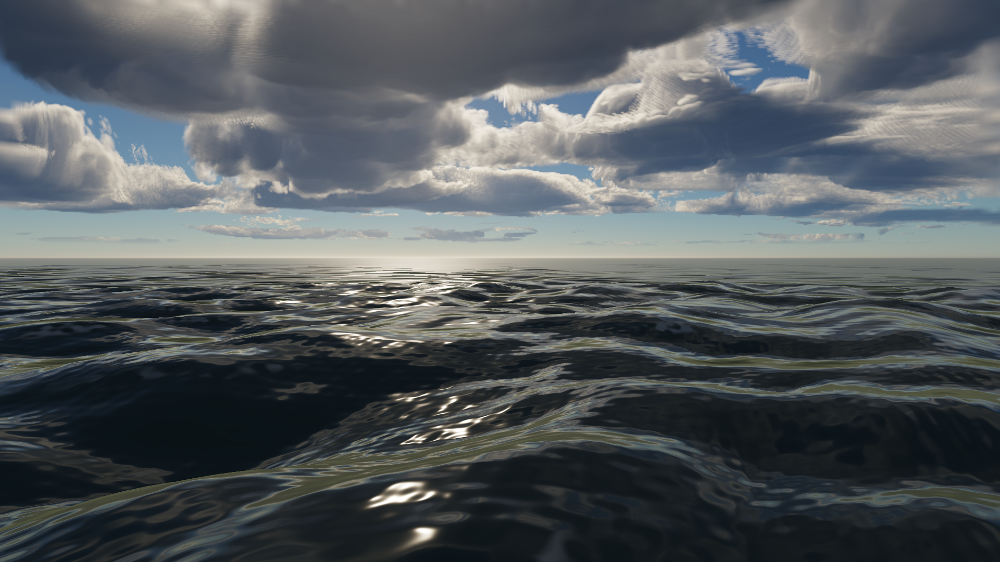
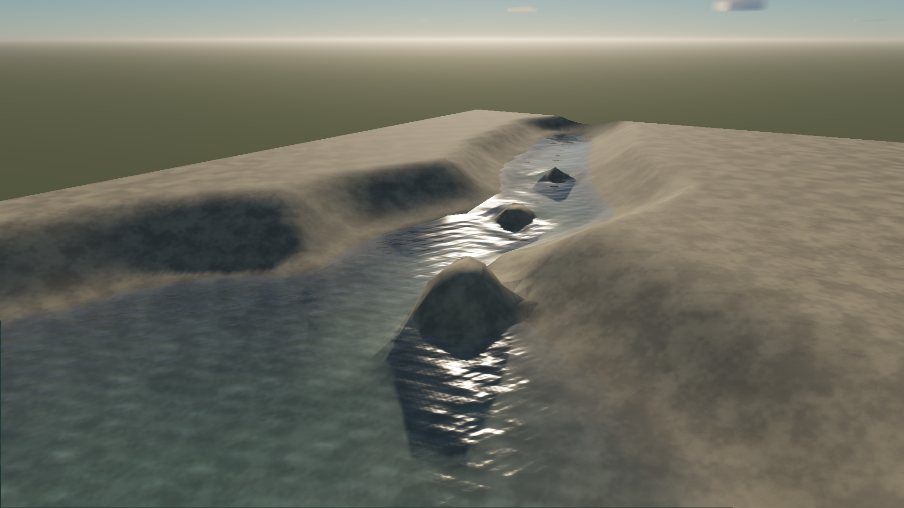

# Water implementation — September 23, 2026

The first playable water milestone is implemented: a sloping creek flowing into a lake, local shallow-water dynamics, and an independent open-ocean study. This establishes the shared authoring, simulation, physics and rendering path proposed in the [research audit](water-rendering-2026-09-23.md). It does **not** establish the final AAA visual bar or the proposed 2 ms p95 water budget.

**Try it.** Start `bun run dev`, open `/player?water=creek`, and use **Make a ripple**, **Lake view**, or double-click the water. Drag to orbit and scroll to zoom. Select **Open ocean** for the ocean study, or open `/player?water=ocean` directly. The built review is available at [the local water player](http://127.0.0.1:4175/player/?water=creek) while its preview server is running. It uses `output/water-review-build`, avoiding development hot reloads from concurrent work. A development reload incorrectly served a changed WGSL import as an asset URL; restarting the development server corrected it. The built player rendered both studies and switched subjects successfully.

**What ships in this milestone.**

| Area | Implemented behavior |
|---|---|
| Source and editing | Optional bounded domains, basins, bed obstacles, inflow/outflow sources, downhill river control-point elevations, directional wave controls, absorption, foam and caustic strength. Studio controls edit these as source. Worlds support up to eight distinct water references and retain the legacy primary reference. |
| Compiled geometry | A cached domain product supplies bed geometry, water geometry, initial conditions, collision and wet/dry queries. Open ocean uses camera-centered radial geometry extending to 8,192 m, with spacing-dependent wave filtering. |
| Ocean motion | Twenty-four deterministic directional wave carriers across six bands, plus optional authored waves. Gravity dispersion, bounded horizontal Gerstner displacement, analytic derivatives and particle velocities, and inverse queries for the displaced surface. This is a finite directional spectrum, not an FFT ocean or a calibrated JONSWAP model. |
| Real local dynamics | A CPU-authoritative finite-volume shallow-water solver evolves depth and two horizontal momentum components. Hydrostatic reconstruction, CFL substeps, dry-cell handling, friction, sources/sinks and transported foam are implemented. Available resolutions are 32², 64² and 128²; the study uses 64². |
| Interactions | Replayable radial disturbances, live height/current queries, existing buoyancy using the live surface, and equal/opposite horizontal drag impulses returned to local water. Water does not require synchronous GPU readback. |
| Surface appearance | Filtered wave normals and unresolved slope variance, choppy crests, advected foam, depth absorption, reflected sky, screen-space reflection/refraction and a bounded curvature-based shallow caustic approximation. |
| Persistence | Fluid state joins runtime checkpoints and world saves. Restore validates the compiled bed identity, physical state and common clock before mutation. Changing a bed retires its old collision geometry and establishes new replay state. |
| Hardware specialization | A dedicated spectrum-water pipeline avoids the generic material and legacy wave-integration closure. Open water without opaque scene geometry skips opaque transport work. Foam shading exits early when coverage is negligible; caustic curvature shares wave evaluations. |

The core implementation is in [water source](../../packages/model/src/water-body.ts), [compiled domains](../../packages/compiler/src/water-domain.ts), [compiled spectra](../../packages/compiler/src/water-spectrum.ts), [the solver](../../packages/runtime/src/water-simulation.ts), [runtime water bodies](../../packages/runtime/src/water-body.ts), and [the water shader](../../packages/render-webgpu/src/water-body.wgsl). The [editable studies](../../packages/model/src/water-lookdev.ts) are also used by the player and measurement harness.

**Measured performance.** All GPU numbers below are native 1920×1080, balanced quality, spatial rendering, on the local Apple/Metal adapter. Each experiment renders water on/off/off/on, with 45 warmup and 120 measured dynamic frames per run. The control keeps the opaque bed, sky and fluid simulation. p50/p95 use nearest-rank empirical quantiles. The incremental estimate subtracts the mean control medians from the mean water-on medians; it is **not an incremental p95**. Backend pass timestamps overlap, so they are not summed.

| Experiment | Whole-frame GPU p50, water on | Whole-frame GPU p95, water on | Estimated incremental water GPU median |
|---|---:|---:|---:|
| Initial new ocean implementation, generic closure | 11.99–12.06 ms | 13.63–13.76 ms | 11.44 ms |
| Specialized ocean, earlier run | 3.54–4.06 ms | 5.24–6.55 ms | 3.18 ms |
| Final ocean capture | 3.87 ms | 4.92–5.18 ms | 3.28 ms |
| Earlier creek capture | 6.62–8.91 ms | 7.93–13.37 ms | 3.38 ms |
| Final creek capture | 10.75–10.88 ms | 13.70–14.02 ms | 3.93 ms |

The ocean improvement compares this new implementation before and after specialization, **not** the old eight-wave renderer. Shader ablations showed that removing the fragment wave evaluations alone saved much less than removing the generic shader closure. This supports specialized realizations as a practical compiler optimization, while leaving substantial shading/transport work to reduce.

The 64² fluid solve measured approximately 0.2–0.3 ms median and 0.3–0.5 ms p95 in the earlier creek run; the final run measured 0.5–0.7 ms median and 0.9–1.0 ms p95. The development machine's load and clocks varied materially. The final ocean source remained stable, but a separate visual review overlapped its wall-clock window. These are profiling observations, not exclusive-machine or weaker-hardware guarantees. **Neither the 2 ms p95 GPU target nor the 0.5 ms p95 simulation target is proven.**

At 64² the creek uploads about 197.5 kB of water storage per changing frame, approximately 11.8 MB/s at 60 Hz, plus normal frame uniforms. Its runtime water ledger grows from approximately 1.2 MiB to 1.7 MiB during the benchmark as replay checkpoints accumulate; checkpoint count is bounded at 16. Water surface GPU buffers add approximately 0.65 MiB over the bed-only control. The ocean surface adds approximately 2.43 MiB over its sky-only control. Existing full-resolution opaque snapshots consume approximately 23.73 MiB at 1080p. Whole-renderer allocations were approximately 123–125 MiB, which must not be confused with water-owned memory. Compiler caches and larger/multiple domains require separate budget accounting; this does not certify the 48 MiB target for every authored configuration.

**Verification.**

- Focused model/compiler/runtime/rendering/authoring suite: **72 tests, 49,861 assertions, zero failures**. World/runtime regression suite: **36 tests, 781 assertions, zero failures**.
- Tests cover a still lake over uneven bed, wet/dry transitions, conserved volume with an explicit source ledger, exact horizontal body impulse exchange, downhill flow around bed obstacles, deterministic replay, JSON save/restore, rejected incompatible saves, separate water elevations and translated bed collision.
- Hardware compute checks execute the shipped grid/spectrum WGSL against the CPU evaluator: 64 creek samples and 64 ocean samples, including a world origin of `[100000, 19, -200000]`. Maximum error was approximately **2.70×10⁻⁶** for creek grid/wave values and **5.84×10⁻⁷** for ocean wave values. This checks numerical sampling, not complete reflected-light accuracy or motion quality.
- Both TypeScript configurations, workspace boundaries and the distributable build passed. Hardware captures completed without rendering diagnostics. Interactive creek/ripple/lake controls and ocean switching were exercised in the actual player.
- [Evidence JSON](water-implementation-2026-09-23.json) records source fingerprints, raw output locations, per-run quantiles and conformance results. Raw frame reports, images, fixture bundles and source manifests remain in those output directories. An intermediate creek run failed the source-stability check and is excluded from the performance table.

Reproduce the captures with `bun tools/water-lookdev.ts --bench` and `bun tools/water-lookdev.ts --ocean --bench`. Optional `--ablate=waves`, `--ablate=transport` and `--ablate=caustics` support focused experiments. Do not run another animated preview alongside a measurement.

**Limits and next experiments.** The bounded bed is shared by the new water's renderer, solver and collision, but it does not automatically carve or blend an existing world terrain. The surrounding banks in this study are functional test geometry and need art development. The solver is real depth-averaged fluid dynamics; it does not model overturning waves, waterfalls, airborne splashes, displaced body volume or full 3D pressure. Its body coupling returns horizontal drag, rather than implementing complete two-way hydrostatics. Independent domains do not yet exchange conserved flux across boundaries, and dynamic bodies do not become moving bathymetry.

The directional wave distribution and roughness closure are controlled approximations. Caustics are a focusing approximation; reflection/refraction retains screen-space visibility limits. Underwater transitions, dispersive boat wakes, shoreline breaking, wet terrain, storm conditions and the full near/far lighting matrix remain unvalidated.

The next useful milestone is an art-directed creek integrated into actual terrain, with measured transport/shading reductions and repeated tests on quieter and weaker hardware. Only then should moving simulation domains, cross-domain flux exchange or a bounded 3D splash solver expand the system. The present implementation provides working source, interaction and measurement paths for those experiments.

**Follow-up: stationary-view shaking fixed.** The user reported shaking in both studies. The player used temporal antialiasing, whereas the original water captures used spatial rendering and `capture()`, which disables temporal rendering. A new hardware regression reads the actual presented texture without calling `capture()`. With the camera and simulation frozen, the temporal path produced an eight-frame oscillation: maximum mean frame differences of 3.729/255 for ocean and 1.643/255 for creek. The spatial controls were exactly stable. The renderer now excludes scenes containing compiled water from temporal projection jitter/reconstruction and uses their spatially filtered realization; ordinary scenes retain their previous antialiasing policy. This is an explicit compatibility fallback, not a completed temporal-water reconstruction algorithm.

`bun tools/water-motion-check.ts` verifies both studies under default, temporal-requested and spatial policies. After the fix, all six cases have **zero frozen-frame pixel differences**, continue to animate when simulation advances, and report no GPU errors. The focused follow-up suite passed 25 tests and 407 assertions; both type checks and the distributable build passed. Before/after provenance is recorded under `motionRegression` in the evidence JSON. Future temporal-water work must pass this presented-frame test before re-enabling jitter; still capture agreement is insufficient.
