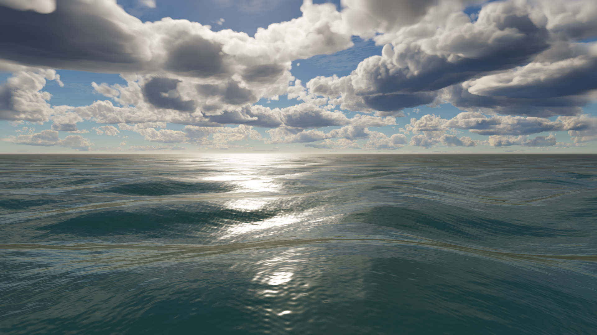

**Water refinement — September 23, 2026**

The ocean has finer wind ripples, more varied wave scales, softer highlights, and less of the previous dark polished-metal appearance. The local 1080p ocean measurements show a substantial GPU improvement. The creek now has a 128² shared bed/simulation/collision grid, lower banks and soil detail, but its environment and full-scene performance still fall short of the intended AAA bar.

The compiler emits 54 generated carriers across nine bands and three periodic shading cascades. A bounded short-wave tail adds ripples without giving short waves excessive height. Integer spatial frequencies allow each cascade to repeat; float32 carrier roundoff is checked. Optional individually authored waves keep their original parameters and are evaluated separately. CPU queries and geometry continue to evaluate the same analytic carriers.

The renderer generates two RGBA16F layers per cascade: slopes, squared slope magnitude and height; and the horizontal deformation Jacobian. Mip reduction preserves the first and second slope moments. Shading uses the filtered slopes and transfers unresolved variance to roughness instead of evaluating all generated carriers at every pixel. These six 256² layers, their mips and the clock uniform occupy **4 MiB per resident spectrum body**. They regenerate only when time or their source changes. Geometry also skips fully filtered carriers, and spatial water no longer evaluates a second, unused previous-frame deformation. Empty ocean scenes skip terrain shadow samples.

This follows the established division between geometric waves and generated normal detail described in [GPU Gems](https://developer.nvidia.com/gpugems/gpugems/part-i-natural-effects/chapter-1-effective-water-simulation-physical-models), and the transition from resolved waves to statistical reflectance studied by [Bruneton, Neyret and Holzschuch](https://evasion.inrialpes.fr/Publications/2010/BNH10/). This implementation remains a finite directional spectrum with an approximate GGX variance closure; it is not a calibrated FFT ocean or a reproduction of that paper's full lighting model.

Additional changes use the existing environment BRDF lookup for reflected sky, suppress incorrect back-facing micro-normal highlights for above-water views, derive bounded caustic focusing from filtered slopes, and use surface compression for crest foam. Depth absorption, screen-space refraction and the conservative shallow-water simulation remain active.

**Measurements.** Chrome, local Apple/Metal adapter, balanced quality, native 1920×1080. Each experiment uses water on/off/off/on, 45 warmup and 120 dynamic measured frames per run. The control retains sky, opaque geometry and fluid simulation. GPU frame extent includes wave synthesis even when the sky is reused; overlapping pass durations are not added. Incremental figures subtract paired medians and are **not water p95 measurements**.

| Run | Whole-frame GPU p50 | Whole-frame GPU p95 | Estimated incremental water median |
|---|---:|---:|---:|
| Before, ocean | 4.52–5.70 ms | 6.49–7.80 ms | 4.16 ms |
| Updated ocean, repeated run | 1.90–2.16 ms | 3.47–3.80 ms | 1.34 ms |
| Updated ocean, final run | 1.57–1.70 ms | 2.75–2.95 ms | 0.92 ms |
| Before, creek, 64² | 9.83–12.52 ms | 15.27–15.34 ms | 3.24 ms |
| Updated creek, 128² | 8.91–11.67 ms | 12.91–18.02 ms | 3.44 ms |

The ocean result is roughly a 60–68% reduction in observed whole-frame medians. The creek comparison includes four times as many simulation nodes and changed banks/materials; it does not establish a creek speedup. Workstation load varied materially, including across control runs. Final experiments used source-stable runs or a frozen source snapshot. A reduced-resolution low-profile run passed, but its timings were slower than balanced under different load; it does not establish weak-hardware performance. Neither the 2 ms p95 water target nor the 0.5 ms p95 fluid target is certified.

The solver skips dry/dry fluxes, shares substep damping factors, and scatters wet surface elevations into neighbouring dry nodes using existing scratch storage. A separate 128² ABBA CPU experiment measured step plus render extraction at **1.069 ms before and 0.929 ms after** (medians): about 13% faster, with **zero state and render-array differences over 300 disturbed frames**. Browser fluid timing was much more variable, reaching 1.4–2.5 ms median in the final creek run. Packing the 128² state also removes **49,152 temporary arrays/views per update**, with byte-identical output at three tested world origins. The denser creek still uploads about 791 kB per changing frame; reducing this bandwidth is useful future work.

**Verification.** The focused compiler/runtime/rendering suite passes **53 tests and 49,445 assertions**. Both TypeScript configurations, workspace boundaries and the production build pass. Hardware checks exercise the shipped synthesis, mip generation and sampling against analytic CPU queries for creek, ocean and mixed authored/generated waves, including a world origin of `[100000, 19, -200000]`. The report records height, slope, Jacobian, seam and far-field variance errors; the shading-map height error is approximately 3 mm or less in these samples. This is approximation evidence for the sampled cases, not a universal error bound.

All six presented-frame motion cases (ocean/creek under default, temporal-requested and spatial policies) have zero frozen-frame pixel differences and continue to animate when time advances. Hardware captures cover daylight, dense cloud cover, low sun, lake/noon, and a non-water architecture regression. The built player successfully exercises ripple creation, lake view, ocean switching and switching to the low graphics profile without GPU diagnostics.

[Machine-readable results and raw evidence locations](water-refinement-2026-09-23.json) preserve fingerprints, per-run distributions, conformance results, solver comparisons and validation paths. The built player is in `output/water-refinement-build`; the local review server, while running, serves [ocean](http://127.0.0.1:54612/player/?water=ocean) and [creek](http://127.0.0.1:54612/player/?water=creek).

Reproduce using `bun tools/water-lookdev.ts --ocean --bench`, `bun tools/water-lookdev.ts --bench`, and `bun tools/water-motion-check.ts`. Lighting reviews accept `--lighting=sunset`, `--lighting=overcast`, `--lighting=noon`, and `--lake`; `--resolution=64` permits an explicit cheaper creek study.

The next visible shortcomings are the creek's regular bank/rock shapes, sparse and simple foam, screen-space reflection limits, and missing breaking waves/spray. Underwater transitions and boats remain unvalidated. The richer ocean and cheaper wave shading are a useful advance, not completion of the world-class visual target.
