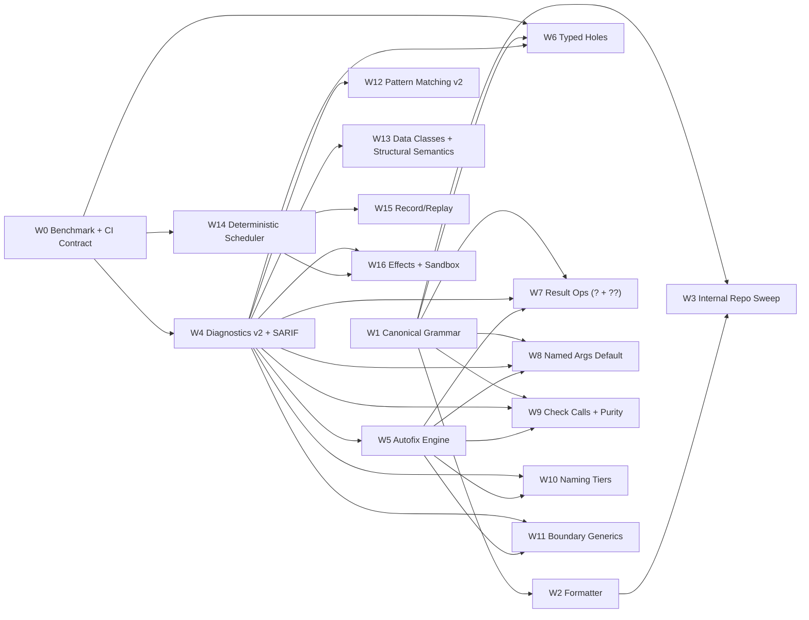

# Wrela Agent-First One-Shot Parallel Execution Plan (Alpha)

Date: February 24, 2026
Scope owner: Compiler + Runtime teams
Primary goal: Wrela is delightful for agents to write, and agents one-shot most tasks.

## Compiler-First Delta (February 27, 2026)

1. Rendering and shader compilation primitives are compiler-owned modules, not separate workspace crates.
2. New compiler module ownership:
   1. `compiler/render_ir/*`
   2. `compiler/shader_compiler/*`
3. `wrela agent-run` is hard-cut to intent schema v2 and compiler-first deterministic planning.
4. `studio` and `mmo` command families are first-class CLI surfaces for agent-oriented orchestration.

## 1) Alpha Ground Rules

1. Wrela is greenfield alpha, so we optimize for speed and clarity over backward compatibility.
2. There is one canonical language surface at any point in time.
3. Breaking changes are allowed when parser/formatter + tests keep the repo green.
4. We do not maintain long-lived compatibility parser paths.
5. We do not run cutover or rollout gates in this phase.
6. We do not treat `wrela migrate` as a product requirement in alpha; internal rewrites are enough.

## 2) Success Metrics (Program KPIs)

1. `agent_one_shot_pass_rate >= 70%` on fixed benchmark corpus.
2. `median_loops_to_green <= 2`.
3. `parse_survival_rate >= 99%` under single-edit mutations.
4. `machine_applicable_fix_apply_rate >= 95%`.
5. `deterministic_test_replay_rate = 100%` in deterministic test mode.

## 3) Parallelization Model

### Execution rules
1. Work is split into contract-first workstreams.
2. Each workstream owns a narrow file set and a test suite.
3. Workstreams merge independently behind feature flags when needed.
4. A workstream is blocked only by explicit contract dependencies, not by broad phase sequencing.

### Shared contracts every stream can depend on
1. Diagnostic schema contract: `code`, `severity`, `primary_span`, `related_spans`, `data`, `fixes`, `applicability`.
2. Formatter contract: AST round-trip, idempotence, deterministic print.
3. Autofix contract: non-overlapping edits, deterministic ordering, clean apply.
4. Benchmark contract: fixed corpus, fixed scoring, reproducible CI output.

## 4) Dependency Graph (Massively Parallel)

## 5) Workstream Specs

## W0: Benchmark + CI Contract

1. Objective: make one-shot quality measurable before language changes land.
2. File areas: `compiler/tests/`, `compiler/tests/fixtures/`, `compiler/bin/wrela/command_handlers.rs`.
3. Produces: benchmark harness, scoring report format, CI checks.
4. Depends on: none.
5. Done when: KPI report emits deterministically on every CI run.

## W1: Canonical Grammar (Braces + Token Simplification)

1. Objective: remove layout fragility and overloaded syntax traps.
2. File areas: `compiler/lexer/tokens.rs`, `compiler/lexer/indent.rs`, `compiler/parser/mod.rs`, `compiler/parser/grammar/mod.rs`, `compiler/parser/grammar/class.rs`, `compiler/parser/grammar/func.rs`, `compiler/parser/grammar/expr.rs`.
3. Produces: braces-only blocks, removed expression-level `otherwise`, standard call forms.
4. Depends on: none.
5. Done when: parser accepts only canonical grammar and full repo compiles.

## W2: Canonical Formatter (`wrela fmt`)

1. Objective: collapse style variance and stabilize diffs.
2. File areas: formatter implementation + CLI plumbing in `compiler/bin/wrela/`.
3. Produces: deterministic AST-based formatting, idempotence guarantees.
4. Depends on: W1 parser AST contracts.
5. Done when: `fmt(fmt(x)) == fmt(x)` and parse/format/reparse is stable.

## W3: Internal Repo Sweep (Non-Product)

1. Objective: move all in-repo source to canonical syntax fast without shipping migration UX.
2. File areas: internal scripts + targeted fix paths in `compiler/bin/wrela/command_handlers.rs`.
3. Produces: one-time repo rewrite playbook for this branch only.
4. Depends on: W1 grammar, W2 formatter.
5. Done when: in-repo sources are canonical and compiler no longer depends on legacy syntax paths.

## W4: Diagnostics v2 + SARIF

1. Objective: tool-first diagnostics that agents can act on without guessing.
2. File areas: `compiler/diag/mod.rs`, `compiler/bin/wrela/diag_emit.rs`, `compiler/diag/catalog.rs`.
3. Produces: stable JSON schema, SARIF output, stable codes and spans.
4. Depends on: W0 benchmark contract.
5. Done when: JSON/SARIF snapshots are stable and versioned.

## W5: Autofix Engine (`wrela fix`)

1. Objective: apply machine-safe compiler fixes in one pass.
2. File areas: `compiler/diag/fixit.rs`, `compiler/bin/wrela/command_handlers.rs`.
3. Produces: applicability-aware patch application (`machine_applicable`, `maybe_correct`, `has_placeholders`).
4. Depends on: W4 diagnostics contract.
5. Done when: >=95% clean apply on fix fixture corpus.

## W6: Typed Holes + Hole Fits

1. Objective: let agents ask the compiler what belongs at incomplete locations.
2. File areas: `compiler/parser/grammar/expr.rs`, `compiler/hir/lower.rs`, `compiler/hir/typeck.rs`, `compiler/bin/wrela/diag_emit.rs`.
3. Produces: `_` and `_name` holes, deferred errors, expected type + candidate fits in JSON.
4. Depends on: W1 grammar, W4 diagnostics contract.
5. Done when: hole-fit ordering is deterministic and benchmark loops drop.

## W7: Result Ergonomics (`?` and `??`)

1. Objective: remove error-handling boilerplate that agents frequently fumble.
2. File areas: `compiler/lexer/tokens.rs`, `compiler/parser/grammar/expr.rs`, `compiler/hir/typeck.rs`, `compiler/hir/semantic.rs`.
3. Produces: postfix `?`, `??`, precedence rules, diagnostics.
4. Depends on: W1 grammar, W4 diagnostics, W5 autofix.
5. Done when: precedence suite passes and legacy patterns are rejected at parse time with canonical guidance.

## W8: Named Args by Default

1. Objective: eliminate positional drift bugs in generated calls.
2. File areas: `compiler/parser/grammar/expr.rs`, `compiler/hir/typeck.rs`, `compiler/bin/wrela/command_handlers.rs`.
3. Produces: named-arg requirement for multi-arg calls with narrow exemptions and autofixes.
4. Depends on: W1 grammar, W4 diagnostics, W5 autofix.
5. Done when: positional multi-arg call violations emit machine-applicable rewrites.

## W9: Checks as Normal Calls + Purity Enforcement

1. Objective: keep strict check purity while making normal call syntax the canonical check invocation style.
2. File areas: `compiler/parser/grammar/expr.rs`, `compiler/hir/typeck.rs`, `compiler/hir/checkir.rs`.
3. Produces: standard check invocation + hard purity enforcement.
4. Depends on: W1 grammar, W4 diagnostics, W5 autofix.
5. Done when: check calls use normal syntax and purity violations are still hard errors.

## W10: Naming Enforcement Tiers

1. Objective: preserve safety checks while stopping style-only compile deadlocks.
2. File areas: `compiler/hir/naming.rs`, `compiler/diag/catalog.rs`, `compiler/bin/wrela/diag_emit.rs`.
3. Produces: hard error / strong lint / style lint tiers plus deterministic rename fixes.
4. Depends on: W4 diagnostics, W5 autofix.
5. Done when: style rules no longer block `wrela check` by default.

## W11: Boundary Generics Strictness

1. Objective: remove ambiguous boundary types that hurt hole-fit quality.
2. File areas: `compiler/hir/typeck.rs`, `compiler/hir/semantic.rs`, `compiler/hir/project.rs`.
3. Produces: fully-parameterized generic requirements at module boundaries.
4. Depends on: W4 diagnostics, W5 autofix.
5. Done when: boundary generic violations include actionable type suggestions.

## W12: Pattern Matching v2

1. Objective: reduce extract-then-if boilerplate with safer matching.
2. File areas: `compiler/parser/grammar/mod.rs`, `compiler/hir/lower.rs`, `compiler/hir/typeck.rs`.
3. Produces: structural patterns, guards, or-patterns, exhaustiveness and redundancy diagnostics.
4. Depends on: W4 diagnostics.
5. Done when: non-exhaustive and unreachable-pattern checks are deterministic.

## W13: Data Classes + Structural Semantics

1. Objective: kill repetitive boilerplate that agents should never hand-roll.
2. File areas: type lowering and typecheck paths in `compiler/hir/`.
3. Produces: intrinsic structural `Eq`/`Hash`/`Show` behavior with deterministic runtime semantics.
4. Depends on: W4 diagnostics.
5. Done when: structural equality/hash/show behavior is stable across runs.

## W14: Deterministic Test Scheduler

1. Objective: eliminate schedule flake during agent iteration.
2. File areas: `runtime/src/kernel/config.rs`, `runtime/src/kernel/actor.rs`, `runtime/src/kernel/runtime.rs`.
3. Produces: deterministic default behavior for `wrela test` execution.
4. Depends on: W0 benchmark/CI baseline.
5. Done when: repeated actor-heavy tests are trace-stable.

## W15: Record/Replay

1. Objective: make concurrency failures reproducible on demand.
2. File areas: runtime scheduler + CLI trace hooks in `compiler/bin/wrela/`.
3. Produces: schedule trace record and replay mode.
4. Depends on: W14 deterministic scheduler.
5. Done when: replay run reproduces recorded trace outcome exactly.

## W16: Effects + Sandbox Gating

1. Objective: block accidental side effects and make capabilities explicit.
2. File areas: `compiler/hir/typeck.rs`, `compiler/hir/project.rs`, `runtime/src/host.rs`, `runtime/src/kernel/config.rs`.
3. Produces: effect annotations + runtime policy enforcement for `fs`, `net`, `env`, `time`, `actor`.
4. Depends on: W4 diagnostics, W14 scheduler.
5. Done when: denied capabilities fail with structured errors and clear diagnostics.

## 6) Parallel Delivery Waves

### Wave A (launch immediately, fully parallel)
1. W0 Benchmark + CI Contract
2. W1 Canonical Grammar
3. W4 Diagnostics v2 + SARIF
4. W14 Deterministic Scheduler

### Wave B (starts as soon as dependencies are ready)
1. W2 Formatter
2. W5 Autofix
3. W6 Typed Holes
4. W7 Result Ergonomics
5. W8 Named Args
6. W9 Check Calls + Purity
7. W10 Naming Tiers
8. W11 Boundary Generics
9. W12 Pattern Matching v2
10. W13 Data Classes + Structural Semantics

### Wave C (finishing layer)
1. W3 Codemod Sweep
2. W15 Record/Replay
3. W16 Effects + Sandbox

## 6.1) Live Execution Status (Branch Snapshot)

Date: February 24, 2026

| Stream | Status | Evidence in this branch |
|---|---|---|
| W0 Benchmark + CI Contract | done | Deterministic harness + anti-cheat integrity guards are enforced in `compiler/tests/one_shot_metrics_harness.rs`; acceptance evidence is logged in `target/wrela_alpha_finish_bundle/logs/wrla_one_shot_harness.log` and summarized in `target/wrela_alpha_finish_bundle/legacy_cleanup_summary.json`. |
| W1 Canonical Grammar | done | Canonical parser rejects removed legacy forms (`given`, expression-level `otherwise`, removed keyword forms) with explicit hard diagnostics and canonical hints; parser + compiler unit suites are green (`target/wrela_alpha_finish_bundle/logs/wrla_lib.log`). |
| W2 Formatter | done | `wrela fmt` is deterministic and idempotent with canonical rewrite passes and JSON summary events (`fmt_summary`), covered by full CLI formatter tests and second-run zero-diff checks (`target/wrela_alpha_finish_bundle/logs/wrla_cli.log`). |
| W3 Internal Repo Sweep | done | Internal corpus is canonicalized with zero legacy budget and parse-validity guards (`compiler/tests/corpus_integrity.rs`), and suite evidence is in `target/wrela_alpha_finish_bundle/logs/wrla_corpus_integrity.log`. |
| W4 Diagnostics v2 + SARIF | done | Required diagnostic contract keys are locked (`schema_version`, `kind`, `message`, `path`, `span`, `stage`, `severity`, `diag_id`) with JSON/SARIF contract coverage in CLI and blackbox tests (`target/wrela_alpha_finish_bundle/logs/wrla_cli.log`, `target/wrela_alpha_finish_bundle/logs/wrla_contract_blackbox.log`). |
| W5 Autofix Engine | done | Autofix application is fail-closed (`expected_source` anchoring + deterministic non-overlap rejection), and safe/review applicability behavior is validated by CLI fix suites (`target/wrela_alpha_finish_bundle/logs/wrla_cli.log`). |
| W6 Typed Holes | done | Typed-hole payload contract includes `hole_id`, `expected_type`, typed in-scope bindings, ranked candidates, and code actions with deterministic ranking covered by unit/CLI tests (`target/wrela_alpha_finish_bundle/logs/wrla_lib.log`, `target/wrela_alpha_finish_bundle/logs/wrla_cli.log`). |
| W7 Result Ergonomics (`?` + `??`) | done | Postfix `?` and `??` precedence/type behavior are locked; removed legacy fallback forms are now parse errors with deterministic canonical guidance (`target/wrela_alpha_finish_bundle/logs/wrla_lib.log`, `target/wrela_alpha_finish_bundle/logs/wrla_cli.log`). |
| W8 Named Args by Default | done | Multi-arg named-argument enforcement with deterministic machine-applicable rewrites is covered in typecheck + CLI (`target/wrela_alpha_finish_bundle/logs/wrla_lib.log`, `target/wrela_alpha_finish_bundle/logs/wrla_cli.log`). |
| W9 Check Calls + Purity | done | Checks use canonical normal call syntax while purity remains hard-enforced; enforcement paths are green in semantic/typeck/CLI coverage (`target/wrela_alpha_finish_bundle/logs/wrla_lib.log`, `target/wrela_alpha_finish_bundle/logs/wrla_cli.log`). |
| W10 Naming Tiers | done | Default compile keeps style guidance non-blocking with strict-mode promotion behavior covered by CLI and naming tests (`target/wrela_alpha_finish_bundle/logs/wrla_cli.log`, `target/wrela_alpha_finish_bundle/logs/wrla_lib.log`). |
| W11 Boundary Generics | done | Boundary generic strictness covers `List`, `Map`, `Result`, `Actor`, and `Pending` with structured rewrite payloads and safe apply behavior (`target/wrela_alpha_finish_bundle/logs/wrla_lib.log`, `target/wrela_alpha_finish_bundle/logs/wrla_cli.log`). |
| W12 Pattern Matching v2 | done | Structural destructuring shipped end-to-end: parser supports structural field patterns (`Type { field, alias: pat }`), HIR lowering includes structural pattern nodes, MIR binding handles structural field extraction, typecheck binds class/enum structural fields, and coverage/exhaustiveness accounting treats structural enum variants deterministically. Covered by parser + typecheck regression tests (`test_match_case_structural_pattern_parse`, `test_match_structural_pattern_binds_class_fields`, `test_match_structural_pattern_covers_enum_variant`) with full compiler suite green. |
| W13 Data Classes + Structural Semantics | done | Structural Eq/Hash/Show semantics are intrinsic for classes/enums with deterministic behavior and equality diagnostics validated in parser/lowering/typeck/semantic/CLI (`target/wrela_alpha_finish_bundle/logs/wrla_lib.log`, `target/wrela_alpha_finish_bundle/logs/wrla_cli.log`). |
| W14 Deterministic Scheduler | done | Deterministic runtime contract is locked: deterministic mode forces serialized actor dispatch (no `spawn_blocking` fast path) and single-worker Tokio runtime, with virtual time automatically enabled under deterministic runtime. Coverage includes `actor_pool_preserves_send_order_in_deterministic_mode`, `deterministic_actor_order_is_stable_for_fire_send_and_await_across_pool_sizes`, and `host::tests::deterministic_runtime_implicitly_uses_virtual_time` (`cargo test -p wrela_runtime --lib` green: 567 passed). |
| W15 Record/Replay | done | Replay validation emits typed mismatch categories + stable codes (`schema_drift`, `route_drift`, `seed_drift`, `operation_outcome_drift`, `ordering_drift`, `timestamp_monotonicity_drift`) with machine payloads and non-zero drift exits; contracts are covered by replay and CLI suites (`target/wrela_alpha_finish_bundle/logs/wrla_cli.log`). |
| W16 Effects + Sandbox | done | Capability/sandbox parity is locked across `fs/net/env/time/actor` with `allow_*` precedence over `sandbox_allow_*`, sync+async deny coverage, and standardized denial contracts (`capability_denied:*` in Result payloads/logs, including actor operation-specific denials). Evidence includes runtime deny matrix tests + project effect-parity E2E (`cargo test -p wrela_runtime --lib` green, `cargo test -p wrela --test project_e2e` green: 33 passed). |

## 6.2) Runtime Closeout Evidence (W14/W15/W16)

1. Command evidence (green in this branch):
   - `cargo test -p wrela_runtime --lib` → `567 passed; 0 failed; 4 ignored`.
   - `cargo test -p wrela --test project_e2e` → `33 passed; 0 failed`.
   - `cargo test -p wrela --test cli` → `149 passed; 0 failed`.
2. Artifact bundle path:
   - `target/wrela_alpha_finish_bundle`
3. Runtime matrix logs:
   - `target/wrela_alpha_finish_bundle/logs/wrela_runtime_lib.log`
   - `target/wrela_alpha_finish_bundle/logs/wrla_project_e2e.log`
   - `target/wrela_alpha_finish_bundle/logs/wrla_cli.log`
4. Locked contract versions/surfaces:
   - Replay mismatch codes: `lang::runtime::replay_{schema,route,seed,operation_outcome,ordering,timestamp_monotonicity}_drift`.
   - Replay mismatch payload keys: `kind`, `mismatch_kind`, `mismatch_code`, `mismatch_message`, `mismatch`.
   - Runtime capability precedence: `allow_*` overrides `sandbox_allow_*`.
   - Denial contract string family: `capability_denied:<capability>.<operation>`.

## 6.3) Agent-Loop Contract Hardening Evidence (W4/W5/W6)

1. Artifact bundle path:
   - `target/wrela_alpha_finish_bundle`
2. Command evidence (all pass):
   - `cargo test -p wrela --lib`
   - `cargo test -p wrela --test cli`
   - `cargo test -p wrela --test contract_blackbox`
   - `cargo test -p wrela --test corpus_integrity`
   - `cargo test -p wrela --test one_shot_metrics_harness`
3. Matrix log index:
   - `target/wrela_alpha_finish_bundle/legacy_cleanup_summary.json`
4. Contract locks shipped in this chunk:
   - `machine_applicable` suggestions require concrete source anchoring (`expected_source`).
   - Missing-source suggestions are emitted as `has_placeholders` instead of overstating apply safety.
   - Typed-hole payload is deterministic and machine-friendly (`hole_id`, ranked fits, code actions).

## 6.4) Focused Legacy-Internal Cleanup (Hard-Cut)

1. Core cleanup delivered in this branch:
   - Indentation token semantics removed from lexer/parser (`Indent`/`Dedent` removed).
   - Legacy expression fallback internals removed (`LegacyOtherwise` removed from HIR/MIR).
   - Legacy `given` expression node path removed (`GivenExpr`/`GivenCall` removed from parser/HIR/MIR/semantic/typecheck/project traversals).
   - Legacy coverage aliasing internals removed from CLI mutation/cert pipeline; canonical coverage IDs are enforced.
   - Dead compatibility internals deleted (`compiler/lexer/indent.rs`, `compiler/lexer/comments.rs`, stale coverage alias helpers).
2. Hard-cut contract evidence:
   - Matrix bundle: `target/wrela_alpha_finish_bundle/legacy_cleanup_summary.json` (`all_green=true`).
   - Retry accounting: `target/wrela_alpha_finish_bundle/retry_report.json`.
   - Full command logs: `target/wrela_alpha_finish_bundle/logs/`.
3. Remaining internal debt:
   - None in scope for this hard-cut cleanup stream. Legacy canonicalization helpers and `parse_for_tests` canonicalization wrappers were removed; tests now author canonical source directly.

## 7) Merge and Conflict Strategy for Massive Concurrency

1. Use one worktree per workstream.
2. Keep each stream focused on owned files only.
3. Rebase daily against main to minimize drift.
4. Enforce contract tests before merge.
5. Merge in small vertical slices, not giant feature bombs.

## 8) Acceptance Matrix (Cross-Stream)

1. Grammar and parser robustness tests.
2. Formatter round-trip and idempotence tests.
3. Diagnostics schema snapshot tests (JSON and SARIF).
4. Autofix clean-apply tests.
5. Typed hole determinism tests.
6. Result operator precedence tests.
7. Named-arg enforcement + autofix tests.
8. Check purity hard-error tests.
9. Generic boundary strictness tests.
10. Pattern exhaustiveness/redundancy tests.
11. Derive expansion stability tests.
12. Deterministic scheduler and replay stability tests.
13. Sandbox capability-denial tests.

## 9) First 12 Parallel PRs

1. PR1: W0 benchmark harness + KPI scorer.
2. PR2: W1 braces-only canonical grammar.
3. PR3: W4 diagnostics schema v2 + SARIF.
4. PR4: W14 deterministic test scheduler baseline.
5. PR5: W2 formatter core + idempotence tests.
6. PR6: W5 `wrela fix` engine with applicability filtering.
7. PR7: W6 typed holes + JSON payload.
8. PR8: W7 `?` and `??` semantics.
9. PR9: W8 named args default + rewrites.
10. PR10: W9 check-call redesign + purity checker.
11. PR11: W10 naming tiers + deterministic rename fixes.
12. PR12: W3 internal canonical source sweep over `language/spec/` and `apps/`.

## 10) Definition of Done

1. KPI targets in Section 2 are met for 3 consecutive CI windows.
2. All in-repo source compiles under one canonical alpha grammar.
3. Agents complete benchmark corpus with median <=2 loops.
4. Concurrency tests are deterministic and replayable in test mode.
5. Capability-denied effects fail safely with structured diagnostics.

## 11) Anti-Bullshit / Anti-Cheating Rules

### Truth rules for all claims
1. No claim is valid without a pinned commit SHA and CI run link.
2. No screenshot-only evidence. Claims require raw artifacts.
3. No single-run claims. Minimum run count for KPI claims is 10.
4. No hand-edited benchmark outputs. All reports must be generated by committed tooling.
5. No local-only wins. Any claimed win must reproduce in CI.

### Benchmark integrity rules
1. Benchmark corpus is versioned and immutable per measurement window.
2. Any benchmark corpus change requires a dedicated PR with rationale and baseline reset.
3. Seeds and workload mix must be fixed in the benchmark manifest.
4. Cherry-picking best runs is forbidden; only aggregate report output is accepted.
5. If variance exceeds threshold, result is invalid and cannot be used in planning decisions.

### One-shot metric integrity rules
1. One-shot pass rate must be computed from full corpus runs, not subset runs.
2. Retries must be counted; hidden retries are treated as failed runs.
3. Autofix success must report attempted/applied/failed counts, not only success percentage.
4. Parser robustness claims must include mutation count and failure bucket breakdown.
5. Hole-fit quality claims must include deterministic ordering checks across repeated runs.

### Parallel workstream anti-gaming rules
1. A workstream cannot declare done if contract tests for its dependencies are failing.
2. “Works on my branch” is not a valid status.
3. Large PRs that mix unrelated streams are rejected.
4. Temporary bypass flags must have explicit expiration issues before merge.
5. Every stream must publish weekly progress as one of: `not_started`, `in_progress`, `blocked`, `ready_for_merge`, `done`.

### Required evidence bundle per merged stream
1. Commit SHA and CI run URL.
2. Before/after KPI snapshot for impacted metrics.
3. Raw machine-readable artifacts (JSON/SARIF/test reports).
4. List of added/updated tests and their pass status.
5. Known limitations and follow-up issue links.

### Automatic fail conditions
1. Missing artifact links in PR description.
2. Benchmark manifest modified without baseline reset PR.
3. Non-deterministic output detected in deterministic test suites.
4. Snapshot schema drift without explicit schema version bump.
5. Claimed metric improvement that is not reproducible in CI.
