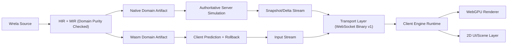

# Wrela Realtime Frontend Engine RFC (Agent-First, Rollback, Dual-Compile)

Date: February 25, 2026  
Status: Draft RFC  
Scope owner: Compiler + Runtime + Web Platform  
Primary thesis: Treat web apps as realtime simulations, not static documents with dynamic patches.

## 1) Executive Summary

Wrela will introduce a new frontend stack that behaves like a game engine while still supporting interactive 2D websites. The stack will be deeply integrated with Wrela backend semantics and centered on one deterministic domain model compiled to both server-native and client-wasm targets.

Core model:
1. Domain logic remains pure and deterministic.
2. Domain logic is dual-compiled:
   1. native machine code for authoritative server simulation
   2. wasm for client-side prediction and rollback
3. Rendering and I/O are isolated in engine/infrastructure layers.
4. Transport starts with binary-over-WebSocket and evolves only when profiling proves a bottleneck.
5. Agents get one-shot success through strict defaults, generated boilerplate, and hard correctness gates.

This RFC intentionally avoids a "rewrite everything at once" failure mode. It proposes an incremental path that starts from existing Wrela web/runtime primitives.

## 2) Problem Statement

Modern web UI development is constrained by a legacy document-first model:
1. Layout trees are fundamentally static and patched after the fact.
2. High-interactivity apps simulate game behavior through ad hoc state frameworks.
3. Network synchronization, prediction, and event consistency are bolted on rather than first-class.
4. Agent-authored code often fails because the platform does not enforce deterministic, composable defaults.

The goal is to redefine "fullstack web app" in Wrela as:
1. deterministic simulation domain + render engine + transport protocol
2. one language + one compiler pipeline + two execution targets
3. strong correctness guarantees for agent-generated code

## 3) Existing Foundation in Wrela

Wrela already has critical pieces that this RFC will reuse:
1. Class-first web surface and listener/event loop APIs:
   1. [/Users/ryanwible/projects/wrela/language/stdlib/host/web_server.wr](/Users/ryanwible/projects/wrela/language/stdlib/host/web_server.wr)
   2. [/Users/ryanwible/projects/wrela/language/stdlib/host/web_server_transport.wr](/Users/ryanwible/projects/wrela/language/stdlib/host/web_server_transport.wr)
2. Runtime web bridge with framed request/response handling:
   1. [/Users/ryanwible/projects/wrela/runtime/src/web/mod.rs](/Users/ryanwible/projects/wrela/runtime/src/web/mod.rs)
3. Compiler builtin plumbing pattern (MIR lower + Cranelift runtime symbol wiring):
   1. [/Users/ryanwible/projects/wrela/compiler/mir/lower.rs](/Users/ryanwible/projects/wrela/compiler/mir/lower.rs)
   2. [/Users/ryanwible/projects/wrela/compiler/backend/cranelift.rs](/Users/ryanwible/projects/wrela/compiler/backend/cranelift.rs)
4. Architecture and purity enforcement for domain boundaries:
   1. [/Users/ryanwible/projects/wrela/compiler/hir/project.rs](/Users/ryanwible/projects/wrela/compiler/hir/project.rs)

Important current constraint:
1. Codegen currently targets host ISA (`Triple::host()` in Cranelift object pipeline), so wasm target support is not yet wired in the CLI/build pipeline.

## 4) Goals

## Product goals
1. Build high-quality interactive 2D/3D experiences in Wrela without JS framework dependence.
2. Make "website as game/simulation" the default mental model.
3. Achieve low-latency local-first input with server authority and rollback reconciliation.

## Platform goals
1. Enforce deterministic domain semantics.
2. Compile same domain source to native and wasm.
3. Provide first-class transport protocol for snapshot/delta/input streams.
4. Ensure observability and replay for desync debugging.

## Agent goals
1. One-shot generation of correct project skeletons.
2. Great defaults so generated apps are viable without hand-tuning.
3. Optimization profile presets rather than fragile low-level flags.

## Non-goals (initial phases)
1. Replacing all browser platform APIs.
2. Inventing a custom network transport before measurement.
3. Solving AAA-class rendering in first release.
4. Supporting mixed deterministic and nondeterministic domain code in same module.

## 5) Design Principles

1. Domain purity is sacred.
2. Render/input/network are effectful edges, never domain internals.
3. Determinism before throughput.
4. Incremental migration over big-bang rewrite.
5. Declarative defaults over manual configuration.
6. Agent success rate is a first-class quality metric.

## 6) Layered Architecture



Execution planes:
1. Authoritative plane:
   1. native domain simulation on server
   2. canonical source of truth
2. Predictive plane:
   1. wasm domain simulation on client
   2. immediate local input feedback
3. Render plane:
   1. WebGPU draw graph + scene graph
4. Transport plane:
   1. input uplink + state downlink
5. Tooling plane:
   1. diagnostics, replay traces, desync analysis

## 7) Compiler and Build Pipeline Changes

## 7.1 New target model

Add explicit compile target modes:
1. `native`:
   1. current behavior
2. `wasm-domain`:
   1. compile pure domain graph to wasm artifact
3. `dual`:
   1. emit both native and wasm from same source graph
4. `engine-bundle`:
   1. package wasm + engine runtime + manifests for deployment

## 7.2 Domain extraction and purity contract

Domain extraction rules:
1. Include only `src/domain/**` plus transitively pure dependencies.
2. Reject imports crossing into host/network side effects.
3. Reject async/concurrency orchestration in domain modules.
4. Reject nondeterministic builtins.

Use/enhance existing policy checks in:
1. [/Users/ryanwible/projects/wrela/compiler/hir/project.rs](/Users/ryanwible/projects/wrela/compiler/hir/project.rs)

## 7.3 Deterministic subset guardrail

The domain compile pipeline enforces:
1. deterministic numeric semantics
2. deterministic collection iteration semantics
3. deterministic RNG calls (seeded streams)
4. deterministic serialization boundaries

Compiler diagnostics must fail hard for disallowed behavior with one-step remediation hints.

## 7.4 Cranelift backend extension

Current backend uses host triple in object module creation. Proposed changes:
1. Introduce target selection abstraction in backend entrypoints.
2. Add wasm ISA path for domain-only codegen.
3. Keep runtime-host ABI lane for native.
4. Generate wasm ABI shim functions for domain entrypoints (`tick`, `apply_input`, `hash_state`).

Initial code insertion points:
1. [/Users/ryanwible/projects/wrela/compiler/backend/cranelift.rs:710](/Users/ryanwible/projects/wrela/compiler/backend/cranelift.rs:710)
2. [/Users/ryanwible/projects/wrela/compiler/bin/wrela/commands/shared.rs](/Users/ryanwible/projects/wrela/compiler/bin/wrela/commands/shared.rs)
3. [/Users/ryanwible/projects/wrela/compiler/bin/wrela/cli_args.rs](/Users/ryanwible/projects/wrela/compiler/bin/wrela/cli_args.rs)

## 7.5 Wasm client shim contract

The domain wasm module will be hosted behind a thin JS shim to integrate browser input/render lifecycle:
1. load wasm artifact + memory.
2. marshal input events to wasm ABI payloads.
3. invoke deterministic domain entrypoints (`init`, `step`, `apply_input`, `hash_state`).
4. expose immutable snapshot views to renderer bridge.
5. isolate browser-only APIs outside wasm domain logic.

This keeps browser APIs and platform effects in shim/engine layers while preserving a pure wasm domain core.

## 8) Runtime Architecture

## 8.1 Server responsibilities

1. Accept session connections.
2. Receive ordered client inputs.
3. Advance authoritative simulation at fixed tick.
4. Emit snapshots + compacted deltas.
5. Emit correction messages for divergence.
6. Maintain per-session replay buffers for debugging.

## 8.2 Client responsibilities

1. Sample local input immediately.
2. Apply input to predicted wasm domain state.
3. Render predicted state at frame rate.
4. Reconcile when authoritative state diverges.
5. Rollback and replay pending inputs.

## 8.3 Session model

Per connected session:
1. `session_id`
2. `client_input_seq`
3. `authoritative_tick`
4. `acknowledged_input_seq`
5. ring buffer of historical states for rollback

## 9) Transport Protocol v1 (Binary over WebSocket)

Rationale:
1. WebSocket gives broad browser support and acceptable latency.
2. Binary framing avoids JSON overhead.
3. We defer custom transport until objective profiling indicates need.

Envelope fields:
1. `protocol_version`
2. `session_id`
3. `message_type`
4. `tick`
5. `sequence`
6. `ack_sequence`
7. `payload_length`
8. `payload_crc`

Message types:
1. `HELLO`
2. `INPUT_BATCH`
3. `STATE_SNAPSHOT`
4. `STATE_DELTA`
5. `CORRECTION`
6. `PING`
7. `PONG`
8. `ERROR`

Reliability model:
1. Ordered stream via WebSocket transport.
2. Explicit sequence/ack for app-level reconciliation.
3. Backpressure policy:
   1. input queue cap
   2. snapshot drop policy for stale frames
4. Heartbeat + timeout for dead sessions.

Transport evolution rule:
1. default to WebSocket until measured thresholds are exceeded.
2. only then evaluate custom transport (for example QUIC/WebTransport or proprietary framing) with parity tests and rollback safety gates.

## 10) Local-First Input + Rollback Reconciliation

## 10.1 Simulation clocks

1. Fixed simulation tick:
   1. default `60Hz` for gameplay
   2. `30Hz` for low-power profile
2. Render loop decoupled from simulation loop.

## 10.2 Prediction algorithm

1. Client captures local input `I(n)` with sequence `n`.
2. Client sends `I(n)` to server and immediately applies to local wasm domain state.
3. Server applies authoritative simulation and returns acknowledgments and state hashes.
4. On mismatch:
   1. client loads last authoritative state `S(k)`
   2. replays pending local inputs `I(k+1..n)`
   3. swaps corrected state atomically

## 10.3 Required domain API contract

Generated domain ABI functions:
1. `init(seed, config) -> State`
2. `step(state, dt) -> State`
3. `apply_input(state, input) -> State`
4. `hash_state(state) -> u64`
5. `serialize_state_delta(base, next) -> Bytes`
6. `apply_state_delta(state, delta) -> State`

## 10.4 Rollback data retention defaults

1. State ring buffer depth:
   1. default `120 ticks` (`2s` at `60Hz`)
2. Input history depth:
   1. default `240 inputs`
3. Configurable by optimization profile.

## 11) Determinism Contract

Domain determinism is required for dual-target parity:
1. identical input stream + seed must produce identical state hash trajectory.

Hard rules:
1. No wall-clock reads in domain.
2. No network/file/system entropy in domain.
3. No unordered nondeterministic iteration where order affects state.
4. Numeric policy:
   1. preferred fixed-point for authoritative simulation
   2. if floats are allowed, use deterministic subset + strict test gate
5. RNG policy:
   1. seeded deterministic PRNG stream
   2. no ambient random source calls

Verification gates:
1. Cross-target determinism test:
   1. native vs wasm over fixed input corpus
2. Golden hash lane in CI:
   1. fail on divergence
3. Replay determinism:
   1. same replay trace must reproduce same output hashes

## 12) Rendering and UI Model

## 12.1 Engine objectives

1. Support 3D realtime scenes.
2. Support 2D interactive websites as scene/UI overlays.
3. Expose a unified component model for both.

## 12.2 Render pipeline stages

1. Scene extraction from domain state + presentation state.
2. Visibility/culling.
3. Material and draw-command compilation.
4. WebGPU submission.
5. UI overlay pass.

## 12.3 2D website as engine scene

Map common web-app primitives to scene primitives:
1. panels/cards -> quads
2. text blocks -> glyph runs
3. interactions -> input hit regions
4. transitions -> timeline clips

This enables one runtime for "website mode" and "game mode."

## 12.4 WebGPU command compilation model

Renderer output path:
1. domain + presentation state -> scene graph
2. scene graph -> render graph IR
3. render graph IR -> WebGPU pipeline and command encoders
4. command buffers submitted per frame

This preserves a compiler/runtime mindset while targeting browser-native GPU execution.

## 12.5 Visual semantics contract (simulation, presentation, motion)

Visual behavior is split into three contracts:
1. simulation:
   1. deterministic domain state only
   2. no render/input/network side effects
2. presentation:
   1. pure mapping from state to visual nodes
   2. includes layout/material/style decisions
3. motion:
   1. animation state machines and timeline tracks
   2. consumes simulation and interaction signals, outputs interpolated visual states

This keeps gameplay correctness independent from art direction iteration.

## 12.6 Visual primitive set and style system

Initial primitive vocabulary:
1. `Node`
2. `Mesh`
3. `Sprite`
4. `Text`
5. `Panel`
6. `ParticleEmitter`
7. `Camera`
8. `Light`
9. `HitRegion`

Style system v1:
1. design tokens define global visual language:
   1. color palette
   2. spacing scale
   3. typography stack
   4. corner radii
   5. easing curves
2. themes are explicit and swappable.
3. widgets consume tokens by default and allow local override.

## 12.7 Animation semantics

Animation model is explicit, not callback soup:
1. state machine clips:
   1. examples: `idle`, `walk`, `attack`, `error`
2. transition graph:
   1. predicate-driven transitions with blend durations
3. timeline tracks:
   1. scalar/vector/color/opacity/layout tracks
4. event hooks:
   1. animation events emit typed domain-safe signals
   2. domain writes still occur through deterministic system logic

Default animation strategy:
1. fixed-step simulation + render interpolation.
2. timeline sampling in presentation/motion layers only.
3. rollback re-simulation updates animation state deterministically.

## 12.8 Asset formats and view mapping

Initial asset lane:
1. 3D models: `glTF`
2. textures: compressed GPU-ready formats
3. fonts: signed-distance field atlas pipeline
4. audio: streamed and buffered clips

View mapping contract:
1. `@view` functions map domain state to scene graph data.
2. `widget` definitions compile to entities/components in presentation layer.
3. UI interactions emit typed events, then domain systems consume those events.

## 12.9 Visual authoring and preview workflow

Required workflow capabilities:
1. live preview with hot reload for views/themes/widgets.
2. animation timeline scrubber.
3. scene graph inspector.
4. screenshot diff lane in CI for visual regressions.
5. frame-time budget panel (cpu, gpu, upload, draw-call counts).

## 12.10 Visual syntax sketch (v1)

```wr
@theme(name="default")
class AppTheme {
    has {
        color_bg: Color = Color(hex="#0B1020")
        color_accent: Color = Color(hex="#4ADE80")
        space_md: Integer = 12
        radius_sm: Integer = 8
        ease_standard: String = "cubic(0.2,0.0,0.0,1.0)"
    }
}

widget ScoreCard {
    prop score: Integer
    prop theme: AppTheme

    view {
        Panel(
            padding=theme.space_md,
            radius=theme.radius_sm,
            background=theme.color_bg
        ) {
            Text(value="Score: " + score.to_string(), color=theme.color_accent)
        }
    }
}

@anim(name="button_hover")
fn button_hover_anim() -> AnimationClip {
    clip = AnimationClip(duration_ms=140)
    clip.track(path="scale", from=1.0, to=1.04, easing="cubic(0.2,0.0,0.0,1.0)")
    clip.track(path="opacity", from=0.92, to=1.0, easing="linear")
    return clip
}
```

## 13) Agent-First One-Shot Design

## 13.1 Primary requirement

Agents should be able to generate correct, runnable games in one shot by default.

## 13.2 Productized defaults

`wrela game init` scaffold includes:
1. deterministic domain template
2. rollback-enabled client runtime template
3. authoritative server session template
4. default scene graph + camera + input mapping
5. test harness for determinism and rollback

## 13.3 Compiler-driven guidance

Diagnostics should be task-oriented:
1. "This domain function uses nondeterministic call X. Move it to infrastructure."
2. "Float op Y breaks deterministic profile. Use fixed-point helper Z."
3. "Rollback buffer too shallow for observed RTT budget."

## 13.4 Generation contract for agents

Agent command surface:
1. `wrela game init <name> --mode=2d|3d --profile=quality|balanced|latency`
2. `wrela game check --determinism --rollback --perf-budget`
3. `wrela game package --target=web`

Generated project must compile without manual edits under default profile.

## 13.5 Game syntax proposal v1 (deterministic ECS-flavored)

V1 should extend current Wrela syntax with annotations instead of introducing a brand-new grammar.

Core abstractions:
1. `@component`:
   1. pure per-entity data
2. `@resource`:
   1. singleton world data
3. `@event`:
   1. typed per-tick facts
4. `@system`:
   1. deterministic logic with explicit read/write declarations
5. `CommandBuffer`:
   1. deferred world mutations
6. `@replicated`:
   1. authority and prediction metadata for sync strategy

```wr
@component
class Transform {
    has {
        mutable x: Fixed = 0
        mutable y: Fixed = 0
        mutable z: Fixed = 0
    }
}

@component
@replicated(mode="predicted")
class Velocity {
    has {
        mutable x: Fixed = 0
        mutable y: Fixed = 0
        mutable z: Fixed = 0
    }
}

@resource
class Time {
    has { mutable tick: Integer = 0 }
}

@event
class JumpPressed {
    has { player_id: Integer }
}

@system(stage="fixed", reads=["InputBuffer", "Time"], writes=["Transform", "Velocity"])
fn move_players(world: World, commands: CommandBuffer) -> Nothing {
    // deterministic simulation update only
}
```

## 13.6 Compiler-enforced semantics for one-shot correctness

Required enforcement in v1:
1. fixed-stage systems cannot call host/network/time entropy APIs.
2. systems must declare read/write sets.
3. scheduler rejects unsafe parallel write/write conflicts unless explicitly ordered.
4. nondeterministic RNG is disallowed in domain systems.
5. replicated data requires explicit authority mode:
   1. `server`
   2. `predicted`
   3. `interpolated`
6. rollback-safe systems cannot depend on nondeterministic values.
7. cross-target hash parity checks are mandatory in `wrela game check`.

## 13.7 Website-as-game syntax lane

UI syntax should compile into the same engine data model:
1. `widget` compiles to presentation entities/components.
2. widget interactions emit typed events.
3. domain systems consume those events and mutate deterministic state.
4. `@view` functions map simulation state into widget trees and scene nodes.

This keeps application and game development in one conceptual runtime.

## 13.8 Syntax anti-goals for v1

Avoid these patterns early:
1. implicit mutable globals in simulation paths.
2. hidden side effects inside systems.
3. implicit auto-replication without authority declarations.
4. unconstrained float-heavy core simulation without determinism gates.

## 13.9 Mini-game example (end-to-end sketch)

```wr
@component
class Player {
    has {
        mutable x: Fixed = 0
        mutable y: Fixed = 0
        mutable vx: Fixed = 0
        mutable vy: Fixed = 0
    }
}

@resource
class Score {
    has { mutable value: Integer = 0 }
}

@event
class MoveInput {
    has {
        entity_id: Integer
        axis_x: Fixed
        axis_y: Fixed
    }
}

@system(stage="fixed", reads=["MoveInput"], writes=["Player"])
fn apply_move_input(world: World) -> Nothing {
    // consume MoveInput events and update Player velocity deterministically
}

@system(stage="fixed", reads=["Time"], writes=["Player"])
fn integrate_player_motion(world: World) -> Nothing {
    // integrate velocity into position with fixed dt
}

@view
fn game_hud_view(world: World, theme: AppTheme) -> Scene {
    score = world.resource[Score]().value
    return Scene(
        root=Panel(background=theme.color_bg) {
            ScoreCard(score=score, theme=theme)
        }
    )
}
```

Flow:
1. local input emits `MoveInput` immediately on client.
2. wasm predicted systems run and render updates instantly.
3. input stream is sent to server authority.
4. authoritative corrections trigger rollback and replay if hashes diverge.

## 14) Optimization Profiles (Preset-Driven)

Users and agents choose presets instead of raw knobs.
Product surfaces (CLI + editor tooling) should expose these as simple profile selectors/dropdowns.

| Profile | Tick Rate | Prediction Window | Visual Quality | Latency Bias | Typical Use |
|---|---:|---:|---|---|---|
| `quality` | 60 | medium | high | medium | visual-heavy scenes |
| `balanced` | 60 | medium | medium | medium | general app/game |
| `latency` | 120 client / 60 server | high | medium-low | high | competitive interactions |

Each preset defines:
1. rollback history depth
2. snapshot cadence
3. interpolation strategy
4. renderer feature toggles
5. asset LOD budget

Advanced options remain available but hidden behind explicit "expert mode."

## 15) Security and Safety Model

1. Domain wasm runs in sandboxed runtime context.
2. Input payload validation is strict and schema-based.
3. Session auth piggybacks existing Wrela web/auth surfaces.
4. Rate limits enforced per session and per identity.
5. Correction stream integrity checks:
   1. version
   2. checksum
   3. monotonic sequence constraints

## 16) Observability, Debugging, and Tooling

Required telemetry:
1. input RTT p50/p95/p99
2. rollback count and replay cost
3. prediction error rate
4. snapshot/delta byte rates
5. state-hash divergence incidents

Required artifacts:
1. session replay traces
2. determinism lane reports
3. protocol wire dump (sampling)
4. frame-time budget breakdown

Developer tools:
1. timeline inspector for input/prediction/correction.
2. state hash diff viewer.
3. one-command replay reproduction.

## 17) Implementation Plan (Phased)

## Phase 0: Foundations

Deliverables:
1. RFC acceptance + contracts finalized.
2. Target abstraction in compiler for native vs wasm-domain.
3. Domain ABI contract definitions.
4. Determinism test harness skeleton.

Exit criteria:
1. Sample pure domain module compiles to both native and wasm artifacts.
2. Native/wasm hash parity on fixed corpus.

## Phase 1: Transport + 2D Engine Minimum

Deliverables:
1. Binary WebSocket protocol v1.
2. Server session loop + snapshot/delta emission.
3. Client wasm prediction loop.
4. WebGPU-backed 2D rendering path.

Exit criteria:
1. Reference 2D interactive app runs with local-first prediction + correction.
2. End-to-end p95 input-to-visual response under target budget on local network.

## Phase 2: Rollback and Agent Scaffolding

Deliverables:
1. rollback/replay ring buffers and correction handling.
2. `wrela game init` and `wrela game check`.
3. optimization profiles (`quality`, `balanced`, `latency`).
4. determinism and rollback gates integrated in CI.

Exit criteria:
1. generated scaffold passes determinism gate in one shot.
2. rollback incidents recover without visible hard stutter in test scenario.

## Phase 3: 3D Expansion and Production Hardening

Deliverables:
1. 3D scene graph and material pipeline.
2. robust asset pipeline (streaming, LOD, compression).
3. production observability and replay tooling.
4. auth/security hardening and load testing.

Exit criteria:
1. representative 3D demo maintains target frame and latency budgets.
2. replay/debugging can root-cause induced desyncs reliably.

## 18) Risks and Mitigations

1. Determinism drift between native and wasm:
   1. Mitigation:
      1. fixed-point default
      2. hash parity gate
      3. replay gate
2. Protocol complexity explosion:
   1. Mitigation:
      1. minimal v1 message set
      2. explicit compatibility versioning
3. Rendering ambition outruns team bandwidth:
   1. Mitigation:
      1. 2D-first production path before 3D expansion
4. Agent-generated unsafe patterns:
   1. Mitigation:
      1. compiler hard errors with exact remediation
      2. scaffold with locked best-practice defaults
5. Latency variability in real networks:
   1. Mitigation:
      1. jitter buffers
      2. adaptive snapshot cadence
      3. rollback window profile tuning

## 19) Backward Compatibility and Migration

Alpha policy:
1. Prefer canonical new surface over long-lived legacy compatibility.
2. Keep migration path explicit through scaffolds and compiler diagnostics.
3. Existing web server surface remains supported as control-plane entrypoint.

Migration strategy:
1. Legacy HTTP routes can host bootstrap shell + session auth.
2. Realtime scene session mounts under dedicated endpoint namespace.
3. Teams can adopt engine mode per feature, not all-at-once.

## 20) Open Questions

1. Should deterministic float subset be supported at all, or fixed-point-only for v1?
2. What is the initial max session size and server fanout model?
3. Do we standardize binary schema as custom compact format or Protobuf for v1?
4. What is the first-class asset package format for engine bundles?
5. Should 2D UI primitives live in core stdlib or in a dedicated `pkg/game/ui` package?
6. Should `@component/@system/@widget/@view/@anim` ship in core language syntax or as macro-like annotation lowering in v1?
7. What is the default animation blending policy for rollback corrections:
   1. hard snap
   2. short blend
   3. profile-driven adaptive blend
8. Which visual regression gate is mandatory for CI in v1:
   1. screenshot diff only
   2. screenshot diff + frame-time budget assertions

## 21) Immediate Next Steps (Execution-Ready)

1. Compiler:
   1. add explicit backend target enum and plumb through CLI.
   2. add wasm-domain artifact emission path.
   3. define and lower v1 annotations (`@component/@resource/@event/@system/@replicated`).
   4. add deterministic-system compile checks for stage + effect constraints.
2. Runtime:
   1. add session transport module adjacent to existing web runtime.
   2. implement protocol envelope and heartbeat.
   3. add rollback buffer + replay pipeline for authoritative corrections.
3. Language/stdlib:
   1. define domain ABI package interfaces for `init/step/apply_input/hash_state`.
   2. define `widget/@view/@anim/@theme` stdlib contracts and lowering targets.
4. Tooling:
   1. create determinism cross-target test harness.
   2. create rollback integration test fixture.
   3. add visual preview inspector and screenshot diff CI harness.
5. Product:
   1. ship `wrela game init` scaffold with balanced defaults.
   2. ship one reference app that proves website and game syntax share one runtime path.

## 22) Decision Record (Current)

1. Decision: start with binary-over-WebSocket instead of custom transport.
   1. Reason: fastest path to measurable product value with broad browser compatibility.
2. Decision: domain purity is mandatory and dual-compile target is derived from that boundary.
   1. Reason: rollback correctness depends on deterministic parity.
3. Decision: agent success depends on defaults and compile-time guardrails, not prompts.
   1. Reason: reproducibility and reliability.
4. Decision: incremental rollout (2D first, 3D second).
   1. Reason: reduce risk and deliver usable platform earlier.
